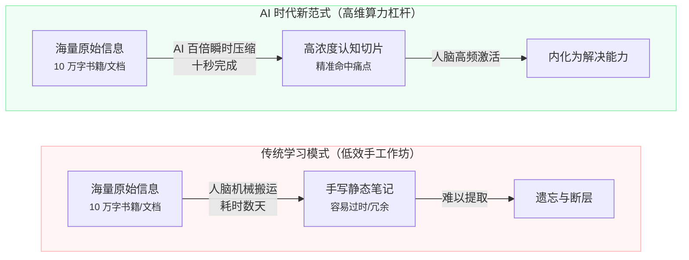
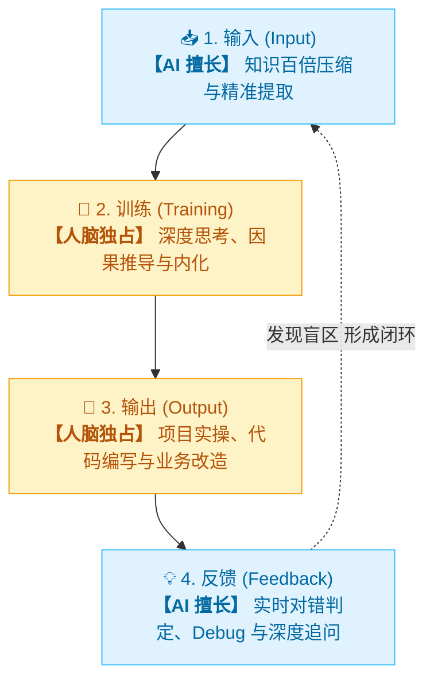
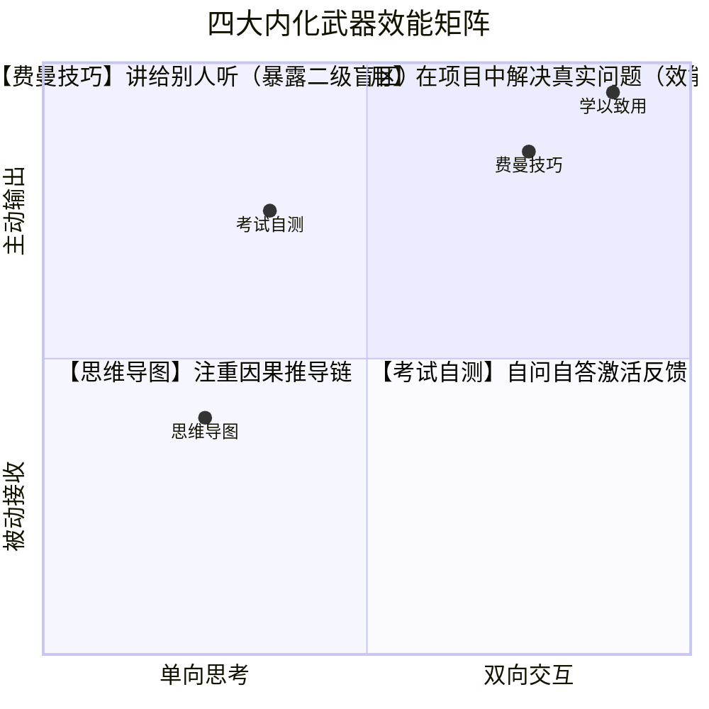
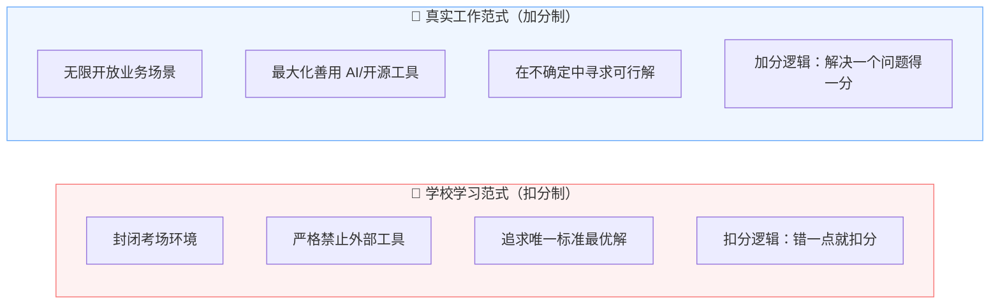
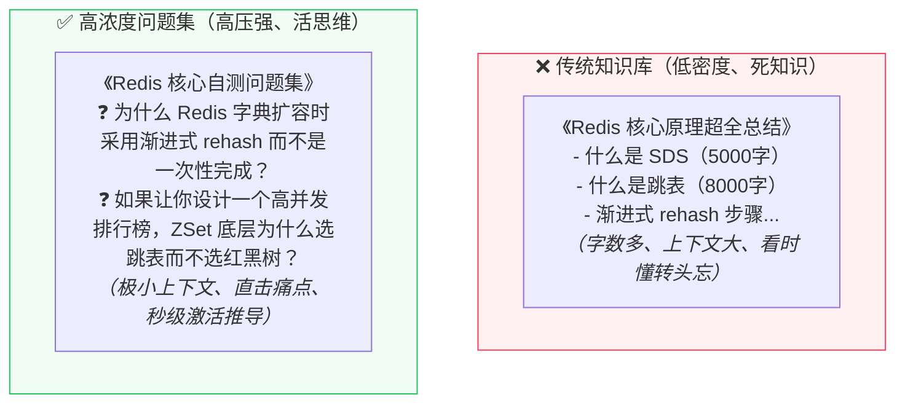
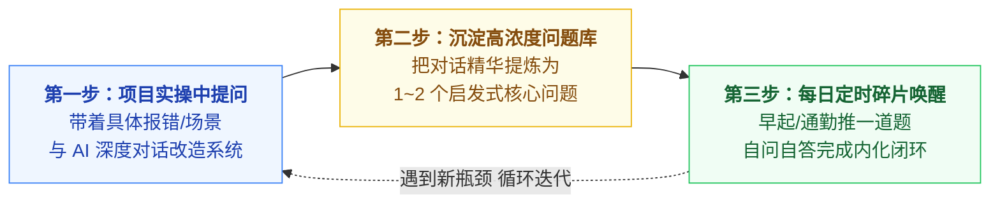

你是否也有过这样的经历？

每当开始学习一门新技术、阅读一本技术经典、或者在工作中接触一个全新的架构，你的第一反应往往是：**打开笔记软件，工工整整地新建一个文件夹，开始疯狂复制、粘贴、摘抄、排版。**

从基础语法、API 参数、配置字典，到底层原理与各种名词解释，你的 Notion / Obsidian / 语雀里塞满了上百篇排版精美、动辄数万字的“大部头”笔记。你看着那一眼望不到头的目录树，内心涌起一股虚幻的充实感与掌控感，仿佛只要知识被保存在了笔记本里，它就已经属于了自己的大脑。

然而，一旦脱离了笔记，切回到真实的开发与业务场景中：

- **面对一个线上 Bug，依然不知从何查起；**
- **遇到一个复杂的系统设计，依然脑子一片空白；**
- **甚至几个月前自己亲手写下的笔记，重新翻开时居然感到无比陌生，宛如在看别人的天书。**

在 AI 爆发的今天，这种传统初高中式的“抄书记笔记”方法，不仅无法帮你建立真正的技术护城河，反而正在沦为一种**高能耗、低产出的虚假努力**。

大模型时代的到来，正在彻底掀翻延续了数十年的知识获取逻辑。我们需要重新审视知识的本质，重构属于这个时代的个人学习与笔记方法论。

<!-- more -->

---

---

# AI 时代笔记的底层变革：从「知识囤积」到「问题驱动」的高效认知跃迁

## 一、AI 时代笔记系统的根本性改变

### 1. 知识压缩的权力转移：从人脑手工到 AI 百倍提纯

在传统时代，做笔记的核心意义在于**信息压缩**。

一本十万字的技术专著，人脑需要花费数十个小时通读，再手动摘录其中的核心脉络与关键定义，将其浓缩为数千字的个人笔记，以便日后查阅。**在这个过程中，笔记实际上充当了人类记忆力不足的“外挂磁盘”。**

但在今天，AI 已经实现了**基于自然语言与海量语料的十倍乃至百倍量级的知识无损压缩**：

- 你可以将一本几十万字的英文技术文档直接扔给 AI，让它在 10 秒内提炼出最核心的 5 个设计哲学与 3 个边界陷阱；
- 你可以让 AI 将晦涩难懂的分布式共识算法（如 Raft、Paxos），用极其通俗的生活比喻或精简的对比表格呈现出来。

> 💡 **核心认知转变**：我们必须建立一个前提信念——**充分信任 AI 能代替人脑完成繁重的信息初筛与文本压缩。** 凡是能被 AI 随时秒级调取的静态事实与标准定义，都不再值得你花宝贵的精力和时间去人肉搬运。

---

### 2. 重新解构学习过程四步骤：人机协同的新分工

任何真正的学习与技能掌握，本质上都由四个基本环节构成：**输入（Input） $\rightarrow$ 训练（Training） $\rightarrow$ 输出（Output） $\rightarrow$ 反馈（Feedback）**。

在没有 AI 的时代，这四个步骤全部压在人类单薄的肉身大脑上；而在 AI 时代，人与工具的边界被重新划定：

| 学习阶段 | 传统模式责任人 | AI 时代最佳分工 | 核心价值与能力表现 |
| :--- | :--- | :--- | :--- |
| **① 输入（Input）** | 个人慢速阅读 | **AI 绝对主导 🤖** | 百倍知识压缩、多源信息检索、去粗取精。 |
| **② 训练（Training）** | 个人被动理解 | **人脑独占价值 🧠** | 因果推导、建立神经元连接、深度内化。 |
| **③ 输出（Output）** | 个人手动编码 | **人脑独占价值 🧠** | 学以致用、业务改造、动手写项目。 |
| **④ 反馈（Feedback）** | 依赖导师/延时测试 | **AI 绝对主导 🤖** | 实时判题、代码 Review、边界 Bug 答疑、Debug 建议。 |

以学习 **“CPU 缓存架构与可见性原理”** 为例：
1. **输入（交给 AI）**：让 AI 直接总结 L1/L2/L3 缓存的访问时延差异、MESI 协议的核心状态机，无需通读几百页的硬件手册；
2. **训练（人脑推导）**：大脑去思考“为什么多核 CPU 会产生指令重排？为什么单靠 volatile 无法保证复合操作的原子性？”；
3. **输出（人脑实践）**：在项目中写一段多线程并发测试代码，复现线程上下文切换时的可见性 Bug；
4. **反馈（交给 AI）**：将测试结果和 JVM 汇编指令发给 AI，让它验证自己的推导是否正确、是否存在更深层的内存屏障（Memory Barrier）细节。

**把输入与反馈大胆托付给 AI，把人脑有限的精力死死按在「训练与输出」上，这是 AI 时代学习效率提升十倍的第一法则。**

---

## 二、知识的本质与传统笔记的局限性

### 1. 为什么你的静态笔记天然会“过时、冗余、充满错误”？

知识并不是客观世界里一块块永恒不变的砖石，**知识只是人类用有限的语言，对客观信息与规律在某个特定阶段的近似描述。**

这就决定了传统静态笔记必然面临的三大宿命：

1. **认知代差导致的内容过时**：你在初学阶段花大把时间记录的“重要心得”，站在半年后的高阶视角来看，往往浅显甚至可笑；
2. **脱离上下文的冗余累赘**：随着技术栈的迭代和系统复杂度的演进，大量死记硬背的 API 参数和配置细节都会失去意义；
3. **缺乏推导验证的隐藏错误**：很多初学者记笔记只是机械转述别人的二手结论，缺乏自身场景的验证，甚至把错误的结论奉为圭臬。

> ⚠️ **初高中记笔记的方法，在 AI 时代已经全面失效。** 高考是一场针对固定知识库的封闭记忆测试，而真实的工程与商业世界，是在瞬息万变的开放未知中解决问题。

### 2. 笔记本身并不重要，记的过程（训练）才重要

很多人沉迷于笔记软件的排版、双链、标签系统，把大量时间浪费在“打扮笔记”上，却误以为这就是在学习。

必须清醒地认识到：**留在笔记软件里的字句没有任何生产力，只有真正重构了你大脑神经元连接的思维推导，才属于你。** 记录这一动作之所以有价值，绝不是为了日后去瞻仰那份文档，而是在记录那一瞬间，你的大脑被迫进行了一次主动的理解、筛选与组织（即完成了**训练**）。

---

## 三、四大高效内化学习武器

人脑的上下文窗口（Working Memory）极其有限，大脑不擅长孤立记忆碎片化的事实，但极其擅长**记忆事物之间的推导因果与逻辑联系**。

想要把信息转化为真正的肌肉记忆，必须依赖以下 4 大内化武器：

### 1. 画思维导图：重在推导过程，掌握知识联系
- 思维导图的核心价值从来不是好看的分支，而是**节点之间的箭头与因果动词**；
- 问自己：从 A 是如何推导出 B 的？为什么在已有方案 A 的情况下，行业还要发明方案 B？它们之间的 DIFF（差异）究竟在哪里？

### 2. 费曼技巧：教给别人，暴露二级知识缺陷
- 尝试把一个复杂的概念（如分布式事务 2PC/3PC/TCC）用极其通俗的话讲给一个刚入行的新人或 AI 听；
- **只要你在某个环节卡壳、支支吾吾或者必须依赖专业术语来掩饰，说明这个地方你根本没有真正理解。** 这就是所谓的“二级知识缺陷”。

### 3. 考试与自测：通过回答问题获得即时反馈
- 不要反复看书或刷笔记（被动的视觉识别会给你带来“我已经掌握了”的虚假熟练度）；
- 盖上答案，直接面对提问进行主动回忆（Active Recall），从虚无中艰难检索并组织语言，这是神经元建立突触连接最高效的时刻。

### 4. 学以致用：在真实项目中解决实际问题（核心）
- **工作中学习最有效，因为真实的项目环境能提供最高密度的即时反馈；**
- 每一个报错日志、每一次压测崩溃、每一个业务性能瓶颈，都是一场为你量身定制的、最高规格的“开放式考试”。

---

## 四、学校与工作的学习逻辑范式转移

为什么很多人在学校里是学霸，进入职场后却在技术和业务面前屡屡受挫？根本原因在于**两种环境的底层逻辑完全相反**：

- **学校是“扣分逻辑”**：所有人都面对已知答案的固定试卷，比拼的是谁犯的错误更少、谁的记忆更精密；
- **工作是“加分逻辑”**：面对的是充满不确定性的真实需求和未知挑战，无论你用什么工具、查什么文档、跟 AI 讨论了多少轮，**只要你把线上问题解决了、把系统性能提上去了，你就拿到了满分。**

在工作中，完全不需要像备考那样搞所谓的“固定周期地毯式大复习”。**必须坚持「问题导向」：每次遇到具体问题，就在具体的项目上下文中彻底攻克它。** 这种以战养战的记忆强度，百倍于被动的书本复习。

---

## 五、革命性笔记法：用「高浓度问题集」取代「冗余知识库」

既然静态的知识注定会过时，且随时能被 AI 检索压缩，那么我们在笔记中究竟该记录什么？

答案是：**不要记知识，记问题！**

### 为什么记“问题”远比记“知识”更强大？

1. **极致的上下文压缩**：
   - 解释清楚“跳表 vs 红黑树”可能需要数千字的技术描述；但一个精准的问题：*“为什么 Redis 核心索引选跳表而不是红黑树？”* 只有 20 个字；
   - 这个问题就像一个**高维度的认知索引指针**，用极小的 Token 开销瞬间唤醒你脑海中的整套推导链。
2. **人总是在自己犯过错的地方反复摔跤（错题集效应）**：
   - 记录你在项目中真正被卡住的问题、排查了三个小时才找到的踩坑记录，本质上是在为你个人的认知盲区绘制**专属的 DIFF 补丁**；
3. **天然契合主动回忆（Active Recall）**：
   - 翻看知识点是在“被动输入”，你的大脑会偷懒；
   - 看到一个直击灵魂的问题，你的大脑会**瞬间进入高负荷的主动检索与推导状态**，直接完成一次高强度的神经元自测训练。

---

## 六、落地机制：构建你的个人「问题复盘飞轮」

如何将这套理念无缝融入你每天的实际开发与学习中？只需严格执行以下 **3 步落地法**：

### 1. 在具体项目上下文中与 AI 对话解决实际痛点
- 遇到技术难点时，不要只问抽象的理论，把你的业务背景、当前代码片段、报错堆栈完整提供给 AI；
- 追问 AI：*“为什么这种写法在并发场景下会有死锁风险？有没有更好的替代方案？业界大厂是如何权衡的？”*；
- 拿到方案后，**立刻切回 IDE 将其应用到实际项目的改造中**。

### 2. 将对话总结归档为「个人问题库」
- 解决完一个问题后，顺手让 AI 帮你提炼：*“请根据我们刚才的排查过程，为我提炼出 1~2 个用于日后自测的经典面试/架构思考题”*；
- 只将这个问题（以及极简的因果要点）存入你的「个人错题库/问题集」，拒绝复制冗长无用的废话。

### 3. 利用碎片时间定时推送，自问自答核对闭环
- 利用自动化工具或定时机制（例如每天早晨通勤时给自己推送 1 道问题集里的题目）；
- **不要急着看答案！** 在脑海中或手机便签里，用费曼技巧快速组织语言回答这道题；
- 回答完毕后再去核对核心要点。如果发现自己有些地方逻辑断层，立刻用 AI 针对性打补丁。

---

## 结语：不做知识的搬运工，做问题的解决者

在 AI 算力泛滥、知识获取边际成本无限趋近于零的时代：

- **比拼谁存的 Markdown 笔记更多，已经毫无意义；**
- **比拼谁能背出更多标准 API 定义，正在迅速贬值。**

真正的顶尖学习者，早已不再充当知识的“二道贩子”和“人肉搬运工”。他们懂得把信息压缩与反馈交给强大的 AI，把自己的大脑变成一台高频运转的“因果推导机”与“问题解决引擎”。

**从今天起，清空那些沉睡在笔记本里吃灰的死知识吧。** 
以真实项目为战场，以核心问题为武器，在人机协同的新范式中，完成属于你自己的认知跃迁！
