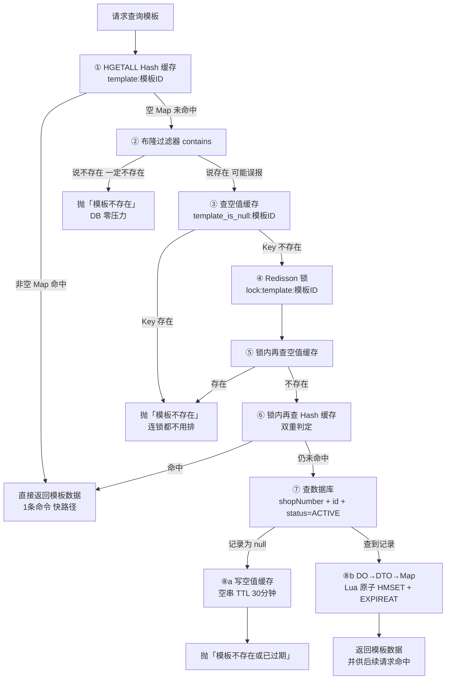
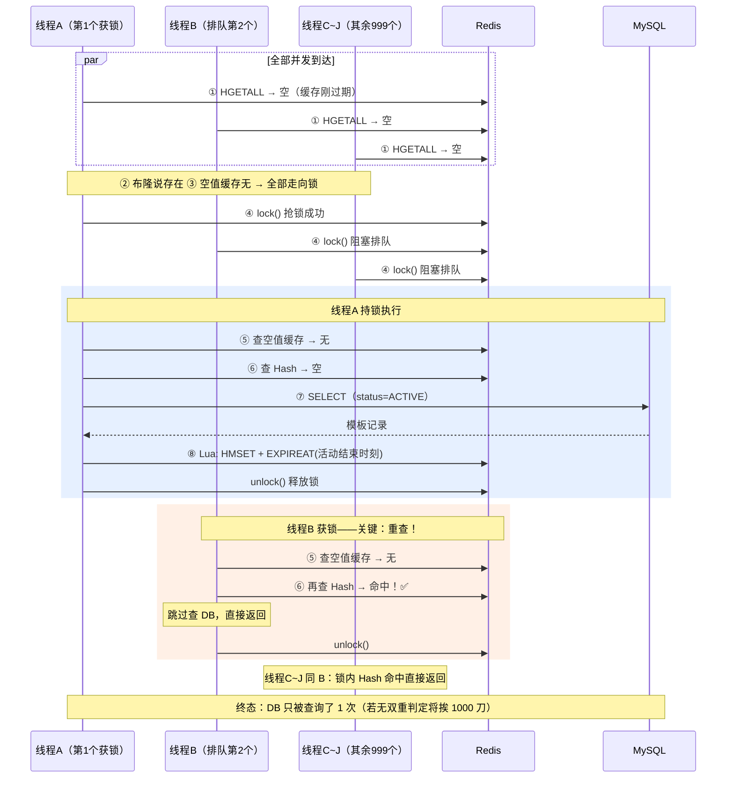
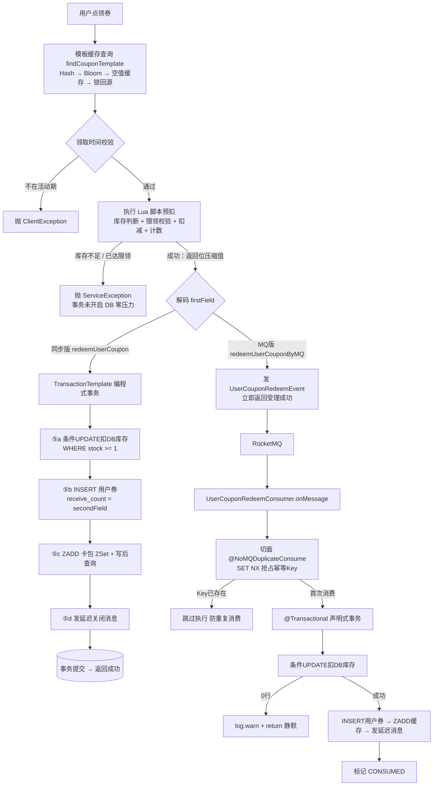
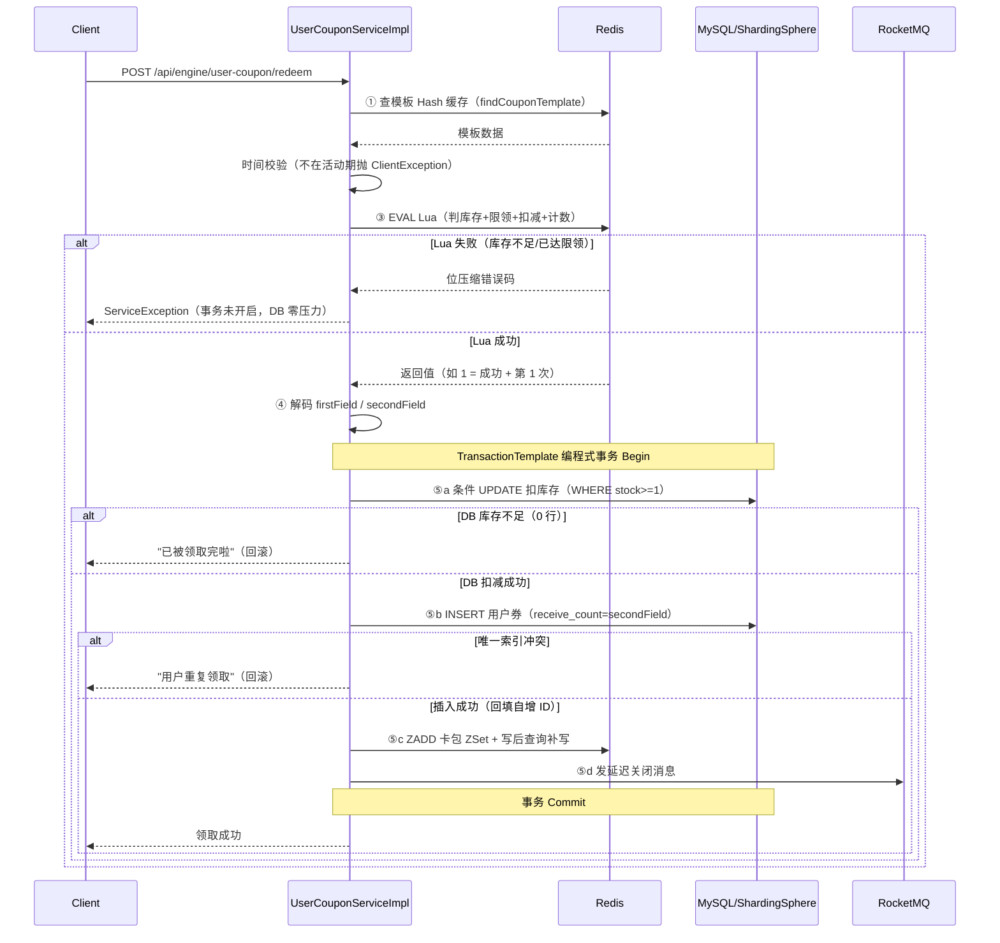
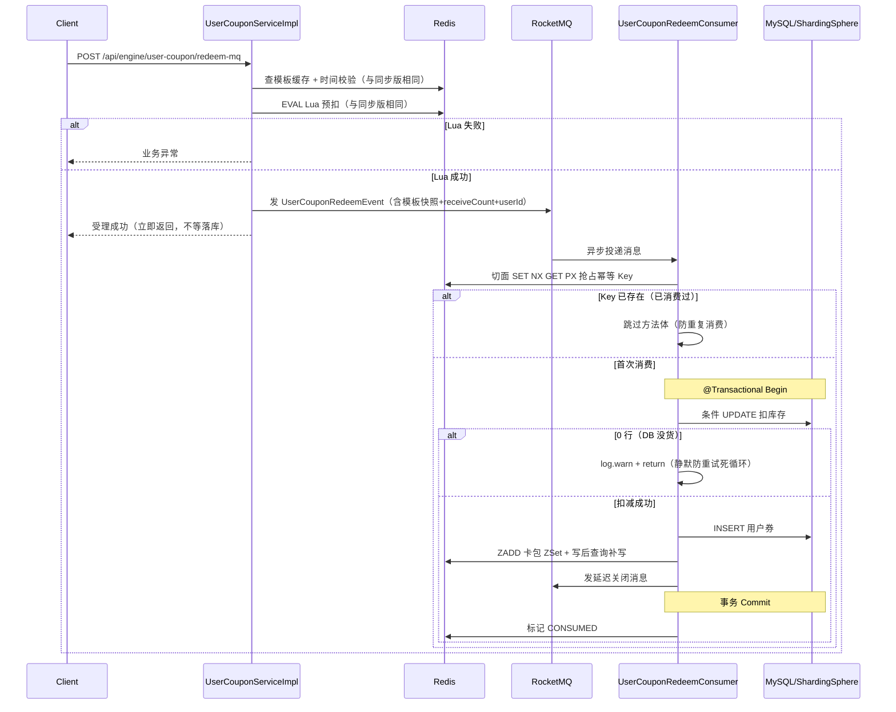
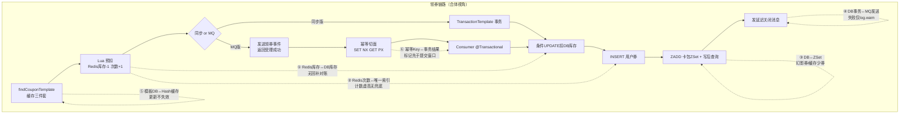
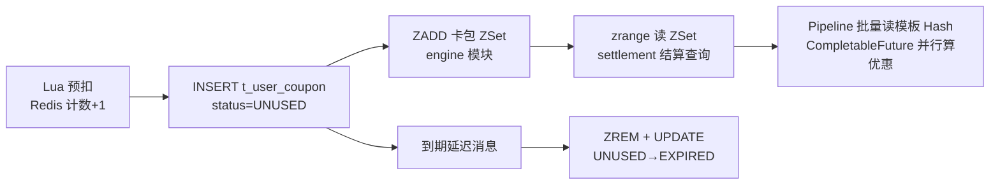

```mermaid
flowchart TD
    Root["统一优惠券平台高并发架构"]
    
    Root --> C1["01 查券链路 (findCouponTemplate)"]
    C1 --> C1_1["Hash 缓存 + 布隆过滤器 + 空值缓存"]
    C1 --> C1_2["Redisson 锁 + 双重判定防击穿"]
    C1 --> C1_3["Lua 原子打包写入 HMSET+EXPIREAT"]
    
    Root --> C2["02 领券链路 (同步与 MQ 异步)"]
    C2 --> C2_1["Lua 原子预扣四步 (位压缩状态码)"]
    C2 --> C2_2["TransactionTemplate 编程式事务 (内圈/外圈隔离)"]
    C2 --> C2_3["RocketMQ 异步削峰 + 延迟关券"]
    C2 --> C2_4["NoMQDuplicateConsumeAspect 幂等切面 (SET NX GET PX)"]
    
    Root --> C3["03 双写一致性全景"]
    C3 --> C3_1["6 处双写窗口分析与事务边界"]
    C3 --> C3_2["ZSet 卡包缓存与写后查询"]
    
    Root --> C4["04 批量分发与结算搜索"]
    C4 --> C4_1["EasyExcel 流式读 + 攒批 + 两级 MQ 削峰"]
    C4 --> C4_2["结算页 Redis Pipeline + CompletableFuture 并行试算"]
    C4 --> C4_3["用券状态机 (UNUSED → LOCKING → USED) 与 CAS 条件更新"]
    C4 --> C4_4["Canal 监听 Binlog 增量同步 ES 倒排索引"]
    
    Root --> C5["05 面试实战与避坑"]
    C5 --> C5_1["10 条速记卡 + 14 条踩坑故事"]
    C5 --> C5_2["口述纠偏与实习面试三问话术"]

    style Root fill:#4f46e5,stroke:#3730a3,color:#fff,stroke-width:2px
    style C1 fill:#f8fafc,stroke:#cbd5e1,stroke-width:1.5px
    style C2 fill:#f8fafc,stroke:#cbd5e1,stroke-width:1.5px
    style C3 fill:#f8fafc,stroke:#cbd5e1,stroke-width:1.5px
    style C4 fill:#f8fafc,stroke:#cbd5e1,stroke-width:1.5px
    style C5 fill:#f8fafc,stroke:#cbd5e1,stroke-width:1.5px
```

# 统一优惠券平台主链路总整合

> 整合来源：day1.md（查券 + 领券链路）与 2-汇总.md（分发 + 结算 + 状态机 + 搜索），两份原文档保留不动，本文为上传/复习用的独立合并版。
> 代码约定：**所有代码直接内联贴出，不使用本地文件链接**（方便上传网站阅读）。
> 冲突裁决（已对代码核实）：
> - `t_user_coupon` 分表数为 **32 张**（`ds_${0..1}.t_user_coupon_${0..31}`，engine/distribution 两模块一致）；早期笔记中"16 张"为笔误。
> - 券状态枚举有两个：engine 模块 `UserCouponStatusEnum`（UNUSED=0 / LOCKING=1 / USED=2 / EXPIRED）与 distribution 模块 `CouponStatusEnum`（EFFECTIVE=0 / ENDED=1）——**两个模块各自定义，落库值都是 0，语义都是"可用"**，不是冲突。

---

## 〇、项目全景：一张券的一生

用用户"小张"的经历串起全部链路：

```text
【查券】小张点开活动页，看到"满100减20"模板 → 缓存三件套秒回
   │
【领券】小张点"领取" → Lua 原子预扣 → 同步落库 / MQ 异步落库
   │        （另一条来路：老王水果店上传 12000 人 Excel 批量分发）
   v
小张的券包里多了一张券（DB: t_user_coupon + Redis: user:{userId} ZSet）
   │
【结算查询】小张下单一单 80 元的订单，结算页问：
   │        "这单哪些券能用？最多省多少？" → 展示可用/不可用列表
   v
【用券状态机】小张选中那张券下单：
   │        券状态 UNUSED → LOCKING(锁定) → USED(已用)
   │        (退款则 USED → UNUSED 还回去)
   v
【ES 搜索】小张另一次主动搜"水果券"，
            搜索结果来自 ES，ES 的数据由 Canal 监听 DB 变更自动同步
```

| 链路 | 业务问题 | 核心技术 | 所在模块 |
| :--- | :--- | :--- | :--- |
| 查券（模板查询） | 热点模板查询怎么不打垮 DB | 缓存三件套 + 双重判定 + Lua 原子写 | engine |
| 领券（同步/MQ 两版） | 用户怎么把券抢到手且不超发 | Lua 原子扣减 + 事务 + 唯一索引 + 幂等切面 | engine |
| 批量分发 | 怎么给百万人安全发券 | EasyExcel 流式读 + Lua 原子扣减 + 攒批 + 两级 MQ | distribution |
| 结算查询 | 下单时怎么快速算出可用券 | Redis Pipeline + CompletableFuture 并行 | settlement |
| 用券状态机 | 一张券从锁定到核销怎么不出错 | 分布式锁 + 条件更新(CAS) + 编程式事务 | engine |
| ES 搜索 | 模板变了搜索怎么近实时更新 | Canal 监听 Binlog + MQ + ES | search |

### 分库分表真实拓扑（ShardingSphere，读配置核实）

```yaml
# engine 模块 shardingsphere-config.yaml
t_coupon_template:  ds_${0..1}.t_coupon_template_${0..15}    # 2 库 16 表，按 shop_number
t_user_coupon:      ds_${0..1}.t_user_coupon_${0..31}        # 2 库 32 表，按 user_id
t_coupon_settlement: ds_${0..1}.t_coupon_settlement_${0..15} # 2 库 16 表，按 user_id
```

> 面试一句话：**模板按店铺分片（16 表），用户券/结算单按用户分片（用户券 32 表、结算单 16 表），每张 t_user_coupon_N 都带 `(user_id, coupon_template_id, receive_count)` 复合唯一索引兜底防重。**

### 一图流：查券 + 领券（Day1 主线）

```text
用户请求领券
    │
    ▼
┌─────────────── 查券链路（findCouponTemplate）───────────────┐
│ Hash 命中? ──是──► 返回（99% 流量止步于此，一条 HGETALL）        │
│   │否                                                        │
│ 布隆说不存在? ──是──► 抛异常（DB 零压力）                       │
│   │说存在(可能误报)                                            │
│ 空值缓存存在? ──是──► 抛异常                                   │
│   │否                                                        │
│ 拿锁 → 锁内再查空值缓存、再查 Hash（双重判定）→ 都落空才查 DB    │
│   DB 有 → Lua 原子写 Hash 缓存（TTL=活动结束）                  │
│   DB 无 → 写空值缓存 30 分钟                                   │
└──────────────────────────┬─────────────────────────────────┘
                           │ 返回模板数据
                           ▼
┌─────────────── 领券链路 ───────────────────────────────────┐
│ 时间校验（不在活动期抛异常）                                    │
│ Lua 原子四件事：判库存+扣库存(HINCRBY)+判上限+计数(INCR)        │
│   失败 → 抛异常（事务未开启，DB 零压力）                        │
│   成功 → 返回位压缩值（状态码×2^14 + 次数）                     │
│                                                              │
│ ── 分叉点：Lua 成功之后的那一行 ──                              │
│ 同步版: TransactionTemplate 编程式事务                          │
│   ⑤a 条件UPDATE扣DB库存 → ⑤b INSERT用户券 → ⑤c ZADD卡包        │
│   → ⑤d 发延迟关闭消息 → 提交 → 用户拿到真实结果                 │
│ MQ 版: 发 UserCouponRedeemEvent → 立即返回"受理成功"            │
│   消费者: 幂等切面(SET NX GET PX) → @Transactional 事务         │
│   → 条件UPDATE → INSERT → ZADD → 发延迟消息 → 标记CONSUMED      │
└────────────────────────────────────────────────────────────┘
```

**领券的本质**（一句话）：三个资源上的三个动作——扣减模板配额（Redis 先扣挡流量、DB 条件 UPDATE 兜底）、铸造用户券实例（唯一索引防重）、维护卡包索引（ZSet + 写后查询）。**模板 ≠ 券**：模板是商家的规则和配额计数器，用户真正拥有的是 t_user_coupon 那一行。

---

# 第一部分：查券链路（findCouponTemplate 缓存三件套）

> 命名纠正：这条链路的准确说法是**查优惠券模板链路**——查的是模板（t_coupon_template 的规则 + 配额计数器 + 活动时间），不是用户手中那张券实例（t_user_coupon，由领券链路铸造）。**模板 = 规则与配额；券 = 用户名下的一行记录。**

## 1.1 十步完整流程（背诵版）

```text
── 锁外 ──────────────────────────────
1. 查 Hash 缓存         命中 → 直接返回
2. 查布隆               说不存在 → 抛异常
3. 查空值缓存           存在 → 抛异常
4. 拿锁排队

── 锁内（每个拿到锁的线程都跑）─────────
5. 再查空值缓存          存在 → 抛异常          ← 第 1 道
6. 再查 Hash             命中 → 直接返回        ← 第 2 道
7. 两道都落空 → 才查 DB
8. DB 有  → Lua 原子写 Hash 缓存
9. DB 无  → 写空值缓存 30 分钟 → 抛异常
10. 释放锁

```

一句话定位：**用"Hash 缓存 + 布隆过滤器 + 空值缓存 + 分布式锁 + 双重判定 + Lua 原子写"六层结构，把热点模板查询的 DB 压力压到接近零**。

核心代码（findCouponTemplate，精简注释版）：

```java
public CouponTemplateQueryRespDTO findCouponTemplate(CouponTemplateQueryReqDTO requestParam) {
    String couponTemplateCacheKey = StrUtil.nullToEmpty(requestParam.getCouponTemplateId());
    Map<Object, Object> couponTemplateCacheMap = stringRedisTemplate.opsForHash().entries(couponTemplateCacheKey);

    // 如果存在直接返回，不存在需要通过布隆过滤器、缓存空值以及双重判定锁的形式读取数据库中的记录
    if (MapUtil.isEmpty(couponTemplateCacheMap)) {
        // 判断布隆过滤器是否存在指定模板 ID，不存在直接返回错误
        if (!couponTemplateQueryBloomFilter.contains(requestParam.getCouponTemplateId())) {
            throw new ClientException("优惠券模板不存在");
        }

        // 查询 Redis 缓存中是否存在优惠券模板空值信息，如果有代表模板不存在，直接返回
        String couponTemplateIsNullCacheKey = ...;
        Boolean hasKeyFlag = stringRedisTemplate.hasKey(couponTemplateIsNullCacheKey);
        if (hasKeyFlag) {
            throw new ClientException("优惠券模板不存在");
        }

        // 获取优惠券模板分布式锁
        RLock lock = redissonClient.getLock(String.format(EngineRedisConstant.LOCK_COUPON_TEMPLATE_KEY, requestParam.getCouponTemplateId()));
        lock.lock();

        try {
            // 双重判定空值缓存是否存在，存在则继续抛异常
            hasKeyFlag = stringRedisTemplate.hasKey(couponTemplateIsNullCacheKey);
            if (hasKeyFlag) {
                throw new ClientException("优惠券模板不存在");
            }

            // 通过双重判定锁优化大量请求无意义查询数据库
            couponTemplateCacheMap = stringRedisTemplate.opsForHash().entries(couponTemplateCacheKey);
            if (MapUtil.isEmpty(couponTemplateCacheMap)) {
                LambdaQueryWrapper<CouponTemplateDO> queryWrapper = Wrappers.lambdaQuery(CouponTemplateDO.class)
                        .eq(CouponTemplateDO::getShopNumber, Long.parseLong(requestParam.getShopNumber()))
                        .eq(CouponTemplateDO::getId, Long.parseLong(requestParam.getCouponTemplateId()))
                        .eq(CouponTemplateDO::getStatus, CouponTemplateStatusEnum.ACTIVE.getStatus());
                CouponTemplateDO couponTemplateDO = couponTemplateMapper.selectOne(queryWrapper);

                // 优惠券模板不存在或者已过期加入空值缓存，并且抛出异常
                if (couponTemplateDO == null) {
                    stringRedisTemplate.opsForValue().set(couponTemplateIsNullCacheKey, "", 30, TimeUnit.MINUTES);
                    throw new ClientException("优惠券模板不存在或已过期");
                }

                // 通过将数据库的记录序列化成 JSON 字符串放入 Redis 缓存
                CouponTemplateQueryRespDTO actualRespDTO = BeanUtil.toBean(couponTemplateDO, CouponTemplateQueryRespDTO.class);
                Map<String, Object> cacheTargetMap = BeanUtil.beanToMap(actualRespDTO, false, true);
                Map<String, String> actualCacheTargetMap = cacheTargetMap.entrySet().stream()
                        .collect(Collectors.toMap(
                                Map.Entry::getKey,
                                entry -> entry.getValue() != null ? entry.getValue().toString() : ""
                        ));

                // 通过 LUA 脚本执行设置 Hash 数据以及设置过期时间（详见 1.6）
                String luaScript = "redis.call('HMSET', KEYS[1], unpack(ARGV, 1, #ARGV - 1)) " +
                        "redis.call('EXPIREAT', KEYS[1], ARGV[#ARGV])";

                List<String> keys = Collections.singletonList(couponTemplateCacheKey);
                List<String> args = new ArrayList<>(actualCacheTargetMap.size() * 2 + 1);
                actualCacheTargetMap.forEach((key, value) -> {
                    args.add(key);
                    args.add(value);
                });
                // 优惠券活动过期时间转换为秒级别的 Unix 时间戳
                args.add(String.valueOf(couponTemplateDO.getValidEndTime().getTime() / 1000));

                stringRedisTemplate.execute(new DefaultRedisScript<>(luaScript, Long.class), keys, args.toArray());
                // ... 返回缓存数据
            }
        } finally {
            lock.unlock();
        }
    }
    return BeanUtil.toBean(couponTemplateCacheMap, CouponTemplateQueryRespDTO.class);
}
```

## 1.2 缓存三件套对三类问题的分工

| 问题 | 定义 | 解法 |
| :--- | :--- | :--- |
| 穿透 | 查**不存在**的数据，缓存永远不命中 | 布隆 + 空值缓存双层 |
| 击穿 | **热点** Key 失效瞬间并发打 DB | 分布式锁 + 双重判定 |
| 雪崩 | 大批 Key **同时**失效 | EXPIREAT 各模板自己的活动结束时刻，天然错开 |

布隆过滤器两个特性（必背）：说"**不存在**"→ 一定不存在（无漏报）；说"存在"→ **可能不存在**（有误报率）。误报由空值缓存接住。布隆不能删元素 → "模板被删"场景必须靠空值缓存兜底。

**两层否定怎么分工**（顺序不能反：布隆在前、空值在后）：

| 层 | 挡谁 | 凭什么判 | 特性 |
| :--- | :--- | :--- | :--- |
| 布隆 | 挡"**从来没存在过**"的 ID | 从未被预热过（无成本判死刑） | **无漏报**：说没有一定没有 |
| 空值缓存 | 挡"**存在过但已没了**"（status≠ACTIVE 过期 / 被删） | 查过 DB 确认没有才写 | **事实性否定** |
| DB（`status='ACTIVE'`） | 最终确认 | where 带活动状态 | 过期模板在 DB 侧也返回 null |

关键：布隆对**被删掉的模板无能为力**（删不了元素），所以"模板被删/过期"必须由空值缓存兜底。DB 查询条件里的 `status='ACTIVE'` 让"过期"和"不存在"都落空值缓存——两条路径语义对齐。

## 1.3 两个 Redis Key 的身份证（易混点）

| | Hash 缓存 | 空值缓存 |
| :--- | :--- | :--- |
| Key 模板 | `template:{模板ID}` | `template_is_null:{模板ID}` |
| Redis 类型 | **Hash** | **String** |
| 里面装什么 | 模板 13 个字段（真实数据） | 空字符串 `""`（只是个标记，值毫无意义） |
| 什么时候写 | DB 里**查得到** | DB 里**查不到** |
| TTL | `EXPIREAT` 活动结束时刻 | 固定 30 分钟 |

**分工语义**：布隆挡"从来没存在过"（对删掉的模板无能为力），空值缓存挡"查过 DB 确认没有"（含 status≠ACTIVE 的过期活动）。99% 流量在**第 1 步 Hash 命中**返回；布隆拦截的从来是不存在的攻击流量。

redis-cli 实景（对同一模板 ID，两个 Key 最多只有一个存在，互斥）：

```text
── 模板存在 ──
127.0.0.1:6379> HGETALL one-coupon_engine:template:1813157245480796160
 1) "id"       "1813157245480796160"
 2) "name"     "满100减20"
 3) "stock"    "99"          ← 领券 Lua HINCRBY 扣的就是它
 ...（共 13 个 field，全为字符串，null → ""）

── 模板不存在 ──
127.0.0.1:6379> GET one-coupon_engine:template_is_null:9999999999999999999
""              ← 值是空串，没人关心它是什么
127.0.0.1:6379> TTL one-coupon_engine:template_is_null:9999999999999999999
(integer) 1798  ← 约 30 分钟后自动消失
```

**为什么空值不写进 Hash 里**（如加个 `"isNull":"true"` 字段）？会污染快路径——`HGETALL` 返回非空 Map → 代码以为命中 → 转出残废 Bean → NPE。必须独立 Key + 独立类型物理分开。

**Hash 的 Value 精确表述**：不是"DB 整行记录"，而是 **DB 行 → DO → DTO → Map 三跳后的形态**（13 字段、全字符串、null 转空串）。多出的 DTO 一跳为了裁剪（审计字段不进缓存）、类型友好（Long→String）、分层隔离。

## 1.4 双重判定（最难理解的点）

**核心：你在锁外看到的"缓存没有数据"，等你排到队拿到锁时，可能已经不是事实了——排队期间，前面的线程可能已经把缓存建好了。**

反例推演（无锁内重查，1000 并发）：1000 个线程都发现缓存为空 → 全部排队抢锁 → 线程 A 拿锁查 DB 建缓存 → 线程 B 拿锁**不重查**直接查 DB……终态：DB 挨 1000 刀——锁只做到"排队挨刀"，没做到"免刀"。

正解：锁内两道检查，各接住第一个持锁线程的一种结局——

| 线程 A 的结局 | A 留下了什么 | 后续线程靠哪道接住 |
| :--- | :--- | :--- |
| 查 DB **有** | Hash 缓存 | 锁内重查 Hash → 命中 |
| 查 DB **无** | 空值缓存 | 锁内重查空值 → 存在 |

认知纠偏：① 锁外还有一次空值缓存检查——不存在模板的请求连锁都不用排；② 锁内两道对所有线程一视同仁，"第一个/后续"的区别是运行时涌现的；③ "双重判定"本意 = 同一个检查锁外锁内各做一遍（与单例 DCL 的 `if(instance==null)` 出现两次完全同构）。

**两处易讲歪的点**：
- **空值缓存未命中 ≠ 模板一定存在**：它只说明"缓存层没拦下"。可能是**第一次来的请求**、也可能是**布隆误报后第一次路过**——不能断言"一定有"，只能得出"该拿锁去 DB 确认了"。
- **双重判定防的不是排队串行**（排队串行是分布式锁的固有代价，省不掉），防的是"**串行拿到锁后每个人仍去查 DB**"。精确表述：双重判定让后拿锁的线程在锁内重查缓存直接返回，**DB 只被第一个线程查一次**——1000 个请求照样排队，但 DB 从挨 1000 刀变成挨 1 刀。

生活类比（食堂打饭）：路过窗口看一眼没饭（Hash）→ 排队催厨师（拿锁）→ **轮到你时再看一眼窗口**（锁内重查 Hash）——前面的人已经催出一锅饭了，别再让厨师做一锅。"厨师说没这菜"→ 前面的人贴了告示（锁内空值缓存），看告示就走。厨窗排队是分布式锁的固有代价省不掉，双重判定省的是"排到队后还让厨师各做一次饭"。

## 1.5 TTL 策略

| Key | 过期策略 |
| :--- | :--- |
| Hash 缓存 | **`EXPIREAT` 到活动结束时刻**（秒级绝对时间戳） |
| 空值缓存 | 固定 30 分钟（防御强度 vs 时效性的权衡） |
| 分布式锁 | 无显式 TTL——Redisson 看门狗续期 |
| 布隆 | 永不过期 |

**追问：Hash 为什么锚定活动结束时刻？** ① 业务同生共死；② 各模板 validEndTime 天然不同 → 防雪崩；③ EXPIREAT（绝对）优于 EXPIRE（相对）——重建时刻不同过期点不漂移。

**TTL 来源别讲串**：模板 Hash 的过期 = **EXPIREAT 锚定活动结束（绝对时间戳）**；而"当前时间 + 有效期"这种**相对值**（EXPIRE）是**用户券的过期时刻**（领券时刻 + validityPeriod，延迟关券消息用它），跟模板缓存不是一个东西。口诀：**模板缓存放"活动结束"，用户券放"领券时刻 + 效期"。**

**追问：活动结束瞬间发生什么？** Hash 蒸发 → 首请求查 DB → status 已不是 ACTIVE（查询条件）→ null → 写空值缓存 30 分钟 → 之后所有请求空值命中直接拒绝。`status=ACTIVE` 条件让"活动结束"在 DB 侧也表现为"不存在"，两条路径语义对齐。

**追问（最高分点）：`stock` 是半缓存半状态**

Hash 缓存 13 个字段里 12 个是**纯缓存**（DB 只读副本，删了重建无损），**stock 是状态**——领券 Lua 的 `HINCRBY -1` 在持续原子扣减的预扣计数器。

```text
Redis:  stock 100 → 99 → 98 → ...   （Lua 秒扣）
DB:     stock 100 ......... → 99     （滞后落地）
              ↑ 窗口内 Redis 值 < DB 值，差值 = 在途预扣量
```

删缓存重建（初始 100，Redis 已扣到 0，DB 只落地 50）：重建查 DB 得 50 写回 → 在途 50 个扣减被"还回去" → Redis 再放 50 人 → 到 DB 条件 UPDATE 时库存已 0 → 抛"已被领取完啦"。**不是超卖**（DB 条件 UPDATE 兜底），是**尾部用户空欢喜**的体验事故。

**措辞提醒**：别把"Redis 库存回涨"说成"多发券 / 超卖"——**DB 条件 UPDATE `WHERE stock>=1` 兜底，超卖不可能发生**。严谨说法：**Redis 放行量被回退（在途预扣还回去）→ Redis 显示可领但 DB 已没货 → 尾部用户过了闸门却领不到（空欢喜）。** 只伤尾部体验、不超卖。

本质区分：**缓存 = 可随时从源头重建的数据副本；状态 = 承载了源头没有的增量信息的业务数据**。"已扣未落地"信息只存在于 Redis，DB 不知道，所以不可重建。

## 1.6 为什么用 Lua 包 HMSET + EXPIREAT

拆成两条命令，中间崩溃会留下**没有 TTL 的永生 Key**。Lua 保证"写数据 + 设过期"原子完成。`getTime()/1000` 转秒是正确写法，与领券 Lua 毫秒直传 EXPIRE 的 Bug 形成同仓库对照组（见第二部分已知边界）。

```lua
-- 查券链路的缓存回填 Lua（Java 内拼字符串）
redis.call('HMSET', KEYS[1], unpack(ARGV, 1, #ARGV - 1))   -- 写 13 个字段
redis.call('EXPIREAT', KEYS[1], ARGV[#ARGV])               -- 最后一个参数是秒级时间戳
```

## 1.7 查券链路流程图与时序图

### 图①：findCouponTemplate 缓存三件套完整流程



### 图②：双重判定防击穿时序图（1000 并发，DB 只挨 1 刀）



---

# 第二部分：领券链路（同步版 + MQ 版）

## 2.0 领券链路全景流程图



## 2.1 Lua 脚本（第一道闸门）

完整脚本（`engine/src/main/resources/lua/stock_decrement_and_save_user_receive.lua`）：

```lua
-- Lua 脚本: 检查用户是否达到优惠券领取上限并记录领取次数
-- KEYS[1]: 优惠券库存键（模板 Hash，含 stock 字段）
-- KEYS[2]: 用户领取记录键
-- ARGV[1]: 优惠券有效期结束时间 (timestamp)
-- ARGV[2]: 用户领取上限 (limit)

local function combineFields(firstField, secondField)
    local SECOND_FIELD_BITS = 14   -- secondField 最大 9999，14 位足够
    local shiftedFirstField = firstField * (2 ^ SECOND_FIELD_BITS)  -- Lua 5.1 无位运算，乘法模拟左移
    return shiftedFirstField + secondField
end

-- 获取当前库存
local stock = tonumber(redis.call('HGET', KEYS[1], 'stock'))

-- 判断库存是否大于 0
if stock <= 0 then
    return combineFields(1, 0) -- 库存不足
end

-- 获取用户领取的优惠券次数
local userCouponCount = tonumber(redis.call('GET', KEYS[2]))
if userCouponCount == nil then
    userCouponCount = 0
end

-- 判断用户是否已经达到领取上限
if userCouponCount >= tonumber(ARGV[2]) then
    return combineFields(2, userCouponCount) -- 用户已经达到领取上限
end

-- 增加用户领取的优惠券次数
if userCouponCount == 0 then
    redis.call('SET', KEYS[2], 1)        -- 首次：SET 1
    redis.call('EXPIRE', KEYS[2], ARGV[1])  -- ⚠️ 毫秒传给秒参数的 Bug 来源
else
    redis.call('INCR', KEYS[2])          -- 后续：只 INCR 不刷新 TTL
end

-- 减少优惠券库存
redis.call('HINCRBY', KEYS[1], 'stock', -1)

return combineFields(0, userCouponCount + 1)
```

### 参数映射

| Lua 参数 | Java 变量 | 运行时实际值 |
| :--- | :--- | :--- |
| `KEYS[1]` | `couponTemplateCacheKey` | 模板 Hash（含 stock 字段）——**正是查券链路建的缓存** |
| `KEYS[2]` | `userCouponTemplateLimitCacheKey` | 用户次数 String |
| `ARGV[1]` | `validEndTime().getTime()` ⚠️ | 毫秒时间戳（**单位 Bug 来源**） |
| `ARGV[2]` | `receiveRule.limitPerPerson` | 限领数 |

### 返回值位压缩

```
返回值 = firstField × 2^14 + secondField
         ↑ 高2位：状态码         ↑ 低14位：领取次数
0=成功 / 1=库存不足 / 2=已达限领
```

十进制类比：`门牌号 = 楼层 × 100 + 房间号`（305 = 3楼05房）。Java 端 `>>14 & 0b11` 取状态、`& 16383` 取次数。隐含契约：secondField ≤ 16383，否则溢出污染状态位。

**术语辨析**：KEYS/ARGV 是**输入**（Java → Lua，"你问 Redis 什么"），firstField/secondField 是**输出**（Lua → Java，"Redis 答了你什么"）。项目中 "field" 一词出现三次，别混：① Redis Hash 的 field（如 `'stock'`）；② 返回值的 firstField/secondField（状态码/次数）；③ KEYS/ARGV 的形参约定。

### 关键设计

1. **原子性**：判断+扣减必须在同一脚本内（check-then-act 竞态 → 超卖/超领）
2. **首次 `SET 1 + EXPIRE`，后续只 `INCR`**：INCR 不设 TTL（避免每次刷新变滑动窗口）；只在首次锚定 = 固定窗口跟随活动结束
3. **成功返回新次数（`count+1`）**：写入 `t_user_coupon.receive_count`，参与复合唯一索引——**Lua 计数与 DB 唯一索引通过该字段咬合**

### 已知边界

| 问题 | 位置 | 说明 |
| :--- | :--- | :--- |
| EXPIRE 单位 Bug | Lua 脚本 `EXPIRE` 行 | 毫秒传给秒参数 → 约 5 万年 TTL |
| stock nil 防御缺失 | Lua 脚本 `HGET` 行 | Hash Key 不存在 → Lua 运行时错误 |
| Redis Cluster 不可用 | — | 两个 Key 无公共 hash tag → CROSSSLOT |
| 代码重复 | 两个领券方法间 | Lua 加载+组 Key+执行逐行复制 |

## 2.2 同步版 redeemUserCoupon（五阶段）

```java
@Override
public void redeemUserCoupon(CouponTemplateRedeemReqDTO requestParam) {
    // ① 模板缓存查询 + 领取时间校验（事务外，纯读）
    CouponTemplateQueryRespDTO couponTemplate = couponTemplateService.findCouponTemplate(...);
    boolean isInTime = DateUtil.isIn(new Date(), couponTemplate.getValidStartTime(), couponTemplate.getValidEndTime());
    if (!isInTime) {
        throw new ClientException("不满足优惠券领取时间");
    }

    // ② Lua 脚本懒加载（Hutool Singleton + EVALSHA）
    DefaultRedisScript<Long> buildLuaScript = Singleton.get(STOCK_DECREMENT_AND_SAVE_USER_RECEIVE_LUA_PATH, () -> {
        DefaultRedisScript<Long> redisScript = new DefaultRedisScript<>();
        redisScript.setScriptSource(new ResourceScriptSource(new ClassPathResource(STOCK_DECREMENT_AND_SAVE_USER_RECEIVE_LUA_PATH)));
        redisScript.setResultType(Long.class);
        return redisScript;
    });

    // ③ 执行 Lua：原子预扣 Redis 库存 + 次数校验
    Long stockDecrementLuaResult = stringRedisTemplate.execute(
            buildLuaScript,
            ListUtil.of(couponTemplateCacheKey, userCouponTemplateLimitCacheKey),
            String.valueOf(couponTemplate.getValidEndTime().getTime()), limitPerPerson
    );

    // ④ 解码返回值，失败快速抛出（事务未开启，DB 零压力）
    long firstField = StockDecrementReturnCombinedUtil.extractFirstField(stockDecrementLuaResult);
    if (RedisStockDecrementErrorEnum.isFail(firstField)) {
        throw new ServiceException(RedisStockDecrementErrorEnum.fromType(firstField));
    }

    // ⑤ TransactionTemplate 编程式事务
    long extractSecondField = StockDecrementReturnCombinedUtil.extractSecondField(stockDecrementLuaResult);
    transactionTemplate.executeWithoutResult(status -> {
        try {
            // ⑤a 条件 UPDATE 扣 DB 库存
            int decremented = couponTemplateMapper.decrementCouponTemplateStock(
                    Long.parseLong(requestParam.getShopNumber()), Long.parseLong(requestParam.getCouponTemplateId()), 1L);
            if (!SqlHelper.retBool(decremented)) {
                throw new ServiceException("优惠券已被领取完啦");
            }

            // ⑤b 插入用户券
            Date now = new Date();
            DateTime validEndTime = DateUtil.offsetHour(now, JSON.parseObject(couponTemplate.getConsumeRule()).getInteger("validityPeriod"));
            UserCouponDO userCouponDO = UserCouponDO.builder()
                    .couponTemplateId(Long.parseLong(requestParam.getCouponTemplateId()))
                    .userId(Long.parseLong(UserContext.getUserId()))
                    .source(requestParam.getSource())
                    .receiveCount(Long.valueOf(extractSecondField).intValue())
                    .status(UserCouponStatusEnum.UNUSED.getCode())
                    .receiveTime(now)
                    .validStartTime(now)
                    .validEndTime(validEndTime)
                    .build();
            userCouponMapper.insert(userCouponDO);

            // ⑤c direct 模式写 ZSet 卡包 + 写后查询
            if (StrUtil.equals(userCouponListSaveCacheType, "direct")) {
                String userCouponListCacheKey = String.format(EngineRedisConstant.USER_COUPON_TEMPLATE_LIST_KEY, UserContext.getUserId());
                String userCouponItemCacheKey = StrUtil.builder()
                        .append(requestParam.getCouponTemplateId()).append("_").append(userCouponDO.getId())
                        .toString();
                stringRedisTemplate.opsForZSet().add(userCouponListCacheKey, userCouponItemCacheKey, now.getTime());

                // 写后查询：防 Redis 主从异步复制的静默丢失
                Double scored;
                try {
                    scored = stringRedisTemplate.opsForZSet().score(userCouponListCacheKey, userCouponItemCacheKey);
                    if (scored == null) {
                        stringRedisTemplate.opsForZSet().add(userCouponListCacheKey, userCouponItemCacheKey, now.getTime());
                    }
                } catch (Throwable ex) {
                    log.warn("查询Redis用户优惠券记录为空或抛异常，可能Redis宕机或主从复制数据丢失，基础错误信息：{}", ex.getMessage());
                    stringRedisTemplate.opsForZSet().add(userCouponListCacheKey, userCouponItemCacheKey, now.getTime());
                }

                // ⑤d 发送到期关闭延迟消息
                UserCouponDelayCloseEvent userCouponDelayCloseEvent = UserCouponDelayCloseEvent.builder()
                        .couponTemplateId(requestParam.getCouponTemplateId())
                        .userCouponId(String.valueOf(userCouponDO.getId()))
                        .userId(UserContext.getUserId())
                        .delayTime(validEndTime.getTime())
                        .build();
                SendResult sendResult = couponDelayCloseProducer.sendMessage(userCouponDelayCloseEvent);

                // 发送消息失败：打印日志并报警，通过日志搜集并重新投递
                if (ObjectUtil.notEqual(sendResult.getSendStatus().name(), "SEND_OK")) {
                    log.warn("发送优惠券关闭延时队列失败，消息参数：{}", JSON.toJSONString(userCouponDelayCloseEvent));
                }
            }
        } catch (Exception ex) {
            status.setRollbackOnly();   // ⑤e 异常翻译 + 回滚
            if (ex instanceof ServiceException) {
                throw (ServiceException) ex;
            }
            if (ex instanceof DuplicateKeyException) {
                log.error("用户重复领取优惠券，用户ID：{}，优惠券模板ID：{}", UserContext.getUserId(), requestParam.getCouponTemplateId());
                throw new ServiceException("用户重复领取优惠券");
            }
            throw new ServiceException("优惠券领取异常，请稍候再试");
        }
    });
}
```

### 事务圈内圈外（全项目最重要的图）

```text
┌─ 事务圈外（占时间不占事务）─────┐   ┌─ 事务圈内 ─────────────────┐
│ ① 查模板缓存（Redis 读）         │   │ ⑤a 扣 DB 库存   ←可回滚 ✓  │
│ ③ Lua 预扣（Redis 写）           │   │ ⑤b 插用户券     ←可回滚 ✓  │
│ ④ 解码返回值                     │   │ ⑤c 写 ZSet      ←❌回滚不了 │
│                                  │   │ ⑤d 发延迟消息    ←❌回滚不了 │
└──────────────────────────────────┘   └─────────────────────────────┘
```

- **圈内 ≠ 能回滚**：事务原子性只对 ⑤a⑤b 两条 MySQL 语句生效
- **⑤c⑤d 为什么在圈内**：依赖 ⑤b 插入后回填的自增 ID（`userCouponDO.getId()`）
- **代价**：⑤d 抛未捕获异常 → DB 回滚但 ZSet 已写 → **幻影券**
- **为什么用 TransactionTemplate 不用 @Transactional**：事务前有大量 Redis IO，注解会白占 DB 连接；编程式边界精确可控

### 四道防线

| 防线 | 防什么 | 类型 |
| :--- | :--- | :--- |
| ① Lua 原子校验 | 超卖、超领，挡掉 99% 无效请求 | 性能闸门 |
| ② DB 条件 UPDATE | Redis/DB 库存漂移时防超卖 | 正确性 |
| ③ 复合唯一索引 | Redis 计数丢失时防重复领取 | 正确性（物理约束） |
| ④ 写后查询 | Redis 主从复制静默丢失 | 提高成功率（非保证） |

```sql
UPDATE t_coupon_template SET stock = stock - 1
WHERE shop_number = #{shopNumber} AND id = #{couponTemplateId}
  AND stock >= 1        -- 扣减条件写进 WHERE，防 check-then-act 竞态
```

### 四个场景例子（用户 1024，模板 T，库存 100，限领 3）

| 场景 | 拦截者 | 结果 |
| :--- | :--- | :--- |
| Happy Path 首次领取 | — | Lua 返回 1 → DB 扣到 99 → 插券 → ZSet → 延迟消息 → 成功 |
| 想领第 4 次 | **Lua 闸门** | firstField=2 → 抛异常，事务未开启 DB 零压力 |
| Redis 计数丢失后重复领 | **唯一索引** | Lua 放行 count=1 → INSERT 撞 (1024,T,1) → "用户重复领取" |
| Redis 有货 DB 没货 | **条件 UPDATE** | UPDATE 0 行 → "已被领取完啦"（MQ 版同场景是静默 return） |

## 2.3 MQ 版 redeemUserCouponByMQ + Consumer

### 同步版与异步版的关系（最重要的认知）

同一个"领券"业务的两套完整实现，前半段完全共享（**查券链路拿模板 → 时间校验 → 同一个 Lua 脚本预扣**），**分叉点就在 Lua 返回成功之后的那一行**——

| | 同步版 | 异步版 |
| :--- | :--- | :--- |
| Lua 成功后下一行 | `transactionTemplate.executeWithoutResult` | `userCouponRedeemProducer.sendMessage` |
| 用户拿到什么 | 真实结果（成/败都知道） | 只有"受理成功"（落库成败无感知） |
| 库存扣失败时 | 抛"已被领取完啦" | log.warn + 静默 return |
| 事务写法 | TransactionTemplate 编程式 | @Transactional 声明式 |
| 适用场景 | 低并发、需要强结果反馈 | 秒杀式高并发，MQ 削峰，最终一致 |

生产端代码（与同步版前半段相同，只贴分叉后）：

```java
@Override
public void redeemUserCouponByMQ(CouponTemplateRedeemReqDTO requestParam) {
    // ① ~ ④ 与同步版完全相同：查模板缓存 → 时间校验 → Lua 懒加载 → 执行 Lua + 解码
    // ......
    // ⑤ 分叉点：组装事件发 MQ（不碰 DB、不开事务）
    UserCouponRedeemEvent userCouponRedeemEvent = UserCouponRedeemEvent.builder()
            .requestParam(requestParam)
            .receiveCount((int) StockDecrementReturnCombinedUtil.extractSecondField(stockDecrementLuaResult))  // Lua 第二字段
            .couponTemplate(couponTemplate)   // 整个模板塞进消息（快照）
            .userId(UserContext.getUserId())
            .build();
    SendResult sendResult = userCouponRedeemProducer.sendMessage(userCouponRedeemEvent);
    // 发送消息失败：打印日志并报警，通过日志搜集并重新投递（不抛异常）
    if (ObjectUtil.notEqual(sendResult.getSendStatus().name(), "SEND_OK")) {
        log.warn("[生产者] 用户兑换优惠券 - 发送优惠券兑换消息失败，消息参数：{}", JSON.toJSONString(userCouponRedeemEvent));
    }
    // 方法正常返回 → 用户看到"受理成功"
}
```

- **receiveCount 从 Lua 第二字段（extractSecondField）取**，塞进消息，由消费者写进用户券参与复合唯一索引——Lua 计数与 DB 防重通过这个字段咬合（与同步版同口径）
- **couponTemplate 整个塞进消息**（快照）：消费者不用再查一次缓存；代价是消息体变大、用的是生产时刻的旧快照
- **为什么加 MQ**：秒杀场景 MySQL 写是瓶颈（事务持锁耗时）→ 异步把 2 次 DB 写从请求链路拆到消费端 → RT 低、吞吐高、能削峰填谷、可水平扩消费者。**代价**：用户响应里拿不到最终结果（最终一致性窗口）+ 要保证消费幂等

### 生产端发送失败的两分支（互斥，高频追问）

`redeemUserCouponByMQ` 的 `sendMessage` 没有 try-catch，一次发送只可能落入两支之一：

| | 分支 A：真抛异常 | 分支 B：非 SEND_OK |
| :--- | :--- | :--- |
| 触发 | broker 不可达/超时（syncSend 抛异常） | 消息已到 broker 但落盘/同步存疑（syncSend 正常返回，如 FLUSH_DISK_TIMEOUT） |
| 走哪 | 生产者基类 log.error 后 rethrow 上抛 | log.warn + 报警 |
| 用户看到 | **失败** | **成功**（方法正常 return） |
| Redis 状态 | 已预扣 → **少卖**（无兜底，人工对账） | 已预扣 → 一致；消息可能丢 → **日志兜底重投** |

"日志兜底重投"指把这条领券事件重新投递到同一个 topic 让消费者再处理一次，来源有二：自动（消费失败 MQ 重投同一条）与手动（非 SEND_OK 时运维/脚本从日志捞消息体重发）。

**"事务管不到 MQ"**：同步版发延迟消息失败也**不触发 DB 回滚**（非 SEND_OK 只 log.warn 不抛）；`setRollbackOnly()` 只在**抛了异常**时才执行。区分"失败是不是异常"决定走"抛"还是"记日志"。

### 消费者完整代码

```java
@NoMQDuplicateConsume(
        keyPrefix = "user-coupon-redeem:",
        key = "#messageWrapper.keys",
        keyTimeout = 600
)
@Transactional(rollbackFor = Exception.class)
@Override
public void onMessage(MessageWrapper<UserCouponRedeemEvent> messageWrapper) {
    log.info("[消费者] 用户兑换优惠券 - 执行消费逻辑，消息体：{}", JSON.toJSONString(messageWrapper));

    // 全部来自消息体（快照），不依赖线程上下文、不查缓存
    CouponTemplateRedeemReqDTO requestParam = messageWrapper.getMessage().getRequestParam();
    CouponTemplateQueryRespDTO couponTemplate = messageWrapper.getMessage().getCouponTemplate();
    String userId = messageWrapper.getMessage().getUserId();

    // 条件 UPDATE 扣 DB 库存
    int decremented = couponTemplateMapper.decrementCouponTemplateStock(
            Long.parseLong(requestParam.getShopNumber()), Long.parseLong(requestParam.getCouponTemplateId()), 1L);
    if (!SqlHelper.retBool(decremented)) {
        // 0 行：静默 return（DB stock=0 是永久状态，抛异常只会无限重试进死信）
        log.warn("[消费者] 用户兑换优惠券 - 执行消费逻辑，扣减优惠券数据库库存失败，消息体：{}", JSON.toJSONString(messageWrapper));
        return;
    }

    // 插入用户券（receiveCount 用消息里那个）
    Date now = new Date();
    DateTime validEndTime = DateUtil.offsetHour(now, JSON.parseObject(couponTemplate.getConsumeRule()).getInteger("validityPeriod"));
    UserCouponDO userCouponDO = UserCouponDO.builder()
            .couponTemplateId(Long.parseLong(requestParam.getCouponTemplateId()))
            .userId(Long.parseLong(userId))
            .source(requestParam.getSource())
            .receiveCount(messageWrapper.getMessage().getReceiveCount())
            .status(UserCouponStatusEnum.UNUSED.getCode())
            .receiveTime(now)
            .validStartTime(now)
            .validEndTime(validEndTime)
            .build();
    userCouponMapper.insert(userCouponDO);

    if (ObjectUtil.notEqual(userCouponListSaveCacheType, "binlog")) {
        // 写 ZSet 卡包
        String userCouponListCacheKey = String.format(EngineRedisConstant.USER_COUPON_TEMPLATE_LIST_KEY, userId);
        String userCouponItemCacheKey = StrUtil.builder()
                .append(requestParam.getCouponTemplateId()).append("_").append(userCouponDO.getId())
                .toString();
        stringRedisTemplate.opsForZSet().add(userCouponListCacheKey, userCouponItemCacheKey, now.getTime());

        // 写后查询：防主从异步复制静默丢失
        Double scored;
        try {
            scored = stringRedisTemplate.opsForZSet().score(userCouponListCacheKey, userCouponItemCacheKey);
            if (scored == null) {
                stringRedisTemplate.opsForZSet().add(userCouponListCacheKey, userCouponItemCacheKey, now.getTime());
            }
        } catch (Throwable ex) {
            log.warn("[消费者] ... 可能Redis宕机或主从复制数据丢失，基础错误信息：{}", ex.getMessage());
            stringRedisTemplate.opsForZSet().add(userCouponListCacheKey, userCouponItemCacheKey, now.getTime());
        }
    }

    // 发延迟关券消息
    UserCouponDelayCloseEvent userCouponDelayCloseEvent = UserCouponDelayCloseEvent.builder()
            .couponTemplateId(requestParam.getCouponTemplateId())
            .userCouponId(String.valueOf(userCouponDO.getId()))
            .userId(userId)
            .delayTime(validEndTime.getTime())
            .build();
    SendResult sendResult = couponDelayCloseProducer.sendMessage(userCouponDelayCloseEvent);
    if (ObjectUtil.notEqual(sendResult.getSendStatus().name(), "SEND_OK")) {
        log.warn("[消费者] 用户兑换优惠券 - 发送优惠券关闭延时队列失败，消息参数：{}", JSON.toJSONString(userCouponDelayCloseEvent));
    }
}
```

### 消费者注解栈（三层盔甲）

| 注解 | 作用 |
| :--- | :--- |
| `@RocketMQMessageListener` | 声明式订阅 topic + 消费组 |
| `@NoMQDuplicateConsume` | **消息级幂等**：SpEL 取 `messageWrapper.keys`，Lua `SET NX GET PX` 抢占，TTL 600 |
| `@Transactional(rollbackFor)` | 声明式事务包全程 |

**为什么消费者敢用 @Transactional**：消息体自带模板快照、receiveCount、userId（生产端塞入），方法第一行就是 DB 操作，零缓存查询——整个方法都是事务该包的内容。

### 相对同步版的三个异步改造

1. **幂等切面挡重复投递**：没有切面会撞唯一索引 → 异常 → 删幂等 Key → MQ 重投 → **死循环**。切面不是优化，是止损
2. **静默 return 止损无效重试**：DB stock=0 是永久状态，抛异常只会无限重试进死信。代价：用户以为领到了（Redis 次数已 +1），DB 永远没有这张券
3. **消息快照消除缓存依赖**：消费者不查任何缓存；代价是消息体变大、用的是生产时刻的旧快照

### MQ 版三个典型场景

| 场景 | 过程 | 终态 |
| :--- | :--- | :--- |
| 消息重投两次 | 第 1 次 SET NX 成功 → 落库 → CONSUMED；第 2 次 SET NX 失败 → 跳过 | ✅ 数据库只有一条记录 |
| Redis 有货 DB 没货 | 生产端 Lua 成功 → 用户收"受理成功"；消费端 UPDATE 0 行 → 静默 return | ❌ 用户视角领到、系统没有、无补偿 |
| 幂等 Key 已设、事务提交前崩溃 | SET NX 成功 → JVM 崩溃（事务未提交）→ MQ 重投 → 切面跳过 | ❌ 消息永远不再处理（"标记先于提交"固有窗口） |

## 2.4 幂等切面 NoMQDuplicateConsumeAspect（防重复消费）

### 为什么需要：at-least-once 是常态

RocketMQ 只承诺**至少送达一次**：网络闪断 ACK 丢失、消费超时重投、rebalance、生产端重发——重复投递不是异常是常态。不防则领 1 次拿 2 张券。**Redis 里存的不是消息，是消费者自己记的"签收账本"**——用消息自带的 keys 字段当条目，消息本体从头到尾没进过 Redis。

### 切面核心代码

```java
@Aspect
@RequiredArgsConstructor
public final class NoMQDuplicateConsumeAspect {

    private final StringRedisTemplate stringRedisTemplate;

    // 一条命令完成"抢占 + 读旧值 + 设 TTL"（NX + GET + PX）
    private static final String LUA_SCRIPT = """
            local key = KEYS[1]
            local value = ARGV[1]
            local expire_time_ms = ARGV[2]
            return redis.call('SET', key, value, 'NX', 'GET', 'PX', expire_time_ms)
            """;

    @Around("@annotation(com.nageoffer.onecoupon.framework.idempotent.NoMQDuplicateConsume)")
    public Object noMQRepeatConsume(ProceedingJoinPoint joinPoint) throws Throwable {
        NoMQDuplicateConsume noMQDuplicateConsume = getNoMQDuplicateConsumeAnnotation(joinPoint);
        // SpEL 从消息体取 key（如 #messageWrapper.keys）
        String uniqueKey = noMQDuplicateConsume.keyPrefix() + SpELUtil.parseKey(noMQDuplicateConsume.key(), ((MethodSignature) joinPoint.getSignature()).getMethod(), joinPoint.getArgs());

        // 抢占：返回 nil = 抢到；返回旧值 = 已被占用（"0" 消费中 / "1" 已消费）
        String absentAndGet = stringRedisTemplate.execute(
                RedisScript.of(LUA_SCRIPT, String.class),
                List.of(uniqueKey),
                IdempotentMQConsumeStatusEnum.CONSUMING.getCode(),
                String.valueOf(TimeUnit.SECONDS.toMillis(noMQDuplicateConsume.keyTimeout()))
        );

        if (Objects.nonNull(absentAndGet)) {
            boolean errorFlag = IdempotentMQConsumeStatusEnum.isError(absentAndGet);  // 只认 "0"
            if (errorFlag) {
                // CONSUMING：别人正在消费 → 抛异常让 MQ 延迟重投（不能替别人 ACK）
                throw new ServiceException(String.format("消息消费者幂等异常，幂等标识：%s", uniqueKey));
            }
            // CONSUMED：已消费完 → 静默跳过（return null = ACK）
            return null;
        }

        Object result;
        try {
            result = joinPoint.proceed();   // 执行业务
            // 成功 → 置 "1"（CONSUMED），TTL 同 keyTimeout
            stringRedisTemplate.opsForValue().set(uniqueKey, IdempotentMQConsumeStatusEnum.CONSUMED.getCode(), noMQDuplicateConsume.keyTimeout(), TimeUnit.SECONDS);
        } catch (Throwable ex) {
            // 失败 → 删 Key（归还许可证）+ 重抛 → MQ 重投可重新抢
            stringRedisTemplate.delete(uniqueKey);
            throw ex;
        }
        return result;
    }
}
```

### 幂等 Key 三状态机

```text
                    Lua: SET NX "0"
   Key 不存在 ────────────────────────► [CONSUMING "0"] 消费中
      ▲                                      │
      │                    proceed() 成功      │ proceed() 抛异常
      │                    SET "1"            │ DELETE
      │                                      ▼
      │                              [CONSUMED "1"] 已消费
      │                                      │
      └────────────── TTL 到期自动蒸发 ◄──────┘
```

### SET NX GET PX（切面的心脏）

```lua
redis.call('SET', key, value, 'NX', 'GET', 'PX', expire_time_ms)
```

| 选项 | 含义 | 管什么 |
| :--- | :--- | :--- |
| **NX** | 不存在才设置 | 互斥——"只有一个能进" |
| **PX** | 毫秒 TTL（600s） | 崩溃自愈——"守门人死了门自动开" |
| **GET** | 返回 Key 旧值 | 状态可见（Redis 7.0+） |

**行为矩阵（背下这张表）**：

| 执行前 Key 状态 | 返回值 | 切面动作 |
| :--- | :--- | :--- |
| 不存在 | `nil` | 抢占成功，执行业务 |
| 存在 = `"0"`（CONSUMING） | `"0"` | 抛异常 → MQ 延迟重投 |
| 存在 = `"1"`（CONSUMED） | `"1"` | return null 跳过 → ACK |

NX 失败时命令是"纯读旧值"——不覆盖、不重置 TTL（不续命）。

**为什么必须一条命令**：Spring `setIfAbsent()` 只返回 boolean 表达不了组合；"查+占"两步走有 check-then-act 缝隙——A 查到 nil 的瞬间 B 抢先 SET，A 的判断作废，两人同时处理同一条消息。**原子性防的是"插队"不是崩溃**，与领券 Lua 预扣同一个道理。

**幂等切面抢的不是优惠券库存，是"这条 MQ 消息归谁处理"**——消息级锁，跟业务无关。

### 为什么消费异常时要删除幂等 Key

> **幂等 Key 是"消费许可证"不是"消费记录"。消费成功 → CONSUMED 永久生效挡重投；消费失败 → DELETE 归还，否则消息被自己的保险丝卡死。**

反事实时间线（keyTimeout=600s，RocketMQ 重投 10s/30s/1m/2m…最多 16 次）：

```text
实际实现（删 Key）：失败 → DELETE → 重抛 → t=10s 重投 → 成功 ✅ 恢复 10 秒
假如不删：Key 卡 "0" 600s，重投全被弹回烧重试额度 → t≈9 分钟才恢复，
         连续失败两个窗口 → 耗尽 16 次 → 进死信
```

**崩溃情形**（catch 没机会跑）：Key 停 "0" 只能等 TTL——DELETE 负责"活人快速归还"，TTL 负责"死人迟到归还"，600s = 崩溃恢复时间上界。**能主动管的都主动（成功改1、失败删），只有拦不住崩溃才靠 TTL。**

### CONSUMING 为什么抛异常而不是静默跳过

rebalance 场景：A 正在消费，B 同时收到同一条消息。B 若静默 return null → MQ ACK 掉消息 → A 失败 → 消息已被 ACK → **永久丢失**。所以 B 抛异常让 MQ 延迟重投。**"正在消费"是唯一不能替别人下结论的状态，只能等。**

### 两套幂等，各管一个维度（不可互替）

| | `@NoMQDuplicateConsume`（消息级） | 复合唯一索引（业务级） |
| :--- | :--- | :--- |
| 防什么 | **同一条消息**重复投递 | **同一用户同一模板**重复领取 |
| 键 | `messageWrapper.keys` | `(user_id, template_id, receive_count)` |
| 实现层 | Redis Lua SET NX，TTL 600 | MySQL 唯一索引，永久 |
| 失效场景 | TTL 过期后重投、崩溃时序窗口 | 无（物理约束） |

唯一索引：`t_user_coupon` 分表（**32 张**，每张都有）上的 `UNIQUE KEY idx_user_id_coupon_template_receive_count (user_id, coupon_template_id, receive_count)`——同一用户对同一模板的第 N 次领取全库只能一条。

**唯一约束 vs 唯一索引**：约束是逻辑规则（目的），索引是物理结构（手段）。MySQL 两者完全等价（没有独立约束对象）；PG/Oracle/SQL Server 才有区别——约束可被 FK 引用、可 DEFERRABLE 延迟检查，索引支持条件唯一/表达式唯一。主键 = 唯一约束 + 非空约束 的特例（InnoDB 里即聚簇索引）。

### 同一切面在两次消费的使用（对比，面试加分）

`@NoMQDuplicateConsume` 全项目只在两处落库消费者上出现过，参数随"兜底对象不同"而变：

| | 领券 `UserCouponRedeemConsumer` | 批量分发 `CouponTaskExecuteConsumer` |
| :--- | :--- | :--- |
| 幂等 Key | `messageWrapper.keys`（消息内 UUID） | **业务任务 ID** `couponTaskId` |
| keyTimeout | 600s | **120s** |
| 第二层兜底 | 复合唯一索引 `(user_id, template_id, receive_count)` | **DB 任务状态校验 `status=IN_PROGRESS`** |

- 幂等 Key 的选取：**消息级用消息 UUID，整批任务用业务任务 ID**——因为后者要防的是"同一任务"重投，而不是"同一条消息"
- 第二层兜底都落在 MySQL，但形态不同：**领券靠"单条落库撞唯一索引"，分发靠"整批任务用状态标记做没做"**——一个兜单条、一个兜整批
- 为什么第二层必须在 MySQL：Redis 幂等 Key 有 TTL 会过期，只有 **MySQL 持久化的唯一约束/状态校验** 才是任何重投都不可逾越的底线——**Redis 只挡短期，MySQL 才是终极兜底**

### 两种消息的幂等分治

**判断标准：把消费逻辑重复执行一遍，状态会不会变。**

| | 落库消息 `UserCouponRedeemEvent` | 延迟关券消息 `UserCouponDelayCloseEvent` |
| :--- | :--- | :--- |
| 本质 | 干活的指令（削峰） | 闹钟（延迟级别当定时器） |
| 重复消费后果 | INSERT 两行、扣两次库存 → **状态会变** | ZREM 返回 0 早退、带守卫 UPDATE 影响 0 行 → **状态不变** |
| 幂等方案 | 切面 + 唯一索引 | **不需要**——结构性幂等 |

**核心认知**：幂等不是"加了防重复的机制"，而是"操作本身可重入"。**能用结构性幂等就不引入状态标记**——标记本身又是一个双写点，少一个状态就少一处不一致。

## 2.5 延迟关券消息（券的生命周期收尾）

消费者完整代码：

```java
@Override
public void onMessage(MessageWrapper<UserCouponDelayCloseEvent> messageWrapper) {
    log.info("[消费者] 延迟关闭用户已领取优惠券 - 执行消费逻辑，消息体：{}", JSON.toJSONString(messageWrapper));
    UserCouponDelayCloseEvent event = messageWrapper.getMessage();

    // ① 先删 Redis 卡包里的这条券
    String userCouponListCacheKey = String.format(EngineRedisConstant.USER_COUPON_TEMPLATE_LIST_KEY, UserContext.getUserId());
    String userCouponItemCacheKey = StrUtil.builder()
            .append(event.getCouponTemplateId())
            .append("_")
            .append(event.getUserCouponId())
            .toString();
    Long removed = stringRedisTemplate.opsForZSet().remove(userCouponListCacheKey, userCouponItemCacheKey);
    if (removed == null || removed == 0L) {
        return;   // 早已删过（结构性幂等：重复消费安全）
    }

    // ② 再改 DB 状态：UNUSED → EXPIRED（WHERE 守卫：只动未使用的券）
    UserCouponDO userCouponDO = UserCouponDO.builder()
            .status(UserCouponStatusEnum.EXPIRED.getCode())
            .build();
    LambdaUpdateWrapper<UserCouponDO> updateWrapper = Wrappers.lambdaUpdate(UserCouponDO.class)
            .eq(UserCouponDO::getId, event.getUserCouponId())
            .eq(UserCouponDO::getUserId, event.getUserId())
            .eq(UserCouponDO::getStatus, UserCouponStatusEnum.UNUSED.getCode())   // ← 最后一道保险
            .eq(UserCouponDO::getCouponTemplateId, event.getCouponTemplateId());
    userCouponMapper.update(userCouponDO, updateWrapper);
}
```

要点：
- 每张券发**自己的**过期时刻（now + validityPeriod 小时，不是活动结束——领得越晚过期越晚）
- **先删缓存（门口摘牌）再销账（DB）**：先让用户卡包里立刻看不到，再落账。反过来会有一小段"DB 已过期但 Redis 还在"
- `WHERE status=UNUSED` 守卫：券已被用过（结算成 USED）→ update 影响 0 行，**不会把用过的券错标成过期**——这就是"结构性幂等"，重复消费也安全
- 发送失败只 log.warn 不回滚：券已合法铸造，为"葬礼通知"回滚领取不值得。代价：最坏券永不过期
- RocketMQ 4.x 只有 18 个固定延迟级别（最长 2h），任意时间戳延迟需 5.x 定时消息
- 它自己的双写洞：ZREM 成功 → UPDATE 前崩溃 → 重投时 ZREM 返回 0 早退 → UPDATE 永远不执行（DB status 永远 UNUSED）——`removed==0` 把"已处理完"和"处理一半崩了"混为一谈

### 三个"过期"别混（易卡壳点）

| | 对象 | 有没有过期 | 依据 |
| :--- | :--- | :--- | :--- |
| ① 用户券（DB 数据） | ✅ 有 | `validEndTime = 领券时刻 + validityPeriod 小时` |
| ② 模板缓存 Hash | ✅ 有 | `EXPIREAT` 锚定模板 `validEndTime`（活动结束） |
| ③ 用户券包 Redis ZSet | ❌ 无 | 整个 key 没设 EXPIRE；ZSet **member 无按时间自动过期**，score 只是排序分数不是过期时间 |

- **关键**：券的"过期"（①）存在于 DB `validEndTime`，**但不会自动传导去删 Redis 券包 member（③）**——ZSet 不支持"某个 member 到某时刻自动消失"。所以③的删除动作是**手动触发的**：延迟关券消息到期 remove 掉那条 member + DB 状态改 `EXPIRED`
- **消息丢了券会残留**：券包 ZSet 是永久 key，member 会一直躺在那、DB 状态永远 UNUSED → 理想兜底是定时任务扫 DB 已过期 + 删 Redis（演进点，代码没做自动对账）
- 口诀：**用户券放"领券时刻 + 效期"，模板缓存放"活动结束"，Redis 券包靠延迟消息删。**

## 2.6 领券链路时序图

### 同步版：redeemUserCoupon



### 异步版：redeemUserCouponByMQ + Consumer



---

# 第三部分：双写一致性全景（贯穿查券 + 领券的横切面）

## 3.1 双写一致性 6 处

**总纲：事务的原子性只能覆盖单一资源——MySQL。Redis 和 RocketMQ 都不参与 ACID。凡是"事务里夹着 Redis 写或 MQ 发送"的地方，全是双写。**

| # | 双写的两个资源 | 失败方向 | 现有缓解 | 缺口 |
| :--- | :--- | :--- | :--- | :--- |
| ① | **Redis 库存**（Lua HINCRBY）↔ **DB 库存**（条件 UPDATE） | Lua 扣了、DB 失败 → Redis 比 DB **少卖** | 条件 UPDATE 兜住不超卖 | **无回补、无对账** |
| ② | **Redis 领取次数**（Lua INCR）↔ **DB receive_count + 唯一索引** | 计数 +1 了、DB 插入失败 → 配额白扣 | 唯一索引防计数**丢失**方向 | 计数**虚高**方向无兜底 |
| ③ | **DB 用户券 INSERT** ↔ **Redis ZSet 卡包** | DB 成功 ZSet 丢 → 缓存少券；DB 回滚 ZSet 已写 → **幻影券** | 写后查询补写；binlog 模式 | 写后查询非强保证；binlog 仅处理 INSERT |
| ④ | **DB 事务** ↔ **MQ 发送** | 延迟消息 SEND_FAIL → 券永不过期 | 都只 log.warn | 无事务消息、无 Outbox、无补偿 |
| ⑤ | **DB 模板记录** ↔ **Redis Hash 模板缓存** | 商家改模板 → 缓存不失效 | EXPIREAT 自然蒸发 | 无写侧删缓存；**stock 删了重建重置预扣量** |
| ⑥ | **Redis 幂等 Key** ↔ **DB 消费事务结果** | 标记先于提交的窗口；崩溃卡 CONSUMING | DELETE + TTL | 提交了没置 CONSUMED → 重投撞唯一索引烧重试额度 |

**6 处的共同形状**：写 A（Redis/MQ）成功 + 写 B（DB）失败 → A 撤不回、B 补不上 → 两本账不一样。项目策略不是消灭双写（分布式事务代价极高），而是**分层兜底正确性**（条件 UPDATE、唯一索引、幂等三态）+ **接受完整性瑕疵**（少卖、白扣——账对不上但不出错），终极一致交给"未来可加的对账"。

**② 的两个方向展开**（同一份"用户领过几次"的账记两处）：
- 方向一（计数虚高→白扣配额）：Lua +1 了 DB 插入失败回滚，计数回不去 → 限领 2 实际只领到 1，**无兜底**。和① 同构（①伤商家②伤用户）
- 方向二（计数丢失）：Redis 重启丢数据，第二次领取 Lua 返回又是 1 → INSERT 撞唯一索引 → "重复领取"异常，**有兜底**；且用户重试时计数已被推回 1，INSERT count=2 成功，**计数自愈**

### 双写 6 处窗口在领券链路的位置



### 六处双写的精确边界（防止被追问戳破）

面试最怕把 6 处的"失败因果"说串。每处最容易被想歪、必须钉死的一条：

**①**：少卖**不是欠用户，是欠库存**。Redis 扣了、DB 回滚、接口已给用户报失败 → 用户那单本就没成，谈不上补偿用户；要还的是 Redis 那 -1 在场量（对账差值加回）。

**②**：领取次数**双向**。方向一（Lua +1→DB 插入失败回滚→计数回不去→白扣配额）**伤用户、无兜底**；方向二（Redis 重启丢计数→二次领取撞唯一索引兜底并自愈）**有兜底**。和①同构，但①伤商家、②伤用户。

**③（幻影券完整成因链）**：member 的券 ID 来自 `userCouponDO.getId()`（MyBatis INSERT 成功**回填**的主键）→ **INSERT 撞唯一索引那种根本不产生幻影**（INSERT 已失败，ZADD 一行都不会跑）；幻影只在"INSERT 成功+ID 已回填+ZADD 已写 **+事务在其后因其它异常回滚**"这条窄缝里发生——MySQL 撤销了那行，Redis 卡包却因 ID 合法回填而永久留下 → DB 查无此券。

**④（重投≠清幻影）**：log.warn + 日志重投救的是**"券永不过期"**；幻影券清不清是延迟关券消息"到点拿着那个 ID 去 ZSet.remove"的**偶然副产物**——只有消息成功投出才可能，发送失败的幻影券没有保障性兜底（真正根治是 binlog 模式）。不要把"④重投"说成"专门用来清幻影券"。

**⑤（stock 不能删缓存重建）**：Redis Hash 里 stock 是**预扣计数器（放行量）**，DB 的 stock 才是**真实账本**。套用"改 DB 删缓存"重建会把在途预扣量还回去 → Redis 放行量虚高 → 尾部用户过了闸门领不到。除 stock 外 12 个字段删了重建无损；因为 stock 不能删，整体才"不主动删缓存、全等 TTL 自然过期"。

**⑥**：就是幂等切面的**双写视角**（Redis 幂等 Key ↔ DB 消费事务），同一机制两个身份。双写角度只强调那个**错位窗口**：`proceed()` 成功到写 `"1"` 之间崩溃 → Key 卡 CONSUMING / 事务没提交 → 重投撞唯一索引烧重试额度。

## 3.2 面试实战：三条真实提问路径

**6 处全景是弹药库不是背诵稿**。①⑤ 必问、③④ 中频主动露半句加分、②⑥ 低频但追问到第三层时的答案。**表是地图，不是台词。**

**路径 A（命中最高）：领券主流程 → Redis 扣了 DB 没扣成怎么办**

```text
"领券的流程讲一下"
  → "库存是在哪扣的？为什么 Redis 先扣？"
  → "Redis 扣成功了，DB 更新失败怎么办？"
  → "那用户不就少券了？怎么补偿？"
  → "你说对账，具体对什么？"              ← 深水区，分水岭
```

- 第一层："Lua 在 Redis 原子地判库存+扣库存+判上限+累加计数，不满足直接返回打不到 DB；成功后事务里条件 UPDATE 扣 DB、INSERT 用户券、维护卡包、发延迟消息。Redis 是放行闸门扛并发，DB 是最终账本保正确。"
- 第二层："这里是双写。Redis 扣了、事务失败，量回不去——不是超卖是**少卖**。超卖被条件 UPDATE 拦死，正确性有保证，缺的是完整性——少卖量无回补。"
- 第三层："根治靠定时对账：扫 DB 剩余库存和 Redis 的差值还回去。项目没做，是我识别的改进点；另一方案是事务消息驱动扣减，Redis 只挡板不记账，但吞吐会降。"

**路径 B（命中第二）：缓存一致性**

- 第一层："模板缓存查询侧按需加载：Hash → 布隆 → 空值缓存 → 锁 + 双重判定 → DB 回写，EXPIREAT 锚定活动结束。"
- 第二层："这是明确取舍——写侧什么都没做，不一致窗口 = 活动剩余时长。营销场景改模板频率极低，用 TTL 自然过期兜底，因为引入写侧失效有个坑——"
- 第三层（最高分点）："13 个字段里 12 个是纯缓存副本删了无损，但 **stock 是状态不是缓存**——预扣计数器，Redis 值领先 DB 值。套用'更新 DB 后删缓存'，重建用在途预扣量被还回去，Redis 放行量超真实剩余，尾部用户过了闸门却领到'已被领取完啦'。不超卖但体验事故——所以 stock 不能走常规缓存策略。"

**路径 C：消息重复消费 → 幂等窗口**

- 第一层："切面用 `SET NX GET PX` 一条命令：NX 互斥；GET 拿旧值分状态——nil 执行、'1' 跳过、'0' 抛异常等重投。"
- 第二层："幂等 Key 和 DB 事务也是双写窗口：proceed() 成功到写 '1' 之间崩了，Key 卡 CONSUMING 烧重试额度；600s 后重跑靠唯一索引拦重复。三层防线：切面挡正常重复、索引兜漏网、死信兜最终失败。"

## 3.3 卡包缓存（ZSet）与写后查询

- Key：`user_coupon_template_list:{userId}`，member=`{模板ID}_{用户券ID}`，score=领取时刻毫秒
- 为什么 DB 插了还要写缓存：结算模块查"我的卡包"直接读 ZSet 不查库（用户券表按 user_id 分 32 张表）——**DB 是事实，ZSet 是面向查询的索引**
- 写后查询：ZADD 后立即 ZSCORE 回查，null 则补写——针对 Redis 主从异步复制的**静默丢失**。只能提高成功率不能保证一致
- 配置开关 `save-cache.type`：`direct`（事务内直写）vs `binlog`（Canal 消费 INSERT 事件异步写，仅处理 INSERT 是局限）。direct 用可用性换时效，binlog 用时效换解耦

> **边界**：领券链路卡包的防线**只到"写后查询"**（`direct` 模式），不含自己实现的 Canal——binlog 属于项目整体一致性基建（见第七部分 ES 搜索的 Canal），不是领券链路自身闭环。

## 3.4 用户券的完整生命周期（跨模块）

```text
Lua 预扣(Redis 计数+1) → INSERT t_user_coupon(status=UNUSED) → ZADD 卡包
→ settlement 结算 zrange 读 ZSet → Pipeline 批量读模板 Hash → 并行算优惠
→ 到期延迟消息 → ZREM + UPDATE(UNUSED→EXPIRED)
```



---

# 第四部分：批量分发（运营侧发券）

## 4.1 业务是什么（人话版）

券有两种来路：用户自己抢（查券+领券链路）和平台主动发（本链路）。

商家在运营后台上传一个 Excel 名单（userId、手机号、邮箱，可能多达百万人），选一个优惠券模板，点发送——批量分发就是把这批券**不超发、不漏发、可追溯**地塞进每个用户的券包。

典型场景：双 11 老用户召回、坏订单客服补偿、新店开业撒券。

三个硬要求 → 三个技术手段：

| 业务要求 | 技术手段 |
| :--- | :--- |
| 百万 Excel 不能撑爆内存 | EasyExcel 流式逐行读（读一行处理一行，不是全加载） |
| 不能超发 | Redis Lua 原子扣减 + DB 条件更新兜底 + 唯一索引 |
| 谁没收到要知道 | 失败落表 + 生成失败 Excel 供运营下载 |

## 4.2 完整数据流（一个例子走全程）

设定：老王水果店（shopNumber=13800），模板"满50减10"库存 **10000 张**，运营小美上传 **12000 人**名单，立即发送。

### 第 1 步：创建任务（merchant-admin 模块）

**这一步只做"创建任务"——开个工单、记一下应发人数、把工单派给工人。真正的"发券"在 distribution 模块的三个文件里：**

| 文件 | 定位 | 真正做了什么 |
| :--- | :--- | :--- |
| `CouponTaskExecuteConsumer` | 一级消费者 | 收到 MQ → 校验 → 开始读 Excel |
| `ReadExcelDistributionListener` | Excel 监听器 | 逐行读 → Lua 扣 Redis 库存 → Set 攒批 |
| `CouponExecuteDistributionConsumer` | 二级消费者 | 扣 DB 库存 → 批量 insert 用户券 → 写券包 |

```java
@Transactional(rollbackFor = Exception.class)
@Override
public void createCouponTask(CouponTaskCreateReqDTO requestParam) {
    // 校验模板是否存在
    CouponTemplateQueryRespDTO couponTemplate = couponTemplateService
            .findCouponTemplateById(requestParam.getCouponTemplateId());
    if (couponTemplate == null) {
        throw new ClientException("优惠券模板不存在");
    }

    // ───── 事件A：构建任务记录，落库 ─────
    CouponTaskDO couponTaskDO = BeanUtil.copyProperties(requestParam, CouponTaskDO.class);
    couponTaskDO.setBatchId(IdUtil.getSnowflakeNextId());           // 雪花批次号，失败表关联用
    couponTaskDO.setOperatorId(Long.parseLong(UserContext.getUserId()));
    couponTaskDO.setShopNumber(UserContext.getShopNumber());
    couponTaskDO.setStatus(
            Objects.equals(requestParam.getSendType(), CouponTaskSendTypeEnum.IMMEDIATE.getType())
                    ? CouponTaskStatusEnum.IN_PROGRESS.getStatus()   // 立即→执行中
                    : CouponTaskStatusEnum.PENDING.getStatus()       // 定时→待执行
    );
    couponTaskMapper.insert(couponTaskDO);  // 入 MySQL: t_coupon_task

    // ───── 事件B：异步统计 Excel 行数，用于事后对账 ─────
    // 为什么异步？100万行同步数要4秒，用户不能干等
    JSONObject delayJsonObject = JSONObject
            .of("fileAddress", requestParam.getFileAddress(), "couponTaskId", couponTaskDO.getId());
    executorService.execute(() -> refreshCouponTaskSendNum(delayJsonObject));

    // ───── 事件B的兜底：Redisson延迟队列20秒后补数 ─────
    // 假设刚提交异步任务就宕机，线程池任务丢了 → 20秒后守护线程检查
    // 如果 sendNum 还是 NULL，就补数一次
    RBlockingDeque<Object> blockingDeque = redissonClient
            .getBlockingDeque("COUPON_TASK_SEND_NUM_DELAY_QUEUE");
    RDelayedQueue<Object> delayedQueue = redissonClient.getDelayedQueue(blockingDeque);
    delayedQueue.offer(delayJsonObject, 20, TimeUnit.SECONDS);

    // ───── 事件C：发MQ触发真正的发券流程 ─────
    // 事件B（数行数）和事件C（发MQ）是并行的，互不依赖
    if (Objects.equals(requestParam.getSendType(), CouponTaskSendTypeEnum.IMMEDIATE.getType())) {
        CouponTaskExecuteEvent couponTaskExecuteEvent = CouponTaskExecuteEvent.builder()
                .couponTaskId(couponTaskDO.getId())
                .build();
        couponTaskActualExecuteProducer.sendMessage(couponTaskExecuteEvent);
    }
}
```

**面试高频追问：为什么既有异步数行数，又发 MQ？它们不是重复的吗？**

不是。这是**两件完全不同的事**：

```
事件B（异步数行数）→ 统计"Excel里一共多少行"，回填 sendNum，方便事后对账
事件C（发MQ）      → 通知下游消费者开始读Excel、扣库存、落库，这才是真正的发券
```

类比：快递站到了一车货。事件B = 先数一下一共多少箱（记在账本上）；事件C = 通知工人开始卸货派送。**数箱子不等于送货。**

**面试高频追问：事件B和延迟队列兜底会不会重复统计两次？**

会，但结果**幂等**，不影响正确性。两条路径都读同一个 Excel、都得到 12000、都写同一个字段。**结果一样，没坏账，只是浪费一次 IO。** 作者注释说明"这是兜底策略，一般来说不会执行"。

**任务表的字段（t_coupon_task）**：

| 字段 | 值（例子） | 说明 |
| :--- | :--- | :--- |
| id | 9527 | 任务主键（雪花） |
| batchId | 666612340001 | 雪花批次号，**关联失败表的钥匙** |
| shopNumber | 13800 | 店铺编号 |
| fileAddress | /oss/users.xlsx | 名单文件——"发给谁"不存表里，在文件里 |
| sendNum | NULL → 12000 | 应发数量，异步数行数后回填 |
| status | 1 → 3 | 1执行中 → 3执行成功 |
| failFileAddress | /tmp/失败Excel.xlsx | 失败清单 Excel 路径 |
| couponTemplateId | 2026082811 | 发哪个模板的券 |

**三个面试设计点**：
1. **数行数为什么异步？** 100 万行同步数要 4 秒+，用户点"发送"不能干等 → 丢进线程池，延迟队列兜底
2. **"任务发给谁"为什么不存表？** 100 万行存不进一个字段；Excel 本身就是名单的事实来源；**结果**才需要持久化——成功的在 t_user_coupon（带 batchId），失败的在 t_coupon_task_fail（带 batchId）
3. **sendNum 为什么存 MySQL 不存 Redis？** 对账数据是持久化需求，Redis 挂了或过期就查不到了

### 第 2 步：一级消费者：三层校验 + 触发流式读取（distribution 模块）

```java
@NoMQDuplicateConsume(                          // ← 第一层：幂等保护（切面细节见第二部分 2.4）
        keyPrefix = "coupon_task_execute:idempotent:",
        key = "#messageWrapper.message.couponTaskId",  // 幂等键 = 任务ID（业务级）
        keyTimeout = 120                                // 120秒过期
)
@Override
public void onMessage(MessageWrapper<CouponTaskExecuteEvent> messageWrapper) {
    var couponTaskId = messageWrapper.getMessage().getCouponTaskId();
    var couponTaskDO = couponTaskMapper.selectById(couponTaskId);

    // 第二层：任务状态校验 → 必须是执行中才放行
    if (ObjectUtil.notEqual(couponTaskDO.getStatus(), CouponTaskStatusEnum.IN_PROGRESS.getStatus())) {
        log.warn("任务状态异常：{}，已终止推送", couponTaskDO.getStatus());
        return;  // ❌ 已完成/已取消/待执行都拦掉
    }

    // 第三层：模板状态校验 → 必须是生效中才放行
    var couponTemplateDO = couponTemplateMapper.selectOne(queryWrapper);
    if (ObjectUtil.notEqual(couponTemplateDO.getStatus(), CouponTemplateStatusEnum.ACTIVE.getStatus())) {
        log.error("优惠券模板状态：{}，已终止推送", status);
        return;  // ❌ 下架/过期模板拦掉
    }

    // 全部校验通过 → 创建监听器，开始流式读 Excel
    ReadExcelDistributionListener listener = new ReadExcelDistributionListener(
            couponTaskDO, couponTemplateDO, couponTaskFailMapper,
            stringRedisTemplate, couponExecuteDistributionProducer
    );
    EasyExcel.read(couponTaskDO.getFileAddress(), CouponTaskExcelObject.class, listener)
            .sheet().doRead();  // 流式读，不加载全部数据到内存
}
```

**任务状态枚举**（CouponTaskStatusEnum，5 种）：

| 状态 | 数字 | 什么时候变到这 |
| :--- | :--- | :--- |
| PENDING | 0 | 定时发送任务创建时，还没到时间 |
| IN_PROGRESS | 1 | 立即发送任务创建时，或定时任务到时间触发时 |
| FAILED | 2 | 执行过程中出异常 |
| SUCCESS | 3 | 所有用户处理完，收尾完成 |
| CANCEL | 4 | 运营手动取消任务 |

一级消费者只放行 **status = 1（执行中）**，其他状态直接终止。

**为什么两层保护缺一不可**（高频追问）：

| 场景 | 第一层（Redis SET NX 120s） | 第二层（DB 状态校验） | 结果 |
| :--- | :--- | :--- | :--- |
| 10秒内重投（第一次还在执行） | 幂等Key存在 → 拦住 | - | ✅ 不会重复执行 |
| 130秒后重投（第一次已走完） | 幂等Key过期 → 放行 | 状态=SUCCESS → 拦住 | ✅ 不会重复执行 |
| 150秒后重投（第一次还在走，卡了） | 幂等Key过期 → 放行 | 状态还是=IN_PROGRESS → 放行 | 概率极低，可接受 |

**这一步只做校验 + 触发，真正的发券不在这里**。类比：班长接工单，检查活没被取消、材料（模板）还在，然后通知工人开始干活。

### 第 3 步：逐行读 Excel，每行执行一个 Lua

每读一行（如 userId=10001），Redis 里发生：

```
coupon_template:2026082811 (Hash)
└─ stock: 10000 → 9999          ← 扣 1 张

distribution:batch_user_set:9527 (Set，攒人用)
└─ SADD {"userId":"10001","rowNum":2}

task_execute_progress:9527 = "1"    ← 进度，支持宕机断点续传
```

Lua 核心逻辑（`stock_decrement_and_batch_save_user_record.lua`）：

```lua
local stock = tonumber(redis.call('HGET', key, 'stock'))  -- 读库存
if stock == nil or stock <= 0 then
    -- 库存没了：返回 (false, Set当前大小)，Java侧记失败表
    return combineFields(false, redis.call('SCARD', userSetKey))
end
redis.call('HINCRBY', key, 'stock', -1)      -- 原子扣 1
redis.call('SADD', userSetKey, userIdAndRowNum)  -- 用户进待落库集合
return combineFields(true, redis.call('SCARD', userSetKey))
```

**为什么不超发的保证在这**：判库存、扣库存、记用户三步在一个 Lua 里，Redis 单线程执行，中间没有并发插队的窗口。

分流：
- 读到第 10001 行时 stock=0 → 该行写失败表（cause=优惠券模板无库存，共 2000 条）
- Set 攒满 5000 人 → 发一条消息给二级 Topic
- Excel 读完 → 发 `distributionEndFlag=TRUE` 收尾消息（不满 5000 的尾巴也要落库）

**为什么设攒批 5000？**

| 不攒批（一行一发） | 攒批 5000 |
| :--- | :--- |
| 10 万行 → 10 万次 DB 插入 | 10 万行 → 20 次批量插入 |
| 10 万行 → 10 万条 MQ 消息 | 10 万行 → 20 条 MQ 消息 |
| 10 万次 Redis 网络往返 | 1 次 Lua 批量搞定 5000 个用户 |

**核心思想**：把多次小操作拼成一次大操作，减少网络往返，提升吞吐量。**两级 MQ 是削峰 + 职责分离**（一级 IO 密集读文件，二级批量写 DB），不是为了重试。

### 第 4 步：二级消费者落库

第一批 5000 人到达，六个动作：

```
① DB扣库存: UPDATE t_coupon_template SET stock = stock - 5000
           WHERE id=2026082811 AND stock >= 5000   -- 10000→5000
   失败(DB只剩3000)→ 查实际值，按3000递归重试 → 以DB为准裁剪本批
② SPOP 弹出5000人（弹出的才落库，弹多少=DB实扣多少）
③ 构建5000个UserCouponDO批量insert到 t_user_coupon
   (雪花ID, validEndTime = now + 72h 领到那刻才起算, source=平台分发)
④ 假设10333之前抢过这张券 → 唯一索引冲突 → 整批失败
   → 降级逐条insert → 4999成功 + 1失败记表
⑤ 执行第二个Lua: 每个用户 ZADD 券记录到 user:{userId} + INCR 限领Key
⑥ 差额回滚: 5000-4999=1 → Redis和DB各加回1张
   (10333没拿到券，这1张不回滚就永久蒸发了)
```

DB 扣库存代码（不足时递归裁剪）：

```java
private Integer decrementCouponTemplateStock(CouponTemplateDistributionEvent event, Integer decrementStockSize) {
    Long couponTemplateId = event.getCouponTemplateId();
    int decremented = couponTemplateMapper.decrementCouponTemplateStock(
        event.getShopNumber(), couponTemplateId, decrementStockSize);

    // 如果修改记录失败，意味着优惠券库存已不足，需要重试获取到可自减的库存数值
    if (!SqlHelper.retBool(decremented)) {
        LambdaQueryWrapper<CouponTemplateDO> queryWrapper = Wrappers.lambdaQuery(CouponTemplateDO.class)
                .eq(CouponTemplateDO::getShopNumber, event.getShopNumber())
                .eq(CouponTemplateDO::getId, couponTemplateId);
        CouponTemplateDO couponTemplateDO = couponTemplateMapper.selectOne(queryWrapper);
        // 递归重试，按 DB 实际库存裁剪本批
        return decrementCouponTemplateStock(event, couponTemplateDO.getStock());
    }
    return decrementStockSize;
}
```

**关键点问答**：
- **Q：为什么先扣 DB 再 SPOP？** 如果反过来先弹再扣，弹出来 5000 人但 DB 只够 3000，那 2000 人已经被 SPOP 删除回不去 Set 了，就丢了。先扣 DB，锁定多少弹多少，保证不丢不漏。
- **Q：DB 库存不足为什么递归重试，不直接回滚 Redis？** Redis 预扣已经做了，直接以 DB 实际能扣多少为准裁剪本批，剩下的留在 Set 里后续记失败表即可。**以 DB 为准裁剪，不是回滚 Redis**。

SPOP 弹出用户（随机弹出，弹多少 = DB 实扣多少）：

```java
String batchUserSetKey = String.format(DistributionRedisConstant.TEMPLATE_TASK_EXECUTE_BATCH_USER_KEY, event.getCouponTaskId());
List<String> batchUserMaps = stringRedisTemplate.opsForSet().pop(batchUserSetKey, couponTemplateStock);
```

构建 UserCouponDO 批量插入（雪花 ID 提前在 Java 层生成）：

```java
for (String each : batchUserMaps) {
    JSONObject userIdAndRowNumJsonObject = JSON.parseObject(each);
    DateTime validEndTime = DateUtil.offsetHour(now, JSON.parseObject(event.getCouponTemplateConsumeRule()).getInteger("validityPeriod"));
    UserCouponDO userCouponDO = UserCouponDO.builder()
            .id(IdUtil.getSnowflakeNextId())         // 雪花 ID 作为主键
            .couponTemplateId(event.getCouponTemplateId())
            .rowNum(userIdAndRowNumJsonObject.getInteger("rowNum"))
            .userId(userIdAndRowNumJsonObject.getLong("userId"))
            .receiveTime(now)
            .receiveCount(1) // 第一次领取该优惠券
            .validStartTime(now)
            .validEndTime(validEndTime)  // 有效期从"领到这一刻"开始算
            .source(CouponSourceEnum.PLATFORM.getType())  // 平台分发
            .status(CouponStatusEnum.EFFECTIVE.getType())  // 生效中（值=0，与 engine 的 UNUSED 同义）
            .build();
    userCouponDOList.add(userCouponDO);
}
```

**Q：为什么用雪花 ID，不用数据库自增 ID？** 批量插入后，需要拿这个 ID 拼成 `模板ID_雪花ID` 写入 Redis ZSet。MyBatis-Plus 批量插入不回填自增 ID，所以用 Java 生成雪花 ID。

**Q：唯一索引怎么判断重复领取？** 同一用户 + 同一模板 + 同一领取次数，只能有一条记录。三列组合支持限领多张（限领 3 张时，receive_count 分别是 1/2/3，都能插入）。

批量插入 + 唯一索引冲突降级（伪代码浓缩真实逻辑）：

```java
try {
    userCouponMapper.insert(userCouponDOList, userCouponDOList.size()); // 尝试批量插入
} catch (Exception ex) {
    if (cause instanceof BatchExecutorException) { // 唯一索引冲突 → 整批失败
        // 降级：逐条插入
        userCouponDOList.forEach(each -> {
            try {
                userCouponMapper.insert(each);
            } catch (Exception ignored) {
                // 查到用户已领取 → 记失败表，从列表移除
                couponTaskFailDOList.add(CouponTaskFailDO.builder()
                        .batchId(couponTaskBatchId)
                        .jsonObject(JSON.toJSONString(MapUtil.builder()
                                .put("rowNum", each.getRowNum())
                                .put("cause", "用户已领取该优惠券")
                                .build()))
                        .build());
                toRemove.add(each);
            }
        });
        couponTaskFailMapper.insert(couponTaskFailDOList, couponTaskFailDOList.size()); // 批量记失败表
        userCouponDOList.removeAll(toRemove); // 移除重复的，剩下成功的
    }
}
```

第二个 Lua（`batch_user_coupon_list.lua`）批量写券包 + 限领 Key：

```lua
local userIds = cjson.decode(ARGV[1])      -- 用户ID集合
local couponIds = cjson.decode(ARGV[2])  -- 优惠券ID集合（模板ID_雪花ID）
local userIdPrefix = KEYS[1]              -- 用户前缀
local limitKeyPrefix = KEYS[2]           -- 限领前缀
local couponTemplateId = KEYS[3]         -- 模板ID
local currentTime = tonumber(ARGV[3])    -- 当前时间戳
local couponTemplateValidEndTime = tonumber(ARGV[4]) -- 过期时间

for i, userId in ipairs(userIds) do
    local key = userIdPrefix .. userId         -- user:10001
    local couponId = couponIds[i]
    redis.call('ZADD', key, currentTime, couponId)  -- ZADD 到用户券包

    local limitKey = limitKeyPrefix .. userId .. '_' .. couponTemplateId
    redis.call('INCR', limitKey)               -- INCR 限领次数
    redis.call('EXPIRE', limitKey, couponTemplateValidEndTime)
end
```

**差额回滚**（只回滚库存，不回滚用户）：

```java
int originalUserCouponSize = batchUserMaps.size();     // SPOP 弹出人数 5000
int availableUserCouponSize = userCouponDOList.size(); // 真正成功落库人数 4999
int rollbackStock = originalUserCouponSize - availableUserCouponSize;  // = 1
if (rollbackStock > 0) {
    // Redis 回滚：库存加回（HINCRBY 对称加减，不是事务回滚）
    stringRedisTemplate.opsForHash().increment(
            String.format(EngineRedisConstant.COUPON_TEMPLATE_KEY, event.getCouponTemplateId()),
            "stock", rollbackStock
    );
    // DB 回滚：库存加回
    couponTemplateMapper.incrementCouponTemplateStock(event.getShopNumber(), event.getCouponTemplateId(), rollbackStock);
}
```

**关键点问答**：
- **Q：差额回滚回滚什么？用户需要放回 Set 吗？** 只回滚**库存**，不回滚用户。用户已经确定重复领取，记失败表就完了，不需要放回 Set，放回下次还是失败。
- **Q：Redis 没有回滚机制，差额是怎么"加回"的？** 补偿 = HINCRBY 对称加减，不是事务回滚。Redis 是"哑巴存储"，加减多少由业务代码算好告诉它（弹出人数 − 成功落库人数，内存里算，不查库）。查 MySQL 只发生在"DB 条件更新失败时取实际库存做裁剪"。

### 第 5 步：收尾 + 对账闭环

收尾消息分支：Set 剩余的（库存不足没发出去的）全记失败表 → 分批查库生成失败 Excel → 任务置 status=3 成功 + 记完成时间。

**最终对账（闭环验证）**：

| 项 | 数量 | 来源 |
| :--- | :--- | :--- |
| 应发 | 12000 | sendNum |
| 实发成功 | 9999 | t_user_coupon（batchId 关联） |
| 失败-无库存 | 2000 | t_coupon_task_fail |
| 失败-重复领取 | 1 | t_coupon_task_fail |
| 剩余库存 | 1 | Redis + DB |

**12000 = 9999 + 2000 + 1**，账对得上，闭环。

## 4.3 面试复述版（背这段，30 秒）

> 批量分发分五步：**建任务**只做落库+发MQ，Excel 行数异步统计、Redisson 延迟队列 20 秒兜底、数行数幂等；**一级消费者**做三层校验（SETNX 幂等、任务必须执行中、模板必须生效），过了就 EasyExcel 流式读；**逐行处理**用 Lua 原子扣 Redis 库存、用户进临时 Set 攒批、进度 Key 支持断点续传；**攒满 5000 发二级 MQ**（削峰+职责分离），二级消费者落库——DB 条件扣库存不足就按实际值裁剪、SPOP 弹对应人数、批量 insert 用户券表、唯一索引冲突降级逐条、先落 MySQL 再写 Redis 券包、失败差额回滚 Redis+DB；**收尾**生成失败 Excel、任务转 SUCCESS、应发实发对账闭环。

**锚点卡（讲的时候只看这五行）**：

```
① 建任务     → 落库+发MQ ｜ 异步数行数+延迟兜底
② 一级校验   → 幂等SETNX ｜ 任务status=1 ｜ 模板ACTIVE → 触发流式读
③ 逐行Lua    → EasyExcel流式读 ｜ 原子扣Redis库存 ｜ Set攒批 ｜ 进度Key断点续传
④ 二级落库   → 扣DB库存(不足裁剪) ｜ SPOP弹对应人数 ｜ 批量insert+唯一索引降级 ｜ 先MySQL后Redis写券包 ｜ 差额回滚(Redis+DB)
⑤ 收尾对账   → 失败Excel ｜ 任务SUCCESS ｜ 应发vs实发闭环
```

## 4.4 口述纠偏（易错点对照）

| # | 容易说错 | 正确认知 |
| :--- | :--- | :--- |
| 1 | 一级消费者做了"逐行 Lua 扣库存" | 一级消费者只做三层校验 + 触发读取；逐行 Lua 是第 3 步 `ReadExcelDistributionListener` |
| 2 | "给每个用户判断能不能领券" | Lua 判断的是**库存是否充足**，不是"能不能领" |
| 3 | "一级就写 ZSet 用户券包" | ZSet 券包是第 4 步二级消费者第二个 Lua 写的，一级只攒临时 Set |
| 4 | "先插 Redis 卡包再落库" | 顺序必须**先落库 MySQL（拿雪花主键）→ 再写 Redis ZSet**（member=templateId_snowflakeId） |
| 5 | "库存不足 → 回滚 Redis" | 是"**以 DB 为准裁剪**"：查实际值按它重试、SPOP 少弹；回滚只发生在唯一索引拦截的**差额** |
| 6 | "任务转成 4 个 size" | 是 **SPOP** 弹出攒批 Set 里的用户，弹多少 = DB 实扣多少 |
| 7 | 两级 MQ 是为了重试 | 是**削峰 + 职责分离**（一级 IO 密集读文件，二级批量写 DB） |

---

# 第五部分：结算查询（下单时算券）

## 5.1 业务是什么

小张下了一单 80 元的水果，结算页要回答两个问题：

1. 小张的券包里**哪些券这单能用**？（满 50 减 10 → 能用；满 100 减 20 → 不能用）
2. 按**优惠力度从大到小**排好给用户选。

难点：用户可能有几十上百张券，每张都要查模板详情 + 算一遍规则。如果一张一张查 Redis，几十次网络往返，结算页就慢了。

## 5.2 完整数据流（六步）

```
① 取券包     → ZRANGE user:{userId} 0 -1 ｜ member=模板ID_券ID ｜ score=领取时间
② Pipeline   → split取模板ID ｜ 拼Hash Key ｜ HGETALL一次往返批量查详情
③ 分区       → partitioningBy(goods) ｜ 空=全场券(整单金额) ｜ 非空=商品券(商品金额,不在单直接不可用)
④ 并行算券   → CompletableFuture两组+组内 ｜ 线程池=CPU核数+SynchronousQueue+CallerRunsPolicy ｜ synchronizedList
⑤ 合流       → allOf().join() 阻塞等待所有子任务完成 ｜ 之后再排序
⑥ 排序返回   → 优惠金额降序 ｜ 返回 可用/不可用 两个列表
```

核心代码（精简注释版）：

```java
// ① 从用户券包 ZSet 拿到所有券（member 格式：模板ID_券ID）
Set<String> rangeUserCoupons = stringRedisTemplate.opsForZSet()
        .range(String.format(USER_COUPON_TEMPLATE_LIST_KEY, userId), 0, -1);

// ② 提取模板ID，拼出每个模板 Hash 的 Key
List<String> couponTemplateIds = rangeUserCoupons.stream()
        .map(each -> StrUtil.split(each, "_").get(0))          // 取模板ID
        .map(each -> prefix + String.format(COUPON_TEMPLATE_KEY, each))
        .toList();

// ③ Pipeline：所有 HGETALL 打包，一次网络往返全部带回
List<Object> rawCouponDataList = stringRedisTemplate.executePipelined(connection -> {
    couponTemplateIds.forEach(each -> connection.hashCommands().hGetAll(each.getBytes()));
    return null;
});

// ④ 按 goods 字段分区：空 = 全场/店铺券（按订单金额算），非空 = 商品专属券（按商品金额算）
Map<Boolean, List<CouponTemplateQueryRespDTO>> partitioned = ...partitioningBy(c -> StrUtil.isEmpty(c.getGoods()));

// ⑤ 两组并行 + 组内并行，用线程池跑判断逻辑
CompletableFuture<Void> emptyGoodsTasks = CompletableFuture.allOf(
        goodsEmptyList.stream()
                .map(each -> CompletableFuture.runAsync(() -> {
                    handleCouponLogic(详情, 规则, 订单金额, 可用列表, 不可用列表);
                }, executorService))
                .toArray(CompletableFuture[]::new));

// ⑥ 等全部算完，可用列表按优惠力度降序排（业内标准：最大优惠置顶引导使用）
CompletableFuture.allOf(emptyGoodsTasks, notEmptyGoodsTasks)
        .thenRun(() -> availableCouponList.sort((c1, c2) -> c2.getCouponAmount().compareTo(c1.getCouponAmount())))
        .join();
```

判断逻辑 `handleCouponLogic`：

```java
switch (券类型) {
    case 0: // 立减券：无门槛，直接可用，优惠 = maximumDiscountAmount
    case 1: // 满减券：订单金额 >= termsOfUse 才可用，否则进不可用列表
    case 2: // 折扣券：订单金额 >= termsOfUse 时，
            // 优惠 = min(订单金额 × discountRate, maximumDiscountAmount)
}
```

### 逐步详解（背这块就够了）

**① 为什么用 ZSet 存券包、还要拆字符串？**
- 选 ZSet 而不是 List/Set：**成员是 `模板ID_券ID`**，Score 存**领取时间**，天然按时间排序；ZSet 本身还可去重，一套结构搞定"顺序 + 去重"。
- `ZRANGE user:{userId} 0 -1` 一次把全部券捞出来，**不给 DB 任何压力**。
- 成员是"模板ID + 下划线 + 券ID"的**复合字符串**。为了查模板详情，得先 `split("_").get(0)` 把模板 ID 抠出来，再拼各自的模板 Hash Key。

**② 为什么能"一次 Pipeline 带回所有模板"？**
- 每张券的模板详情是**单独一个 Redis Hash**（Key 含模板 ID）。查详情 = 对每个 Hash 发一次 `HGETALL`。
- 若 for 循环逐张查：**n 张券 = n 次网络往返**，结算页就卡在网络上了。
- **Pipeline** 把 n 条 `HGETALL` 命令攒成**一个请求**发出去，Redis 逐条执行后**一次打包返回** → **永远是 1 次网络往返**。命令条数没少，**往返趟数少了**。
- 返回的 `List<Object>` **下标顺序 = 塞命令的顺序**。

**③ 为什么先分区（partitioningBy）？**
- `goods` 为空 → 店铺/全场券，用**整单金额** `orderAmount`（满 50 减 10，看整单 80 元）。
- `goods` 非空 → 商品专属券，用**该商品金额** `goodsAmount`；若该商品根本不在订单里 → **直接判不可用**，连算都不算。

**④ 并行怎么并发？**
- 线程池（CPU 密集）：用 `Runtime.availableProcessors()` 当核心/最大线程数（纯计算不占 IO）、`SynchronousQueue`（无多余缓冲）+ **`CallerRunsPolicy`**（线程池满了退回调用线程跑，**保证不丢任务、不抛 RejectedExecutionException**）。
- 并发写两个列表：必须用 `Collections.synchronizedList(new ArrayList<>())` 包一层。

**⑥ 合流排序那步很容易被忽略**：先 `join()` 等所有子任务结束，再 `sort`，否则会在一边写一边排。

## 5.3 为什么快？（面试点）

| 手段 | 解决什么 | 怎么做 |
| :--- | :--- | :--- |
| Redis ZSet 存券包 | 不查 DB | 用户券列表直接从 Redis 读，Score 存领取时间天然有序 |
| Pipeline | 减少网络往返 | 10 张券 10 次 HGETALL 打包成 **1 次**请求一起发 |
| CompletableFuture 并行 | CPU 密集的规则判断 | 两组 + 组内每张券并行跑，而不是 for 串行 |
| CPU 线程池 | 匹配计算场景 | 线程数 = CPU 核心数，`SynchronousQueue` + `CallerRunsPolicy` 兜底不丢任务 |
| synchronizedList | 多线程写安全 | 两个并行列表用线程安全容器，排序放 `join()` 之后 |
| goods 分区裁剪 | 减少无用计算 | 专属券商品不在单里 → 直接判不可用，不用算门槛 |

> 前置知识：数据为什么在 Redis 里？——批量分发/领券链路把券 ZADD 进了 `user:{userId}`，模板详情 Hash 是查券链路维护的缓存。**结算查询本身不查 DB，全部读缓存。**

## 5.4 面试追问答疑

### Q1：Pipeline 是什么？（面试高频）

Pipeline（流水线）是 Redis **客户端**的优化手段：**把 N 条命令打包成一个请求一次发出，Redis 逐条执行后又一次打包返回**。

- 它不是 Redis 服务端新功能，只是**传输层面的拼接**，靠**减少网络往返（RTT）**提速。
- **注意一个坑**：Pipeline 牺牲了"发一条看一条结果"的即时反馈，要等全部发完才有结果。适合**互相独立、不依赖前面结果**的命令（如批量查模板）；有依赖/要原子的逻辑（如判库存）要用 **Lua**。

> 三种"批量/原子"手段区分（面试爱对比）：
> - **Pipeline**：只减少网络往返，命令并不原子，无中间结果透出时用。
> - **Lua 脚本**：整个脚本原子执行、中间不透出，适合"get→判断→set"有依赖逻辑。
> - **Redis 事务 Multi**：打包执行、中间可透出，但不保证原子回滚。

### Q2：这单能用几张券？全场券/专属券如何选？（重要业务边界）

**结论：这个查询接口不决定"选哪张、用几张、能不能叠加"——它只返回候选，最终选券是前端业务的事。**

- 返回两个列表：`availableCouponList`（能用）+ `notAvailableCouponList`（不能用，置灰也返回前端）。
- **全场/店铺券（goods 为空）**→ 用整单金额判断；业务上**一单通常取最合适的一张**。
- **商品专属券（goods 非空）**→ 用该商品金额判断；单据惯例是**每个商品各对应一张专属券**。
- 金额计算是**一次只算一张券**：传一张券 + 一个金额，返回这张的优惠。项目里**没有"把可用券全部叠加求和"的逻辑**。

### Q3：线程安全怎么处理的？（本项目已实践）

两个并行列表是**多个子任务同时写入**，必须用线程安全容器，不能裸用 `ArrayList`：

```java
List<QueryCouponsDetailRespDTO> availableCouponList = Collections.synchronizedList(new ArrayList<>());
List<QueryCouponsDetailRespDTO> notAvailableCouponList = Collections.synchronizedList(new ArrayList<>());
```

> `synchronizedList` 对每个"单个方法调用"加锁，不影响 `CompletableFuture` 的并发提交；排序在 `allOf(...).join()` 等**全部子任务结束后**再对可用列表做，保证不会一边写一边排。

## 5.5 口述纠偏（易错点对照）

| # | 容易说错 | 正确认知 |
| :--- | :--- | :--- |
| 1 | 券包是 Redis Set | 是 **ZSet**：member=模板ID_券ID，score=领取时间，**排序 + 去重**一套搞定 |
| 2 | goods 判断"值为 no" | 是"**goods 是否为空**"：空=全场/店铺券，非空=商品专属券 |
| 3 | "把两个列表合并后再排序" | 排序对象就是 `availableCouponList` 本身，**没有合并动作**；分区只是"计算时"的分组 |
| 4 | join = 合并 | **join() = 阻塞等待**所有子任务完成（Java 语义），不是合并数据 |
| 5 | "不可用的券不显示" | 放进 `notAvailableCouponList` **也返回前端**（置灰），不是删除 |
| 6 | 线程池"立即拒绝" | `CallerRunsPolicy` 是"**调用者执行**"不丢不抛；真正"拒绝+抛异常"的是 `AbortPolicy` |

## 5.6 面试复述版（30 秒）

> 结算查询**全程读 Redis 不碰 DB**：①从用户券包 ZSet `ZRANGE` 取出所有券（member=模板ID_券ID，score=领取时间）；②split 出模板 ID，用 **Pipeline** 把所有模板 Hash 的 `HGETALL` 打包成一次请求，n 张券只有 1 次网络往返；③按 `goods` 字段**分区**——空=全场券看整单金额，非空=商品专属券看商品金额，商品不在订单里直接判不可用；④两组并行、组内每张券并行，线程池=CPU 核数+SynchronousQueue+CallerRunsPolicy，结果写线程安全的 `synchronizedList`；⑤`allOf().join()` 阻塞等待所有子任务算完，**之后**再按优惠金额降序排序；⑥返回可用/不可用两个列表，选哪张由前端决定。

---

# 第六部分：用券状态机（锁定 → 核销 / 退款）

## 6.1 业务是什么

小张选中那张满 50 减 10 的券下单。经典难题：

> 如果刚把券标记为"已使用"，支付失败了怎么办？券就废了。
> 如果等支付成功才标记，支付成功的瞬间用户又用这张券下了另一单怎么办？券被用了两次。

解法：引入**中间状态 LOCKING（锁定）**，一张券的生命周期：

```
UNUSED（未使用，0）
   │ ① createPaymentRecord：下单选券（事务内锁券 + 事务外删缓存）
   v
LOCKING（锁定中，1）
   │ ② processPayment：支付成功核销（只改 DB，不动 Redis）
   v
USED（已使用，2）──③ processRefund：订单退款（事务内还券 + 事务外加回缓存）──> UNUSED
```

> 注意：**支付失败/超时并不会自动回到 UNUSED**——事务回滚只会让券停在 LOCKING，而 processRefund 只处理"已支付(结算单=2)"的订单，匹配不上失败的单。这个释放缺口见 6.6 的 Q7/Q8。

结算单 `t_coupon_settlement` 同步流转：0 创建 → 2 已支付 → 3 已退款（1 已取消已定义但当前代码未使用）。

## 6.2 三个方法 + 完整数据流

### ① 创建结算单（UNUSED → LOCKING）→ createPaymentRecord

```
1. Redisson 分布式锁 tryLock（key = couponId）→ 拿不到说明同一张券正在被处理
2. 查结算单表：该券存在 status=0(使用中) 或 2(已使用) 的记录 → 拒绝（防重复使用）
3. 校验券：存在、没过期、状态是 UNUSED
4. 计算折扣金额（重复校验前端传的金额，防篡改）
5. 编程式事务里两步（要么都成功要么都回滚）：
     a. 插入结算单（status=0）
     b. 条件更新券状态：UPDATE ... SET status=LOCKING WHERE status=UNUSED  ← CAS
6. 事务外删缓存：从 user:10001 的 ZSet 里移除该券（券包里不可见了）

```

```java
RLock lock = redissonClient.getLock("...lock:coupon-settlement:888888");  // 1. 锁粒度=单张券
if (!lock.tryLock()) throw new ClientException("正在创建优惠券结算单，请稍候再试");
// 2. 防重复：查结算单 status in (0,2) 存在则拒绝
// 3. 校验券存在/未过期/UNUSED，算折扣金额
transactionTemplate.executeWithoutResult(status -> {                       // 4. 编程式事务（范围最小）
    couponSettlementMapper.insert(结算单(status=0));                       //    a. 插结算单
    userCouponMapper.update(券.setStatus(LOCKING), ...eq(status, UNUSED)); //    b. CAS 锁券
});
stringRedisTemplate.opsForZSet().remove("user:10001", "2026082811_888888");// 5. 事务外删缓存
```

### ② 支付成功核销（LOCKING → USED）→ processPayment

```java
transactionTemplate.executeWithoutResult(status -> {
    // a. 结算单 0→2（已支付），WHERE status=0，更新0行=异常回滚
    int r1 = couponSettlementMapper.update(结算单.setStatus(2), ...eq(status, 0));
    // b. 券 LOCKING→USED，WHERE status=1，同理
    int r2 = userCouponMapper.update(券.setStatus(USED), ...eq(status, LOCKING));
});
// 无任何 Redis 操作：券包第一步已移除，无需再动
```

### ③ 退款（USED → UNUSED，券还回去）→ processRefund

```java
transactionTemplate.executeWithoutResult(status -> {
    // a. 结算单 2→3（已退款），WHERE status=2
    couponSettlementMapper.update(结算单.setStatus(3), ...eq(status, 2));
    // b. 券 USED→UNUSED，WHERE status=2
    userCouponMapper.update(券.setStatus(UNUSED), ...eq(status, USED));
});
// 事务提交后：查回券 → ZADD 加回券包
stringRedisTemplate.opsForZSet().add("user:10001", "2026082811_888888", receiveTime);
```

## 6.3 用具体例子走一遍（小张满 50 减 10）

场景：小张（userId=10001）用"满 50 减 10"店铺券（券 ID=888888，模板 ID=2026082811）买 100 元商品、实付 90 元。

**初始状态**：

| 存储 | 内容 |
| :--- | :--- |
| MySQL `t_user_coupon` | `id=888888, user_id=10001, status=0(UNUSED)` |
| MySQL `t_coupon_settlement` | 无记录 |
| Redis 券包 `user:10001`（ZSet） | member=`2026082811_888888` |

| 阶段 | 结算单.status | 券.status | Redis 操作 |
| :--- | :--- | :--- | :--- |
| 下单选券 createPaymentRecord | 0（创建） | 1=LOCKING | 事务提交后 ZSet remove（券包不可见） |
| 支付成功 processPayment | 2（已支付） | 2=USED | **不动 Redis**（券包第一步已移除） |
| 退款 processRefund | 3（已退款） | 0=UNUSED | 事务提交后 ZSet add（重新可见） |

> 一句话：**改 LOCKING 是①创建结算单时的事务；支付核销②只会把券改成 USED，支付失败也只是回滚回 LOCKING，永远不碰 UNUSED；想让券回 UNUSED 只能走③退款（要求先 USED）。**

## 6.4 为什么这样设计？（面试点）

| 设计 | 原因 |
| :--- | :--- |
| LOCKING 中间状态 | 支付是异步的，"先锁券再核销"，支付失败本应退回 UNUSED（**当前实现缺口**：不会自动回，见 Q7） |
| 条件更新（WHERE status=旧状态） | 数据库层面的 CAS，即使分布式锁失效，状态也改不过去（改 0 行即失败）——**双保险** |
| 编程式事务而非 @Transactional | 把校验、金额计算等只读操作排除在事务外，事务只包两条写 SQL，减小事务范围和锁持有时间 |
| 先事务后删缓存 | 删缓存失败只是暂时的不一致（券多显示一会），反过来会出现"券没了但状态没锁"的资损 |
| 锁粒度 = couponId | 不同用户不同券完全并行，性能不受影响 |

## 6.5 状态全景：MySQL 与 Redis 各存什么（面试必背）

**一句话：MySQL 存状态（事实来源），Redis 存视图（可从 DB 重建）。**

| 状态/数据 | 存在哪 | 结构/取值 | 说明 |
| :--- | :--- | :--- | :--- |
| 券状态 | MySQL `t_user_coupon.status` | 0=UNUSED 1=LOCKING 2=USED | **唯一事实来源**，锁券/核销/退款都靠它 |
| 结算单状态 | MySQL `t_coupon_settlement.status` | 0=锁定 1=已取消 2=已支付 3=已退款 | 记录"每次用券行为"的流水进度 |
| 券包视图 | Redis `user-template-list:{userId}`（ZSet） | member=`模板ID_券ID`，score=领取时间 | **只有可用券**；锁券 remove、退款 add；无 status 字块 |
| 领取次数 | Redis `user-template-limit:{userId}_{templateId}`（String） | 次数 | 领券/分发防超领 |
| 模板详情 | Redis `template:{模板ID}`（Hash） | 含模板 status（生效中/已结束） | 是**模板**的状态，不是用户券的状态，别混淆 |
| 分布式锁 | Redis `lock:coupon-settlement:{couponId}` | 锁 | 状态机并发控制第一道防线 |

> 结论：**Redis 里没有"券状态"的 key**。券的状态（UNUSED/LOCKING/USED）只在 MySQL 一份；Redis 券包靠"成员在不在 ZSet 里"间接表达可用性。所以这条链路根本不是"Redis 与 MySQL 双写一致性"，而是 **Cache-Aside（先更新 DB、再删/建缓存）**；真正的双写最终一致是 ES 搜索链路（MySQL→Canal→MQ→ES）。

## 6.6 面试追问答疑

### Q1：锁 key 为什么只有 couponId，不带 userId？

因为 **couponId 就是单张券实例的主键（雪花全局唯一）**，唯一对应一个用户。加 userId 不改变粒度（冗余）。若用模板 ID 当锁 key，同一模板下所有用户的券会被串行，并发直接崩掉。真正正确性靠 DB 条件更新（WHERE 带 userId + 旧状态）兜底。

### Q2：券包展示时已把券藏了，下单 Step 2 为什么还要查 DB？

**缓存不权威，DB 才权威。** 两种必须查 DB 的场景：
1. **删缓存失败**：券在 DB 已 LOCKING，但 ZSet 没删掉，界面还显示 → 不查 DB 就会把已锁的券再用一遍。
2. **并发双端下单**：手机+电脑同时点，两个请求都看到"可用" → 只有 DB 检查能拦下第二个。

Step 2 查 `t_coupon_settlement.status in (0,2)` = 这张券有"使用中/已使用"记录就拒绝；status=3（已退款）不在里面，允许再用。

### Q3：编程式事务（TransactionTemplate）和 @Transactional 区别？

| 维度 | @Transactional（声明式） | TransactionTemplate（编程式） |
| :--- | :--- | :--- |
| 粒度 | 整个方法 | 精确圈住任意代码块 |
| 事务范围 | 大（含只读校验/算金额/缓存操作） | 只包"两条写 SQL" |
| 同类自调用 | 不生效（不走代理） | 生效 |

事务只包"插结算单 + 锁券"两条 SQL，把校验、金额计算、删缓存全踢出事务，缩短事务和分布式锁的持有时间。catch 里 `status.setRollbackOnly()` + `throw ex` 双保险。

### Q4：DB 能回滚，Redis 怎么回滚？

**Redis 不需要回滚**，因为它是缓存不是事实来源，且操作顺序是"先 DB 事务、后动缓存"（Cache-Aside）：

| 失败场景 | 结果 | 需要回滚吗 |
| :--- | :--- | :--- |
| DB 事务失败 | 券还是 UNUSED，缓存没动 | 不用（DB 自己回滚） |
| DB 成功、删缓存失败 | 券 DB 已 LOCKING，缓存还显示 → 下单被 Step 2 拦 | 不用，短暂不一致，Canal 自愈 |

**为什么不能反过来"先写 Redis 再写 DB"**：Redis 无事务回滚，先写 Redis、DB 失败后无法撤销 → 永远不一致，且错的还是权威数据。项目里 CanalBinlogSyncUserCouponConsumer 监听 t_user_coupon binlog 重建缓存做自愈。

### Q5：支付成功那步为什么完全不动 Redis？

processPayment 只有两条 DB UPDATE，没有任何 Redis 调用。因为券在**第一步下单时**就已经从 ZSet 移除了，支付成功后券包本来就没有它，无需再动缓存。全链路只有 createPaymentRecord（删）和 processRefund（加）碰 Redis，且都在事务提交之后。

### Q6：支付失败（processPayment 抛异常）会走退款吗？回滚和退款啥区别？

**不会走退款，回滚 ≠ 退款**：

| | DB 事务回滚 | processRefund（退款） |
| :--- | :--- | :--- |
| 触发 | processPayment 内部抛异常自动发生 | 外部订单退款了才被 HTTP 回调 |
| 做什么 | 两条 UPDATE 还原成旧值（结算单→0、券→LOCKING） | 结算单 2→3、券 USED→UNUSED、加回缓存 |

支付失败 → 事务回滚 → 券停在 LOCKING、结算单停在 0；异常返回给订单系统，由它重试或走补偿。

### Q7：支付失败后券会不会卡死？要不要人工？（重要缺口）

**会卡死，且当前代码没有自动释放逻辑。** 原因：
1. 支付失败 → 券永久停在 LOCKING（券包不可见、下单被拦）→ 用户"少一张券"。
2. processRefund **救不了**：它要求 `结算单 status=2` + `券 USED`，而失败的是 `0` + `LOCKING`，WHERE 匹配不上。
3. 结算单定义了"1=已取消"但**代码里没人把结算单置为 1、也没人释放 LOCKING** → 该补偿链路未实现。

生产正确方案（面试可讲）：
1. **事件驱动释放**：订单支付失败/超时 → 订单系统发"订单关闭"事件（MQ）→ engine 消费后：`结算单 0→1(已取消)`、`券 LOCKING→UNUSED`、`ZADD 加回券包`。
2. **定时任务兜底**：XXL-Job 定期扫"长时间 LOCKING 且订单未支付"的结算单，批量释放。
3. 再加日志/告警，兜底人工改库。

> 结论：**当前实现下支付失败确实会"少券"**；面试时主动指出这个缺口并给出"事件驱动 + 定时任务"方案是加分项。

### Q8：为什么支付失败"不能回滚"到未使用？（事务边界）

看事务在哪开，就知道为什么救不回来：

```
createPaymentRecord 编程式事务：插结算单(占用中) + 券 未使用→锁定
                                    ↑ 这个事务【提交】了 → 锁定固化、持久生效
支付失败 → 发生在【下单事务之后】，不在锁券事务里
        → 没有任何针对"支付失败"的事务去回滚券
        → 券保持锁定，永不回未使用
```

- **关键**：锁券的下单事务**早已提交**，支付失败是**独立事件**，不在那个事务里 → "回滚到未使用"无从谈起。
- 即便 processPayment 自己的事务失败回滚，恢复的也只是"事务开始前的状态 = 锁定"（因为开始前券就是锁定）。

## 6.7 口述训练卡

> 口述练习时请用**文字状态**：券表（未使用/锁定/已使用）、结算单流水（占用中/已支付/已退款），别念 0/1/2 数字，面试也更听得懂。

### 本次口述暴露的误区

| # | 容易说错 | 正确认知 |
| :--- | :--- | :--- |
| 1 | "数据库没扣券，所以券还锁定" | 是"**锁定已生效**（下单事务已提交）→ 核销没完成 → **没人释放**"，不是"没扣到" |
| 2 | CS / Compare-and-Swap | 是 **CAS**（Compare And Swap）：`UPDATE 券 SET 锁定 WHERE 未使用`，改 0 行即失败 |
| 3 | 券状态和结算单状态混为一谈 | 券状态=这张券**现在**什么情况；结算单=这张券的**占用流水**，一次用券插一行 |
| 4 | "退款后券还能用 = 已使用" | 反了：**已使用=用完**；退款是让券**回到未使用**（还能用） |

### 30 秒版

> 支付是异步的，所以下单时不能"直接用掉券"，要引入**锁定**中间态。**下单选券**：分布式锁（锁这张券）→ 查结算单流水（有"占用中/已支付"就拒，防重复用）→ CAS（只在"未使用"时才锁）→ 通过后插一条"占用中"结算单 + 券未使用→锁定，藏起券包；**支付核销**：结算单→已支付、券→已使用，不动 Redis；**退款**：结算单→已退款、券→未使用，加回券包。一张券不被用两次靠三层防线：**锁**挡并发、**流水**挡占用（写入即存在删不掉）、**CAS** 挡状态竞争。缺口：支付失败券停在锁定没人释放，退款救不了（要求已支付+已使用），需"订单关闭事件释放 + 定时任务兜底 + 人工"。

---

# 第七部分：ES 搜索（Canal 数据同步）

## 7.1 业务是什么

用户在 App 搜索框搜"水果券"，搜索走 **Elasticsearch**（分词、相关性排序，MySQL 搜不好）。但数据的主人在 MySQL——问题来了：

> 运营把一个模板下架/修改/删了，ES 里还是旧数据，用户搜到已下架的券怎么办？

笨办法：业务代码里每次改模板都写一遍 ES——**双写**，一处忘写就不一致。

本项目的做法：**Canal 伪装成 MySQL 的从库，监听 t_coupon_template 表的 Binlog，任何增删改都变成消息投进 RocketMQ，search 模块消费消息同步 ES**。业务代码完全不用关心 ES，天然解耦。

### 为什么搜索走 ES（分词 + 倒排索引 + 相关性排序）

MySQL 的 `LIKE '%水果券%'` 是整串模糊匹配，不能拆词、不能算相关性。ES 内部做三件事：

1. **分词**：中文搜索用分词器（如 IK）把查询词切成词元。`"水果券" → ["水果", "券"]`。
2. **倒排索引**：把"文档→包含哪些词"反着建成"**词→包含哪些文档**"，查询变成多个词取交集，不用全表扫：

   | 词 | 包含它的文档 |
   | :--- | :--- |
   | 水果 | doc1, doc3, doc5 |
   | 券 | doc1, doc2, doc4 |

   搜"水果券" = `"水果" ∩ "券"` = doc1，直接命中。

3. **相关性排序（BM25/TF-IDF 算分）**：TF 词频越高分越高；IDF 词越稀有权重越大。`"券"` 几乎每篇都有 → 权重低；`"水果"` 只在少数篇出现 → 权重高。

> 面试一句话：**分词把查询切成词元；倒排索引让查找变成取交集；相关性排序按"词频越高、词越稀有分越高"算分降序返回。**

### Canal 是什么（伪装从库拉 Binlog）

**Canal 是阿里巴巴开源的 Binlog 订阅组件**。核心矛盾：binlog 记录了所有增删改，但 MySQL 不会把它推给业务代码，只会发给"从库"（主从复制机制）。自己读 binlog 文件解析又极难（内部二进制格式）。

于是 Canal 的做法是：**把自己伪装成 MySQL 的一个从库，走官方主从复制协议向主库拉 binlog，解析成结构化消息（表名 + 操作类型 INSERT/UPDATE/DELETE + 变更后的行数据）再投递出去**。业务代码零侵入、连运维直接改库的操作也能被捕获、DB 始终是唯一事实来源。

> 面试一句话：**Canal 是阿里开源的 binlog 订阅中间件，伪装成 MySQL 从库，用主从复制协议拉取 binlog 并解析成结构化消息投递到 RocketMQ。它不写不改数据，只是"搬运工"。**

## 7.2 完整数据流

```
运营改模板 → MySQL t_coupon_template 变更（写 Binlog）
                    │
                    v
              Canal（伪装从库，订阅 Binlog）
                    │ 解析成结构化消息投递
                    v
              RocketMQ【binlog同步Topic】
                    │
                    v
    CanalBinlogSyncCouponTemplateConsumer.onMessage
        ├─ type=INSERT → ES save（新增文档）
        ├─ type=UPDATE → 模板已过期/已删除？ → ES delete
        │                否则：ES 里有这篇文档吗？
        │                    有 → update；没有 → save（补漏）
        └─ type=DELETE → ES delete（硬删除兜底）
                    │
                    v
              用户搜"水果券" → ES 分词+相关性排序 → 结果
```

核心代码（带注释精简版）：

```java
@Override
public void onMessage(CanalBinlogEvent canalBinlogEvent) {
    // Canal 消息里的 data 是变更后的行数据，取第一行转成模板对象
    Map<String, Object> first = CollUtil.getFirst(canalBinlogEvent.getData());
    CouponTemplateDO couponTemplate = BeanUtil.toBean(first, CouponTemplateDO.class);
    CouponTemplateDoc doc = BeanUtil.copyProperties(couponTemplate, CouponTemplateDoc.class);

    switch (canalBinlogEvent.getType()) {
        case "INSERT":   // 新增：直接存入 ES
            elasticsearchTemplate.save(doc);
            break;
        case "UPDATE":
            // 已过期或已删除 → 从 ES 移除，别让用户搜到失效券
            if (已过期 || 已删除) {
                elasticsearchTemplate.delete(doc);
                break;
            }
            // 文档不存在（之前漏同步过）→ 转新增，自愈
            if (!elasticsearchTemplate.exists(doc.getId().toString(), CouponTemplateDoc.class)) {
                elasticsearchTemplate.save(doc);
                break;
            }
            elasticsearchTemplate.update(doc);
            break;
        case "DELETE":   // 硬删除兜底
            elasticsearchTemplate.delete(doc);
            break;
    }
}
```

## 7.3 面试点

1. **为什么用 Canal 而不是业务代码双写？** 业务代码零侵入；DB 是唯一事实来源，所有变更（包括直接改库的运维操作）都能被 Binlog 捕获，不漏。
2. **能保证强一致吗？** 不能，MQ 是异步的，存在短暂延迟（最终一致）。对搜索场景可接受——用户晚几秒搜到新模板无资损。
3. **UPDATE 分支为什么要 exists 判断？** 容错自愈：万一之前有条消息丢了（ES 里没这篇），UPDATE 到来时转成 save，把坑补上。

## 7.4 口述训练卡

### 本次口述暴露的误区

| # | 容易说错 | 正确认知 |
| :--- | :--- | :--- |
| 1 | "kernel 伪装成 MySQL 从库" | 是 **Canal**（阿里开源 binlog 订阅组件），kernel 是操作系统内核 |
| 2 | 把"过期判断"提到最外层 | 过期/删除判断只存在于 **UPDATE 分支内部**第一步；外层是先 switch 操作类型 |
| 3 | 只讲 exists 自愈、漏了过期删除 | UPDATE 分支**先判**已过期/已删除 → ES delete；否则才 exists 判断 |
| 4 | 以为 MySQL 直接同步 ES | 中间有 **RocketMQ**：MySQL → Canal → RocketMQ → 消费者 → ES |

### 30 秒版

> 搜索走 ES（分词、相关性排序），但数据主人在 MySQL。用 **Canal 伪装成 MySQL 从库**订阅 binlog，任何增删改都变消息投进 RocketMQ，search 消费按 INSERT/UPDATE/DELETE 同步 ES——业务代码零侵入、连运维直接改库都不漏。**UPDATE 分支**：先看模板是否已过期/已删除——是就从 ES 删掉（不让用户搜到失效券）；否则再看 ES 里有没有这篇文档，没有就转 save 自愈补漏、有就 update。MQ 异步所以是**最终一致**，搜索场景晚几秒无资损，可接受。

**锚点卡（讲的时候只看这五行）**：

```
① 为什么ES   → 分词/倒排/相关性排序（MySQL的LIKE做不到）｜ 但数据主人在MySQL
② 双写弊端  → 业务代码侵入大 ｜ 一处忘写就不一致
③ Canal方案 → 伪装从库读binlog ｜ 投RocketMQ ｜ 消费者异步同步ES ｜ 零侵入+不漏
④ 分支处理  → INSERT→save ｜ UPDATE→先判过期/删除(是则delete)，否则exists(有→update/无→save自愈) ｜ DELETE→delete
⑤ 一致性    → 异步MQ=最终一致 ｜ 搜索场景延迟几秒无资损 ｜ 可接受
```

---

# 第八部分：面试速记 + 已知问题 + 自测 + 打卡

## 8.1 面试速记卡（10 条）

1. **两条链路一句话**：查券链路"六层结构把 DB 压力压到接近零，99% 止步一条 HGETALL"；领券链路"Redis 先抢名额（快、原子），DB 再落事实（事务一致）"
2. **为什么锁内要重查**："锁外观察和拿到锁之间有时间窗口，期间别人可能已重建缓存。锁内不重查，锁就退化成'把并发查库串行化'而非'消除查库'——1000 刀变 1 刀"
3. **为什么这个缓存不能随便删**："stock 是状态不是缓存——Lua 在持续 HINCRBY 扣它，删了重建会把在途预扣量重置回 DB 值，尾部用户会领到'已被领取完'"（最高分点）
4. **领券的本质**："三个资源三个动作——扣配额、铸券实例（唯一索引防重）、建卡包索引（ZSet+写后查询）。模板≠券"
5. **四道防线**：Lua 原子校验（性能闸门）→ DB 条件 UPDATE（防超卖）→ 复合唯一索引（防重复）→ 写后查询（防缓存丢失）
6. **为什么两套实现并存**：同步版适合低并发强结果反馈；MQ 版削峰高并发，代价是最终一致 + 失败静默
7. **两套幂等不可互替**：消息级（keys）挡重复投递，业务级（唯一索引）挡重复领取；消息级必须挡在事务前面否则死循环
8. **两种事务写法各自正确**：同步版编程式（事务前有 Redis IO），消费者声明式（消息快照、零缓存查询）
9. **两种消息幂等分治**：落库消息不幂等需切面+索引；延迟关券消息结构性幂等不需要——判断标准"重复消费一次结果变不变"
10. **双写一致性总纲**："事务只覆盖 MySQL，Redis 和 MQ 的写都是双写，我项目里一共 6 处"——能数出来就赢了 80% 的候选人

**30 秒电梯版（项目总纲）**：

> 这个项目的优惠券体系分两半：用户侧领券用券、运营侧发券管券。
> 领券侧我做了 Lua 原子扣减防超发、缓存三件套防穿透击穿；用券侧通过"锁定-核销"状态机 + 分布式锁 + 条件更新保证一张券不会被重复使用。
> 运营侧批量分发用 EasyExcel 流式读百万名单、Redis 攒批、两级 MQ 削峰落库，失败可追溯；模板搜索用 Canal 监听 Binlog 同步 ES，业务零侵入，最终一致。

## 8.2 已知问题清单（主动交代素材，14 条）

| # | 问题 | 位置 | 影响 |
| :--- | :--- | :--- | :--- |
| 1 | EXPIRE 毫秒/秒单位 Bug | 领券 Lua `EXPIRE` 行 | 次数 Key 约 5 万年 TTL |
| 2 | Lua stock nil 防御缺失 | 领券 Lua `HGET` 行 | 缓存缺失时脚本异常 |
| 3 | Redis 预扣后 DB 失败无回补 | 整条领券链路 | Redis/DB 库存漂移（对账缺失核心） |
| 4 | ⑤c⑤d 在事务内但不可回滚 | 同步版事务 | 幻影券窗口 |
| 5 | 延迟消息发送失败无补偿 | log.warn 处 | 券永不过期 |
| 6 | MQ 版 DB 扣失败静默 return | 消费者 | 用户以为领到实际没有 |
| 7 | 幂等标记先于事务提交 | 切面机制 | 崩溃窗口内消息永久丢失 |
| 8 | 切面与事务顺序无 @Order 保证 | 切面机制 | 事务包切面时提交失败则消息丢失 |
| 9 | Lua 加载代码两处复制 | 两个领券方法 | 维护性 |
| 10 | 脚本不兼容 Redis Cluster | 无 hash tag | CROSSSLOT |
| 11 | 模板更新不失效缓存 | 查券链路 | 不一致窗口 = 活动剩余时长 |
| 12 | 缓存 Key 不含店铺号 | 查券链路 | 命中路径不校验店铺，隔离缺口 |
| 13 | 延迟关券 removed==0 结果歧义 | 延迟关券消费者 | DB status 永远 UNUSED |
| 14 | UserContext 在消费线程取不到 | 延迟关券消费者 | 拼 Key 用错上下文来源 |

**Day2 补充缺口**（主动交代加分）：

| # | 问题 | 影响 |
| :--- | :--- | :--- |
| 15 | 支付失败券停在 LOCKING 无自动释放 | 用户"少一张券"，退款救不了，需事件释放+定时任务兜底 |
| 16 | 150秒后重投且第一次还在执行（批量分发） | 极低概率重复执行，可接受 |
| 17 | binlog 模式仅处理 INSERT | UPDATE/DELETE 的卡包变更不重建 |

## 8.3 终极串联：一张券的完整一生（数据闭环）

```
                        ┌────────── MySQL（事实来源）──────────┐
                        │  t_coupon_template  t_user_coupon    │
                        │  t_coupon_task     t_coupon_task_fail│
                        └──┬───────────┬───────────┬──────────┘
                     Binlog│       落库/更新     查询兜底
                           │           │           │
                     Canal↓       分发/领券↓        ↓查券链路模板缓存
                      RocketMQ   (批量落库)    Redis Hash模板详情
                           │           │           │
                      ES搜索↓      领券/分发↓        │
                       ES搜索   Redis user:{userId} ZSet 券包
   <─────────────── 结算查询读这里 ──────────┘
                           │
                      状态机↓
                  UNUSED → LOCKING → USED（核销/退款）
```

一句话：**MySQL 存真相，Redis 存热点（券包+模板），ES 存搜索视图，MQ 负责让它们之间最终一致。**

## 8.4 自测清单（画不出来 = 白学）

1. [ ] 默画查券十步流程（含布隆在前、空值在后的顺序）
2. [ ] 说清 stock 为什么是"状态不是缓存"、删了重建会怎样
3. [ ] 默画领券同步版事务圈内圈外图（哪些可回滚哪些不行）
4. [ ] 说清分叉点：同步版开事务 vs MQ 版发消息，各自下一行是什么
5. [ ] 说清 MQ 版消费者注解栈三层盔甲 + 为什么静默 return
6. [ ] 默画幂等切面三状态机 + 行为矩阵 + 为什么失败要删 Key
7. [ ] 数出双写 6 处 + 每处的失败方向
8. [ ] 说清幻影券的完整成因链（为什么 INSERT 撞索引不产生幻影）
9. [ ] 默画批量分发五步图（含 12000 人、10000 库存的数字流转）
10. [ ] 说清 Redis 扣 5000 / DB 只剩 3000 时的处理（以 DB 为准裁剪）
11. [ ] 说清唯一索引拦截后回滚 1 张库存的完整过程
12. [ ] 默画结算查询的数据流（ZSet → Pipeline → 分区 → 并行判断 → 排序）
13. [ ] 默画券状态机三个状态 + 结算单状态联动
14. [ ] 说清为什么需要 LOCKING 中间状态 + 支付失败为什么救不回来
15. [ ] 说清 Canal 链路为什么是最终一致、UPDATE 分支的 exists 自愈

## 8.5 锚点速查（六块浓缩，复习时看着它默讲）

```
【查券链路】
布隆      → 挡"从来没存在过"，无漏报，判死刑
空值      → 挡"存在过但已没了"（过期/被删），事实性否定
DB        → WHERE status='ACTIVE'，让过期也返回 null
双重判定  → 防串行后每人仍查库 → DB 只挨 1 刀
Lua       → HMSET + EXPIREAT 原子回填，防永生 Key
stock     → 状态非缓存，删了重建 → Redis 放行量回退、尾部空欢喜

【领券链路】
Lua 四件事 → 判库存+扣库存+判上限+计数，位压缩返回（状态×2^14+次数）
同步版    → 事务圈：⑤a扣DB库存(可回滚) ⑤b插券(可回滚) ⑤c ZSet(不可) ⑤d延迟消息(不可)
MQ 版     → 分叉点后：组事件发MQ即返回；消费者幂等切面+@Transactional落库
四道防线  → Lua原子 / 条件UPDATE / 唯一索引 / 写后查询
幂等切面  → SET NX GET PX 一条命令；nil执行 0抛异常 1跳过；成功置1 失败删+重抛 崩溃等TTL
双层兜底  → Redis挡短期(600s/120s)，MySQL终极兜底（唯一索引/任务状态）

【批量分发】
① 建任务     → 落库+发MQ ｜ 异步数行数+延迟兜底
② 一级校验   → 幂等SETNX ｜ 任务status=1 ｜ 模板ACTIVE → 触发流式读
③ 逐行Lua    → EasyExcel流式读 ｜ 原子扣Redis库存 ｜ Set攒批 ｜ 进度Key断点续传
④ 二级落库   → 扣DB库存(不足裁剪) ｜ SPOP弹对应人数 ｜ 批量insert+唯一索引降级 ｜ 先MySQL后Redis写券包 ｜ 差额回滚(Redis+DB)
⑤ 收尾对账   → 失败Excel ｜ 任务SUCCESS ｜ 应发vs实发闭环

【结算查询】
① 取券包     → ZRANGE user:{userId} ｜ member=模板ID_券ID ｜ score=领取时间
② Pipeline   → split取模板ID ｜ HGETALL一次往返批量查详情
③ 分区       → partitioningBy(goods) ｜ 空=全场券(整单金额) ｜ 非空=商品券(商品金额,不在单直接不可用)
④ 并行算券   → CompletableFuture两组+组内 ｜ CPU核数+SynchronousQueue+CallerRunsPolicy ｜ synchronizedList
⑤ 合流       → allOf().join() 阻塞等待所有子任务完成 ｜ 之后再排序
⑥ 排序返回   → 优惠金额降序 ｜ 返回 可用/不可用 两个列表

【用券状态机】
① 为什么LOCKING → 支付异步 ｜ 不能直接用掉券 ｜ 需中间态
② 下单选券 → 分布式锁(couponId) ｜ 查结算单流水(占用中/已支付即拒) ｜ CAS锁券(未使用→锁定) ｜ 插结算单(占用中) ｜ 藏券包
③ 支付核销 → 结算单→已支付 ｜ 券→已使用 ｜ 不动Redis
④ 退款 → 结算单→已退款 ｜ 券→未使用 ｜ 加回券包
⑤ 缺口 → 支付失败券停锁定 ｜ 退款救不了 ｜ 需事件释放+定时任务+人工

【ES 搜索】
① 为什么ES → 分词/倒排/相关性排序 ｜ 但数据主人在MySQL
② 双写弊端 → 侵入大 ｜ 一处忘写不一致
③ Canal方案 → 伪装从库读binlog ｜ 投RocketMQ ｜ 消费者同步ES ｜ 零侵入+不漏
④ 分支处理 → INSERT→save ｜ UPDATE→先判过期/删除(delete)，否则exists(有update/无save自愈) ｜ DELETE→delete
⑤ 一致性 → 异步MQ=最终一致 ｜ 搜索场景无资损可接受
```

## 8.6 复习打卡表（遗忘曲线版）

> 复习**不是重看文档**，是"合上文档，用锚点默讲，卡壳才翻书"。遗忘曲线：24 小时忘掉 70%+，所以要在遗忘临界点前按间隔复习，不是天天通读。

**每次复习必做四步**：
1. 合上文档，用「锚点速查」把对应链路**默讲一遍**（手机录音）
2. 卡壳的点记进「卡壳本」
3. 卡壳处回看该链路对应小节，补完**立刻重讲**这一段
4. 全部过完 → 默画「终极串联」图（30 秒）

| 复习次数 | 时间 | 复习内容 | 打卡 |
| :--- | :--- | :--- | :--- |
| 第 1 次 | 练完当天（睡前）| 全链路锚点默讲一遍 | [ ] |
| 第 2 次 | 第 2 天 | 只讲"卡壳过"的步骤 | [ ] |
| 第 3 次 | 第 3~4 天 | 完整默讲 + 默画数据流图 | [ ] |
| 第 4 次 | 第 7 天 | 自测清单全过 + 30 秒版复述 | [ ] |
| 第 5 次 | 第 14 天 | 30 秒电梯版整体复述（不卡壳=面试稳）| [ ] |

**卡壳本（复习时只看这里，不重读全文）**：

| 日期 | 链路 | 卡壳的点 | 已解决 |
| :--- | :--- | :--- | :--- |
|  |  |  | [ ] |
|  |  |  | [ ] |
|  |  |  | [ ] |

## 8.7 查券链路口述纠偏精选（Q&A）

**Q1：项目到底有几条链路？**
**答**：查券（查优惠券模板）、领券（同步版 / MQ 版，是**同一条链路的两种实现**）、批量分发、结算查询、用券状态机、ES 搜索。幂等切面 / 延迟关券 / 双写一致性是**横切面**。别把"两种实现"数成"两条链路"。

**Q2：为什么查链里会有 Lua"写"操作？（明明是查）**
**答**：Lua 写的是 **Redis 缓存副本**，不是业务写库。查链只查一次 DB（`WHERE status='ACTIVE'`），把结果 + TTL 用 `HMSET + EXPIREAT` **原子回填**到 Redis。不用 Lua 则拆成两条 Redis 命令，中间崩溃会留下**没有 TTL 的永生 Key**。

**Q3：空值缓存未命中 = 这个模板一定存在？**
**答**：**不是。** 空值未命中只说明"缓存层没拦下它"。只能得出"该拿锁去 DB 最终确认"，不能断言"一定有"。布隆说没有才是一锤定音（无漏报）。

**Q4：布隆之后先查什么？空值和布隆谁先谁后？**
**答**：**布隆在前、空值在后。** 布隆挡"从来没存在过"；空值挡"存在过但已没了"。

**Q5：双重判定防的是"排队串行"吗？**
**答**：**不是。** 排队串行是分布式锁的固有代价。双重判定防的是"串行拿到锁后，每个人仍都去查 DB"——1000 请求照样排队，但 DB 从挨 1000 刀变挨 1 刀。

**Q6：模板 Hash 缓存的 TTL 是"当前时间 + 有效期"吗？**
**答**：**不是。** 模板 Hash 是 **EXPIREAT 锚定活动结束时刻（绝对时间戳）**；"当前时间 + 有效期"是**用户券的过期时刻**。口诀：**模板缓存放活动结束，用户券放领券时刻 + 效期。**

**Q7：删缓存重建后 Redis 库存回涨，算超卖吗？**
**答**：**不算。** DB 条件 UPDATE 兜底，多发券不可能。严谨措辞：**尾部用户过了闸门却领不到（空欢喜）**，只伤体验不产生超卖。

**Q8：查券链路的"六层"到底是哪六层？**
**答**：**三件套缓存 + 两件并发 + 一件原子写**：Hash（快路径）、布隆（挡从未存在）、空值（挡过期/删除）、分布式锁、双重判定、Lua 原子写。

**Q9：缓存三问题 ↔ 解法怎么分配？**
**答**：穿透 → 布隆 + 空值双层；击穿 → 分布式锁 + 双重判定；雪崩 → EXPIREAT 锚定各模板自己的活动结束，天然错开。**穿透与锁无关，击穿才用锁，雪崩靠错开。**

## 8.8 真实卡壳点 → 面试踩坑故事（"最难问题"专用弹药）

> 面试官必问："项目里遇到最难的问题 / 印象最深的 bug？" 速通项目最怕这类问题答得太"标准"。以下三个故事全部来自**真实卡壳经历**的包装，按"现象 → 排查 → 根因 → 修复"四段讲，**细节的琐碎程度 = 真实度**。

### 故事一：卡包里的"幽灵券"（对应双写一致性第③处）

- **现象**：自测领券时发现卡包 ZSet 里偶尔出现 DB 查不到的券——用户看到自己有券，点进去详情却是空的。
- **排查**：先怀疑是 ZADD 写错了 key，对着日志一条条核对 member 格式（templateId_snowflakeId）没问题；后来在事务里打了断点才发现——INSERT 成功后 MyBatis 回填了自增 ID，ZADD 拿着这个 ID 写进 Redis，**之后事务抛异常回滚了**，DB 记录没了，Redis 却留下了。
- **根因**：事务边界圈住了不可回滚的操作。MySQL 的 INSERT/UPDATE 能回滚，Redis 的 ZADD 不能。
- **修复与兜底**：短期靠延迟关券消息"顺带"清理（到期 ZREM 时把幽灵券一并移除）；根因上承认这是弱一致——写后查询补写只是尽力自愈，不承诺强一致。面试讲到"我知道它为什么发生、也知道兜底不完美"，比背标准答案值钱得多。

### 故事二：幂等切面"先查后设"的并发漏洞（对应 2.4 幂等切面）

- **现象**：压测领券时，同一条 MQ 消息偶发被消费两次，DB 落了两条一样的用户券。
- **排查**：第一反应是切面没生效，单测打断点明明拦得住。后来看并发日志才复现：两个线程同时执行 `GET` 都拿到 nil → 都认为自己是第一个 → 都 `SET` → 都放行。典型的 check-then-act 竞态。
- **根因**：判重和占位是两条命令，中间有窗口。
- **修复**：换成 `SET NX GET PX` 一条原子命令——nil 说明没人抢过（执行），返回 '0' 说明有人正在处理（抛异常阻断），返回 '1' 说明已处理完（跳过）。**从此理解了"防重"和"防并发重"是两回事。**

### 故事三：幂等键过期时间 < 消费耗时，键先没了（对应 6.4 已知问题）

- **现象**：批量发券的重试测试中，一个任务明明消费成功了，过了一会儿又被执行了一遍。
- **排查**：起初以为是消费失败触发的 MQ 重投，翻消费者日志没看到异常；后来对时间戳才发现——任务消费耗时约 150 秒，幂等键 TTL 只配了 120 秒，**消息还没消费完，键先过期了**，重投进来时键已不存在，判重形同虚设。
- **根因**：keyTimeout 必须大于最大消费时长，这是个配置语义问题不是代码 bug。
- **修复**：keyTimeout 拉大到 600 秒，并约定配置公式：**TTL ≥ 最大消费时长的 2~3 倍**。顺带梳理出两层保护的设计初衷——Redis 键只是短期防重，真正的最终防线是 DB 任务状态检查（只有 IN_PROGRESS 才能执行）。

### 使用说明

- 三个故事覆盖三个模块（卡包一致性 / 消费幂等 / 批量任务），面试任选其一都能讲 2 分钟。
- 讲的时候**先讲现象再讲排查弯路**（"我一开始以为是 X，后来才发现是 Y"）——弯路是真实感的来源，别一上来就报正确答案。
- 与 8.2 已知问题清单的区别：8.2 是"主动交代"的防守素材，本节是"被问难忘经历"时的进攻素材。

## 8.9 实习三问话术（进销存实习专用）

> 实习是面试的"固定题库"，中小公司面试官基本只问这三个问题。每题控制在 1 分钟内，答得"平"，高级话题全部留给优惠券项目。

### 第一问：实习做了什么？（100% 会问）

> 公司是做电子元器件贸易的，我进的内部进销存系统团队，技术栈 Spring Boot + MyBatis，两周一个迭代。我主要做采购、库存、订单模块的接口迭代，比较多的管理后台需求——列表分页、Excel 批量导入导出、表单校验这类，代码过导师 Review 后上线。也参与排查过线上的空指针和慢 SQL。

**答完主动收尾**（把话筒递给主战场）："实习期间主要还是业务开发，更深的技術挑战是在我自己负责的优惠券项目里……"

### 第二问：为什么离职 / 没转正？（几乎必问）

> 大三下学期末学校要求返校准备毕设，公司当时也没有校招 headcount，就正常结束了。回来后我把时间花在了深入高并发和优惠券项目上。

### 第三问：实习遇到的最大困难？

> 运营要导入几万行的商品库存清单，一开始用 POI 一次性读进内存直接 OOM。后来改成 EasyExcel 的 SAX 流式读取，边读边分批处理落库。另一个是订单列表按时间筛选变慢，explain 之后发现没走索引，补了个联合索引解决。

### 防守要点

- **答得太好 = 自曝**：实习语境里就答 CRUD 水平，别谈分布式锁、分库分表。被问"你们 QPS 多少"故事就塌了。
- **进销存业务词汇**（最大露馅点，提前花 2 小时搞懂）：采购单状态流转（待审核→已审核→已入库）、出入库单、库存表、盘点、SKU。
- **背景细节固定**：后端 3-4 人 + 前端 1-2 人 + 1 测试，导师带你；怎么找的实习（招聘软件投的）；为什么去东莞（想去珠三角看看，别改口）。
- **时间线叙事**（回答"讲讲你的学习路径"）：大三上在学校做反馈平台 → 发现工程规范不够，出去实习强化 → 实习发现只做 CRUD 不够，回来深挖高并发做优惠券项目。三个经历互相"解释"了动机。

### 使用说明

- 与 8.8 的分工：8.8 是项目被追问的弹药，本节是实习被追问的弹药，面试前各过一遍口述。
- 每次面完若实习被问到新问题，补充到本节，形成完整题库。

