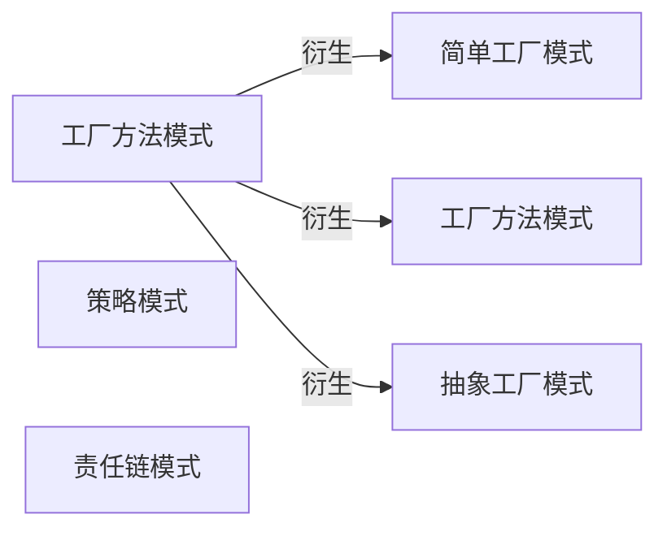
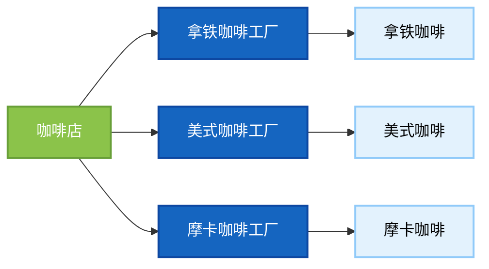
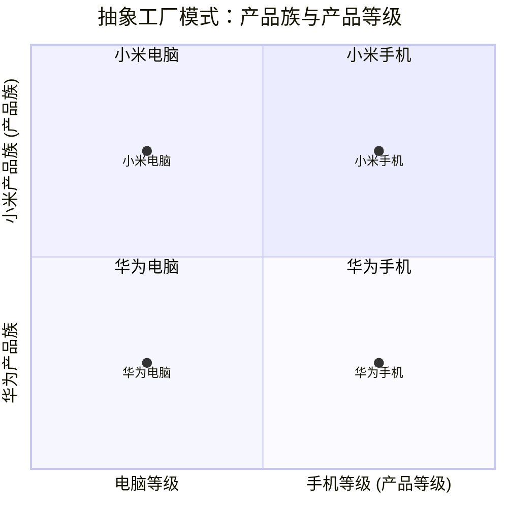
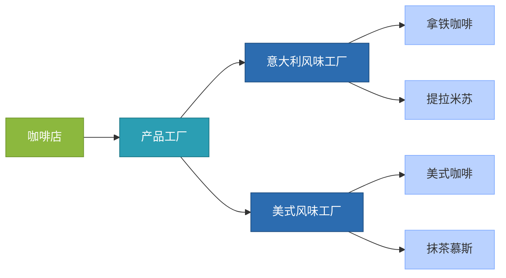
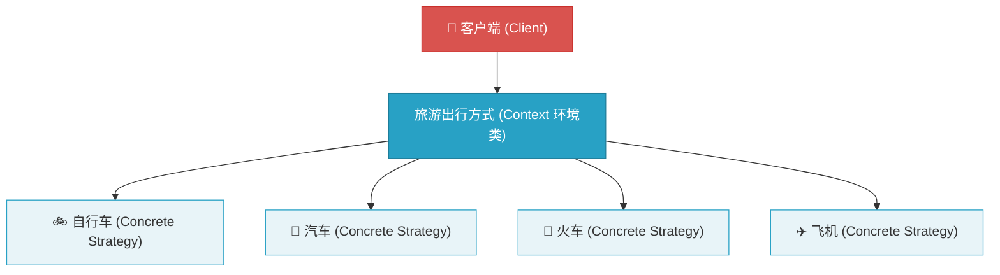
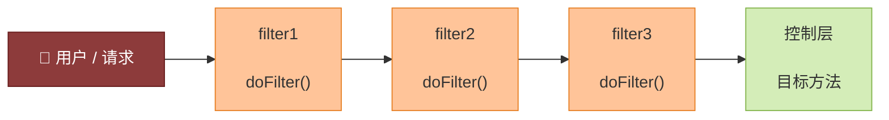
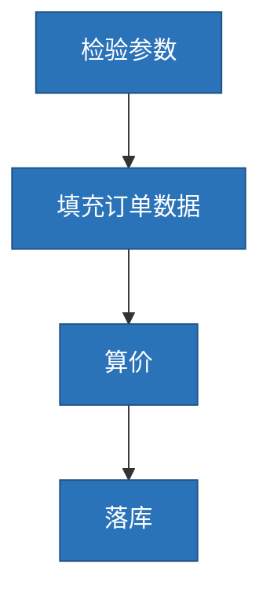
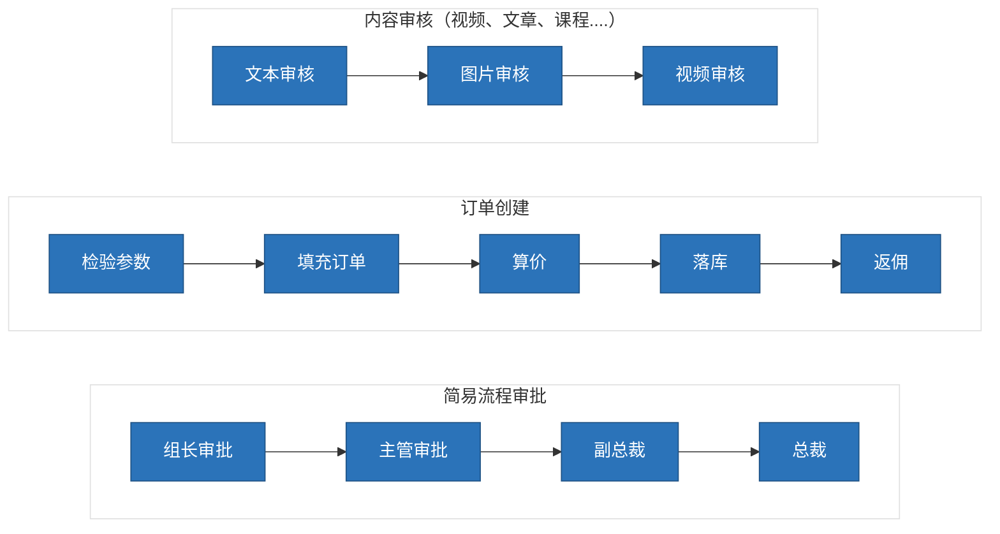

# 工厂设计模式
**工厂模式**
**需求描述：**
需求：设计一个咖啡店点餐系统。
设计一个咖啡类（Coffee），并定义其两个子类（美式咖啡【AmericanCoffee】和拿铁咖啡【LatteCoffee】）；再设计一个咖啡店类（CoffeeStore），咖啡店具有点咖啡的功能。


```java

/**
 * 咖啡接口
 */
public interface Coffee {

    /**
     *  获取名字
     * @return
     */
    public String getName();

    /**
     * 加牛奶
     */
    public void addMilk();

    /**
     * 加糖
     */
    public void addSuqar();
}

```
```java

/**
 * 拿铁咖啡
 */
public class LatteCoffee implements Coffee {
    /**
     *  获取名字
     * @return
     */
    @Override
    public String getName() {
        return "latteCoffee";
    }

    /**
     * 加牛奶
     */
    @Override
    public void addMilk() {
        System.out.println("LatteCoffee...addMilk...");
    }

    /**
     * 加糖
     */
    @Override
    public void addSuqar() {
        System.out.println("LatteCoffee...addSuqar...");
    }
}

```
```java

/**
 * 美式咖啡
 */
public class AmericanCoffee implements Coffee {

    /**
     *  获取名字
     * @return
     */
    @Override
    public String getName() {
        return "americanCoffee";
    }

    /**
     * 加牛奶
     */
    @Override
    public void addMilk() {
        System.out.println("AmericanCoffee...addMilk...");
    }

    /**
     * 加糖
     */
    @Override
    public void addSuqar() {
        System.out.println("AmericanCoffee...addSuqar...");
    }
}

```
```java

/**
 * 咖啡店类
 */
public class CoffeeStore {

    public static void main(String[] args) {
        Coffee coffee = orderCoffee("latte");
        System.out.println(coffee.getName());
    }
    /**
     * 根据类型选择不同的咖啡
     * @param type
     * @return
     */
    public static Coffee orderCoffee(String type){
        Coffee coffee = null;
        if("american".equals(type)){
            coffee = new AmericanCoffee();
        }else if ("latte".equals(type)){
            coffee = new LatteCoffee();
        }
        //添加配料
        coffee.addMilk();
        coffee.addSuqar();
        return coffee;
    }
}

```
> 💡 **核心背景**：在咖啡店代码中，我们需要什么咖啡都是直接new新的对象，如果新添咖啡，则要不断的修改咖啡店代码，代码耦合严重，违背了开闭原则：扩展开放，对修改关闭

**工厂设计模式核心目标：解耦**

## 简单工厂模式
**简单工厂模式**

简单工厂包含如下角色：
- 抽象产品：定义了产品的规范，描述了产品的主要特性和功能。
- 具体产品：实现或者继承抽象产品的子类
- 具体工厂：提供了创建产品的方法，调用者通过该方法来获取产品。


```java

public class SimpleCoffeeFactory {

    public static Coffee createCoffee(String type) {
        Coffee coffee = null;
        if("americano".equals(type)) {
            coffee = new AmericanCoffee();
        } else if("latte".equals(type)) {
            coffee = new LatteCoffee();
        }
        return coffee;
    }
}
```
> 对象的创建交给工厂创建
```java
public static Coffee orderCoffee(String type) {
        //通过工厂获得对象，不需要知道对象实现的细节
        SimpleCoffeeFactory factory = new SimpleCoffeeFactory();
        Coffee coffee = factory.createCoffee(type);
        //添加配料
        coffee.addMilk();
        coffee.addSuqar();
        return coffee;
    }
```
> Coffee与创建对象解耦，但与此同时又产生了新的问题，工厂类与创建对象又耦合了，CoffeeStrore与工厂的耦合，如果要添加新的coffee，依旧要修改工厂方法，耦合依旧严重

## 工厂方法模式
**工厂方法模式**

工厂方法模式的主要角色：
- 抽象工厂（AbstractFactory）：提供了创建产品的接口，调用者通过它访问具体工厂的工厂方法来创建产品。
- 具体工厂（ConcreteFactory）：主要是实现抽象工厂中的抽象方法，完成具体产品的创建。
- 抽象产品（Product）：定义了产品的规范，描述了产品的主要特性和功能。
- 具体产品（ConcreteProduct)：实现了抽象产品角色所定义的接口，由具体工厂来创建，它同具体工厂之间一一对应。


> 具体的工厂创建具体的产品
```java
/**
 * 咖啡工厂接口
 */
public interface CoffeeFactory {

    /**
     * 创建咖啡
     * @return
     */
    public Coffee createCoffee();
}

```
```java
/**
 * 拿铁咖啡工厂类
 */
public class LatteCoffeeFactory implements CoffeeFactory {

    /**
     * 创建拿铁咖啡
     * @return
     */
    @Override
    public Coffee createCoffee() {
        return new LatteCoffee();
    }
}

```
```java
/**
 * 美式咖啡工厂类
 */
public class AmericanCoffeeFactory implements CoffeeFactory {

    /**
     * 创建美式咖啡
     * @return
     */
    @Override
    public Coffee createCoffee() {
        return new AmericanCoffee();
    }
}

```
```java
public class CoffeeStore {

    public static void main(String[] args) {
        //可以根据不同的工厂，创建不同的产品
        CoffeeStore coffeeStore = new CoffeeStore(new LatteCoffeeFactory());
        Coffee latte = coffeeStore.orderCoffee();
        System.out.println(latte.getName());
    }

    private CoffeeFactory coffeeFactory;

    public CoffeeStore(CoffeeFactory coffeeFactory){
        this.coffeeFactory = coffeeFactory;
    }

    public Coffee orderCoffee(){
        Coffee coffee = coffeeFactory.createCoffee();
        //添加配料
        coffee.addMilk();
        coffee.addSuqar();
        return coffee;
    }
}
```
> 根据传入不同的参数，就会创建对应的产品，后续有新产品，只需要新建一个具体的工厂和产品类即可

优点：
- 用户只需要知道具体工厂的名称就可得到所要的产品，无须知道产品的具体创建过程；
- 在系统增加新的产品时只需要添加具体产品类和对应的具体工厂类，无须对原工厂进行任何修改，满足开闭原则；

**缺点：**

- 每增加一个产品就要增加一个具体产品类和一个对应的具体工厂类，这增加了系统的复杂度。

## 抽象工厂设计模式
**抽象工厂模式**
工厂方法模式只考虑生产同等级的产品，抽象工厂可以处理多等级产品的生产
- **产品族**：一个品牌下面的所有产品；例如华为下面的电脑、手机称为华为的产品族；
- **产品等级**：多个品牌下面的同种产品；例如华为和小米都有手机电脑为一个产品等级；





**1. 简单工厂**
- 所有的产品都共有一个工厂，如果新增产品，则需要修改代码，违反开闭原则
- 是一种编程习惯，可以借鉴这种编程思路

**2. 工厂方法模式**
- 给每个产品都提供了一个工厂，让工厂专门负责对应的产品的生产，遵循开闭原则
- 项目中用的最多

**3. 抽象工厂方法模式**
- 如果有多个维度的产品需要配合生产时，优先建议采用抽象工厂（工厂的工厂）
- 一般的企业开发中的较少

# 策略模式
**策略模式**
- 该模式定义了一系列算法，并将每个算法封装起来，使它们可以相互替换，且算法的变化不会影响使用算法的客户
- 它通过对算法进行封装，把使用算法的责任和算法的实现分割开来，并委派给不同的对象对这些算法进行管理

策略模式的主要角色如下：
- **抽象策略（Strategy）类**：这是一个抽象角色，通常由一个接口或抽象类实现。此角色给出所有的具体策略类所需接口。
- **具体策略（Concrete Strategy）类**：实现了抽象策略定义的接口，提供具体的算法实现或行为。
- **环境（Context）类**：持有一个策略类的引用，最终给客户端调用。


> 感觉和工厂模式很像
**优点：**
- 策略类之间可以自由切换
- 易于扩展
- 避免使用多重条件选择语句（if else），充分体现面向对象设计思想。

**缺点：**
- 客户端必须知道所有的策略类，并自行决定使用哪一个策略类。
- 策略模式将造成产生很多策略类

# 登录案例(策略模式+工厂模式)
有多种方式可以进行登录
- 用户名密码登录
- 短信验证码登录
- 微信登录
- QQ登录


使用If-else写法进行登录
```java
if (loginReq.getType().equals("account")) {
            System.out.println("用户名密码登录");

            // 执行用户密码登录逻辑

            return new LoginResp();

        } else if (loginReq.getType().equals("sms")) {
            System.out.println("手机号验证码登录");

            // 执行手机号验证码登录逻辑

            return new LoginResp();
        } else if (loginReq.getType().equals("we_chat")) {
            System.out.println("微信登录");

            // 执行用户微信登录逻辑

            return new LoginResp();
        }
        LoginResp loginResp = new LoginResp();
        loginResp.setSuccess(false);
        System.out.println("登录失败");
        return loginResp;
}
```
是逐层判断哪种登录方式然后执行相关的登录逻辑
**使用策略模式+工厂模式优化**
首先定义一个抽象策略接口，而具体的登录方式则实现此接口
```java
/**
 * 抽象策略类
 */
public interface UserGranter{

	/**
	 * 获取数据
	 * @param loginReq 传入的参数
	 * 		0:账号密码
	 * 	    1:短信验证
	 * 		2:微信授权
	 * @return map值
	 */
	LoginResp login(LoginReq loginReq);

}
```
```java
/**
 *策略：账号登录
 */
@Component
public class AccountGranter implements UserGranter{

	@Override
	public LoginResp login(LoginReq loginReq) {
		System.out.println("策略:登录方式为账号登录");
		// TODO
		// 执行业务操作

		return new LoginResp();
	}

}
/**
 * 策略:短信登录
 */
@Component
public class SmsGranter implements UserGranter{

	@Override
	public LoginResp login(LoginReq loginReq)  {
		System.out.println("策略:登录方式为短信登录");
		// TODO
		// 执行业务操作

		return new LoginResp();
	}

}
/**
 * 策略:微信登录
 */
 @Component
public class WeChatGranter implements UserGranter{

	@Override
	public LoginResp login(LoginReq loginReq)  {
		System.out.println("策略:登录方式为微信登录");
		// TODO
		// 执行业务操作
		
		return new LoginResp();
	}
}

```
> 让Spring读取这些策略并保存到Map中
```yaml
login:
  types:
    account: accountGranter
    sms: smsGranter
    we_chat: weChatGranter
```
```java
@Getter
@Setter
@Configuration
@ConfigurationProperties(prefix = "login")
public class LoginTypeConfig {

    private Map<String,String> types;

}

```
> 工厂生产具体的策略,实现了ApplicationContextAware接口，从上下文中获取Bean，将其放到map中，k是具体的策略，v是策略对应的登录方式的Bean
```java
/**
 * 操作策略的上下文环境类 工具类
 * 将策略整合起来 方便管理
 */
@Component
public class UserLoginFactory implements ApplicationContextAware {

    private static Map<String, UserGranter> granterPool = new ConcurrentHashMap<>();

    @Autowired
    private LoginTypeConfig loginTypeConfig;

    /**
     * 从配置文件中读取策略信息存储到map中
     * {
     * account:accountGranter,
     * sms:smsGranter,
     * we_chat:weChatGranter
     * }
     *
     * @param applicationContext
     * @throws BeansException
     */
    @Override
    public void setApplicationContext(ApplicationContext applicationContext) throws BeansException {
        loginTypeConfig.getTypes().forEach((k, y) -> {
            granterPool.put(k, (UserGranter) applicationContext.getBean(y));
        });
    }

    /**
     * 对外提供获取具体策略
     *
     * @param grantType 用户的登录方式，需要跟配置文件中匹配
     * @return 具体策略
     */
    public UserGranter getGranter(String grantType) {
        UserGranter tokenGranter = granterPool.get(grantType);
        return tokenGranter;
    }

}

```
> 业务层通过传来的具体参数，得到具体的登录逻辑
```java
@Service
public class UserService {

    @Autowired
    private UserLoginFactory factory;

    public LoginResp login(LoginReq loginReq) {

        UserGranter granter = factory.getGranter(loginReq.getType());
        if (granter == null) {
            LoginResp loginResp = new LoginResp();
            loginResp.setSuccess(false);
            return loginResp;
        }
        LoginResp loginResp = granter.login(loginReq);
        return loginResp;
    }
}

```
> 如果要增登录模式呢？只需要在配置文件新增，并新建一个登陆策略类即可


**举一反三**
- 订单的支付策略（支付宝、微信、银行卡...）
- 解析不同类型excel（xls格式、xlsx格式）
- 打折促销（满300元9折、满500元8折、满1000元7折...）
- 物流运费阶梯计算（5kg以下、5-10kg、10-20kg、20kg以上）

**一句话总结：只要代码中有冗长的 if-else 或 switch 分支判断都可以采用策略模式优化**
**总结**
**1. 什么是策略模式**
- 策略模式定义了一系列算法，并将每个算法封装起来，使它们可以相互替换，且算法的变化不会影响使用算法的客户
- 一个系统需要动态地在几种算法中选择一种时，可将每个算法封装到策略类中

**2. 案例（工厂方法+策略）**
- 介绍业务（登录、支付、解析excel、优惠等级...）
- 提供了很多种策略，都让spring容器管理
- 提供一个工厂：准备策略对象，根据参数提供对象

# 责任链模式
**责任链设计模式**
责任链模式：为了避免请求发送者与多个请求处理者耦合在一起，将所有请求的处理者通过前一对象记住其下一个对象的引用而连成一条链；当有请求发生时，可将请求沿着这条链传递，直到有对象处理它为止。

- 抽象处理者（Handler）角色：定义一个处理请求的接口，包含抽象处理方法和一个后继连接。
- 具体处理者（Concrete Handler）角色：实现抽象处理者的处理方法，判断能否处理本次请求，如果可以处理请求则处理，否则将该请求转给它的后继者。
- 客户类（Client）角色：创建处理链，并向链头的具体处理者对象提交请求，它不关心处理细节和请求的传递过程。


```java
/**
 * 抽象处理者
 */
public abstract class Handler {

    protected Handler nextHander;

    public void setNext(Handler handler) {
        this.nextHander = handler;
    }

    /**
     * 处理过程
     * 需要子类进行实现
     */
    public abstract void process(OrderInfo order);
}
/**
 * 计算金额
 */
public class OrderAmountCalcuate extends Handler {
    @Override
    public void process(OrderInfo order) {
        System.out.println("计算金额-优惠券、VIP、活动打折");
        nextHander.process(order);
    }

}/**
 * 补充订单信息
 */
public class OrderFill extends Handler {
    @Override
    public void process(OrderInfo order) {
        System.out.println("补充订单信息");
        nextHander.process(order);
    }

}

// 串成一条链条
public class Application {

    public static void main(String[] args) {
        //检验订单
        Handler orderValidition = new OrderValidition();
        //补充订单信息
        Handler orderFill = new OrderFill();
        //订单算价
        Handler orderAmountCalcuate = new OrderAmountCalcuate();
        //订单落库
        Handler orderCreate = new OrderCreate();

        //设置责任链路
        orderValidition.setNext(orderFill);
        orderFill.setNext(orderAmountCalcuate);
        orderAmountCalcuate.setNext(orderCreate);

        //开始执行
        orderValidition.process(new OrderInfo());
    }

}

```

**责任链优缺点**
**优点：**
- 降低了对象之间的耦合度
- 增强了系统的可扩展性
- 增强了给对象指派职责的灵活性
- 责任链简化了对象之间的连接
- 责任分担

**缺点：**
- 对比较长的职责链，请求的处理可能涉及多个处理对象，系统性能将受到一定影响。
- 职责链建立的合理性要靠客户端来保证，增加了客户端的复杂性，可能会由于职责链的错误设置而导致系统出错，如可能会造成循环调用。

**举一反三**
- **内容审核（视频、文章、课程....）**
- **订单创建**
- **简易流程审批**


