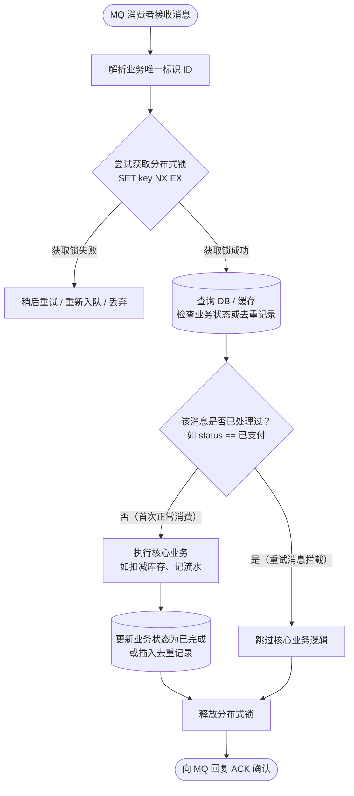
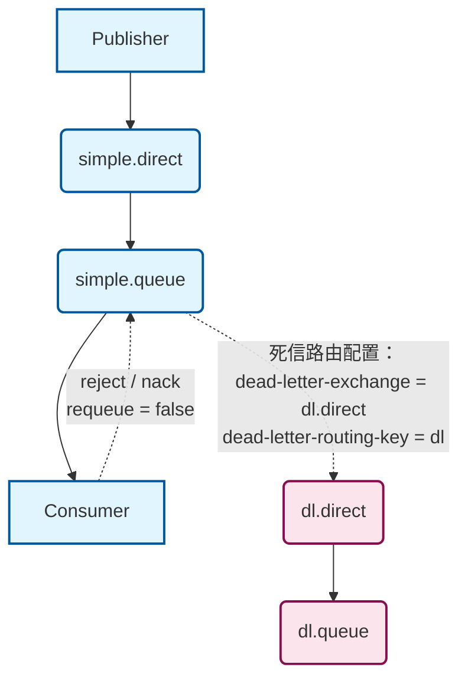
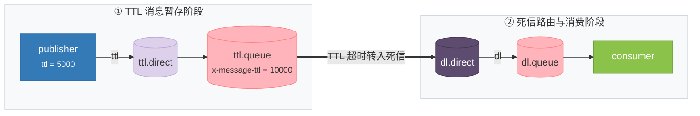
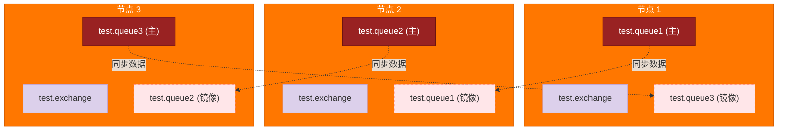

# RabbitMq

## 防止消息丢失


生产者发送消息可能未到达交换机和队列，此时通过生产者确认机制，若未到达则重复发送消息。

消息到达队列时，若Mq此时宕机，则会导致消息的丢失，开启持久化配置保证消息未消费时不会丢失。

同样消费者也有确认机制，一般使用auto模式，当消费者消费消息时出现异常返回nack，没有出现异常返回ack，出现异常会有重试机制，重试几次依然异常，那么就把消息放到一个异常交换机，人工进行处理。

---

## 如何防止被重复消费


消费者消费完成后，还未来得及向队列ack回执，此时消费者宕机或者网络波动导致无法回执，恢复后消费者可能会重新消费消息。解决方案是消息设置唯一id，这样处理消息时，先去数据库查询id是否存在，若存在则不消费消息。



**锁负责防并发，状态负责防重试；单靠锁无法保证幂等，必须“锁 + 状态检查”结合使用。**

### 核心分工
- **分布式锁（解决“同时发生”的并发）**
	- **作用**：强行将多个并发消费排队串行化。
	- **解决的问题**：防止两个消费者在同一毫秒同时查询到“未处理”状态，导致重复执行。
- **业务状态 / 唯一记录（解决“错开时间”的重试）**
	- **作用**：记录历史执行结果（如订单状态变为 `已支付` 或去重表中已有记录）。
	- **解决的问题**：锁释放后，重试消息即使再次拿到锁，也会因“状态已变更”而被直接拦截。

### 落地标准流程（4 步法）
1. **加锁（Lock）**：基于业务唯一 ID 获取分布式锁（如 `SET lock:order_1001 NX EX 30`），未获取到锁则等待或稍后重试。
2. **判重（Check）**：进入临界区后，先查数据库校验前置状态（如 `status == 待支付`）或查询去重记录是否存在。
3. **改状态（Execute & Update）**：
	- **若已处理**：跳过业务逻辑，直接准备退出。
	- **若未处理**：执行核心业务（扣款、加积分等），并更新状态或插入去重流水。
4. **释放与确认（Unlock & ACK）**：释放分布式锁，向 MQ 发送确认信号（ACK）。

> 💡 **总结**：锁是一道排队的“单人旋转门”，门内查验的“业务状态”才是决定放行还是拦截的唯一凭证。

---

## 死信交换机 (RabbitMQ 延迟队列)

**RabbitMQ中死信交换机？(RabbitMQ延迟队列有了解过嘛)**
- **延迟队列**：进入队列的消息会被延迟消费的队列
- **常见场景**：超时订单、限时优惠、定时发布

> 💡 **核心公式**：延迟队列 = 死信交换机 + TTL (生存时间)

### 死信（Dead Letter）产生的三个条件（满足其一即可）：
1. 消费者使用 `basic.reject` 或 `basic.nack` 声明消费失败，并且消息的 `requeue` 参数设置为 `false`。
2. 消息是一个过期消息，超时无人消费。
3. 要投递的队列消息堆积满了，最早的消息可能成为死信。

### 死信交换机（DLX）概念：
如果该队列配置了 `dead-letter-exchange` 属性，指定了一个交换机，那么队列中的死信就会投递到这个交换机中，而这个交换机称为**死信交换机**（Dead Letter Exchange，简称 DLX）。



```java
@Bean
public Queue ttlQueue(){
    return QueueBuilder.durable("simple.queue") // 指定队列名称，并持久化
            .ttl(10000) // 设置队列的超时时间，10秒
            .deadLetterExchange("dl.direct") // 指定死信交换机
            .build();
}
```

### TTL（Time-To-Live）
TTL，也就是 Time-To-Live。如果一个队列中的消息 TTL 结束仍未消费，则会变为死信，TTL 超时分为两种情况：
- 消息所在的队列设置了存活时间
- 消息本身设置了存活时间



生产者和队列都可以声明消息的存活时间，按照存活时间短的生效。

```java
// 创建消息
Message message = MessageBuilder
        .withBody("hello, ttl message".getBytes(StandardCharsets.UTF_8))
        .setExpiration("5000")
        .build();
// 消息ID，需要封装到CorrelationData中
CorrelationData correlationData = new CorrelationData(UUID.randomUUID().toString());
// 发送消息
rabbitTemplate.convertAndSend("ttl.direct", "ttl", message, correlationData);
```

### 延迟队列插件（DelayExchange）
DelayExchange 插件需要安装在 RabbitMQ 中。
RabbitMQ 官方插件社区地址：[https://www.rabbitmq.com/community-plugins.html](https://www.rabbitmq.com/community-plugins.html)

**rabbitmq_delayed_message_exchange**
- Releases: GitHub `rabbitmq/rabbitmq-delayed-message-exchange`
- Author: Alvaro Videla

DelayExchange 的本质还是官方的三种交换机，只是添加了延迟功能。因此使用时只需要声明一个交换机，交换机的类型可以是任意类型，然后设定 `delayed` 属性为 `true` 即可。

```java
@RabbitListener(bindings = @QueueBinding(
        value = @Queue(name = "delay.queue", durable = "true"),
        exchange = @Exchange(name = "delay.direct", delayed = "true"),
        key = "delay"
))
public void listenDelayedQueue(String msg){
    log.info("接收到 delay.queue的延迟消息：{}", msg);
}
```

```java
// 创建消息
Message message = MessageBuilder
        .withBody("hello, delayed message".getBytes(StandardCharsets.UTF_8))
        .setHeader("x-delay", 10000)
        .build();
// 消息ID，需要封装到CorrelationData中
CorrelationData correlationData = new CorrelationData(UUID.randomUUID().toString());
// 发送消息
rabbitTemplate.convertAndSend("delay.direct", "delay", message, correlationData);
```

之所以要扯上“死信”，是因为 **原生 RabbitMQ 本身根本没有“倒计时闹钟”这种延迟队列机制**。
消息一旦发进普通队列，消费者就会在**第 0 秒瞬间**把它拉走消费掉。为了强行实现“等 30 分钟后再消费”，早期开发者利用 RabbitMQ 的特性做了一次**曲线救国**：

**核心障眼法：故意让消息“超时死掉”，再用死信交换机“复活消费”**

整个链路是把死信当作了**定时器的触发器**：
- **第 1 步：找个没人的房间关禁闭（TTL 队列）**
	- 生产者发消息，设置 TTL = 30 分钟（比如未支付订单）。
	- 投递到一个特殊的队列 `ttl.queue`。
	- **关键点**：这个队列**没有任何消费者（Consumer）监听**！如果不设消费者，消息就只能在里面硬生生等 30 分钟。
- **第 2 步：时间到了，消息“憋死”变成死信**
	- 30 分钟一到，消息寿命耗尽，RabbitMQ 判定它为**死信（Dead Letter）**。
- **第 3 步：死信交换机暗度陈仓，转给真正干活的人**
	- `ttl.queue` 提前配置了 `dead-letter-exchange = dl.direct`。
	- 消息死掉的瞬间，队列自动把它踢给死信交换机 `dl.direct`，并路由到最终的 `dl.queue`。
- **第 4 步：消费者在死信队列守株待兔**
	- 消费者监听的是 `dl.queue`。
	- 当消费者拿到这条消息时，距离消息最初发送刚好过去了 **整整 30 分钟**。

### 两种延迟方案对比

| 方案 | 原理 | 缺点 / 局限 |
| :--- | :--- | :--- |
| **TTL + 死信交换机**（老方案） | 消息在无消费者的队列中硬等 -> 超时成死信 -> 死信交换机转发 -> 消费者消费。 | **队头阻塞问题**：如果前一条消息 TTL 是 10 分钟，后一条是 1 秒，由于队列先进先出，后一条必须等前一条死掉后才能出来。 |
| **DelayExchange 插件**（新方案） | 交换机自带暂存存储，等时间到了才把消息路由进队列。 | 原生支持不同延迟时长的消息，无阻塞问题，配置更直观。 |

> 💡 **核心总结**：死信本身并不是什么高深的设计，只是因为原生 RabbitMQ 没有延迟投递功能，大家利用“超时成死信会触发自动转发”这个机制，来当成定时器用。

**RabbitMQ中死信交换机？(RabbitMQ延迟队列有了解过嘛)**
- 我们当时一个什么业务使用到了延迟队列（超时订单、限时优惠、定时发布...）
- 其中延迟队列就用到了死信交换机和TTL（消息存活时间）实现的
- 消息超时未消费就会变成死信（死信的其他情况：拒绝被消费，队列满了）

**延迟队列插件实现延迟队列DelayExchange**
- 声明一个交换机，添加delayed属性为true
- 发送消息时，添加x-delay头，值为超时时间

---

## 如何解决消息积压

**RabbitMQ如果有100万消息堆积在MQ，如何解决(消息堆积怎么解决)**

当生产者发送消息的速度超过了消费者处理消息的速度，就会导致队列中的消息堆积，直到队列存储消息达到上限。之后发送的消息就会成为死信，可能会被丢弃，这就是消息堆积问题。


解决消息堆积有三种思路：
- 增加更多消费者，提高消费速度
- 在消费者内开启线程池加快消息处理速度（充分利用cpu）
- 扩大队列容积，提高堆积上限

### 惰性队列
惰性队列的特征如下：
- 接收到消息后直接存入磁盘而非内存
- 消费者要消费消息时才会从磁盘中读取并加载到内存
- 支持数百万条的消息存储

### 代码配置方式

**方式一：基于 `@Bean` 配置**
```java
@Bean
public Queue lazyQueue(){
    return QueueBuilder
            .durable("lazy.queue")
            .lazy() // 开启x-queue-mode为lazy
            .build();
}
```

**方式二：基于 `@RabbitListener` 注解声明**
```java
@RabbitListener(queuesToDeclare = @Queue(
        name = "lazy.queue",
        durable = "true",
        arguments = @Argument(name = "x-queue-mode", value = "lazy")
))
public void listenLazyQueue(String msg){
    log.info("接收到 lazy.queue的消息：{}", msg);
}
```

**RabbitMQ如果有100万消息堆积在MQ，如何解决(消息堆积怎么解决)**
解决消息堆积有三种思路：
- 增加更多消费者，提高消费速度
- 在消费者内开启线程池加快消息处理速度
- 扩大队列容积，提高堆积上限，采用惰性队列
	- 在声明队列的时候可以设置属性x-queue-mode为lazy，即为惰性队列
	- 基于磁盘存储，消息上限高
	- 性能比较稳定，但基于磁盘存储，受限于磁盘IO，时效性会降低

---

## RabbitMQ 高可用

**RabbitMQ的高可用机制有了解过嘛**
- 在生产环境下，使用集群来保证高可用性
- 普通集群、镜像集群、仲裁队列

### 普通集群
普通集群，或者叫标准集群（classic cluster），具备下列特征：
- 会在集群的各个节点间共享部分数据，包括：交换机、队列元信息。不包含队列中的消息。
- 当访问集群某节点时，如果队列不在该节点，会从数据所在节点传递到当前节点并返回
- 队列所在节点宕机，队列中的消息就会丢失


交换机存在每一个节点，但队列不是，不过会存储其他节点的队列元信息。

### 镜像集群
镜像集群：本质是主从模式，具备下面的特征：
- 交换机、队列、队列中的消息会在各个mq的镜像节点之间同步备份。
- 创建队列的节点被称为该队列的**主节点**，备份到的其它节点叫做该队列的**镜像节点**。
- 一个队列的主节点可能是另一个队列的镜像节点
- 所有操作都是主节点完成，然后同步给镜像节点
- 主节点宕机后，镜像节点会替代成新的主节点



但也会存在问题，例如主节点接收新的信息，还未来得及同步数据就宕机了，会导致消息丢失，发生概率较小。

### 仲裁队列
仲裁队列：仲裁队列是 3.8 版本以后才有的新功能，用来替代镜像队列，具备下列特征：
- 与镜像队列一样，都是主从模式，支持主从数据同步
- 使用非常简单，没有复杂的配置
- 主从同步基于 Raft 协议，强一致

```java
@Bean
public Queue quorumQueue(){
    return QueueBuilder
            .durable("quorum.queue") // 持久化
            .quorum() // 仲裁队列
            .build();
}
```

搭建好标准的 RabbitMQ 节点集群后，在 Java 代码里直接把队列声明为 `.quorum()`，RabbitMQ 就会自动基于 Raft 协议在集群的多节点间分配 Leader 和 Follower。

**RabbitMQ的高可用机制有了解过嘛**
- 在生产环境下，我们当时采用的镜像模式搭建的集群，共有3个节点
- 镜像队列结构是一主多从（从就是镜像），所有操作都是主节点完成，然后同步给镜像节点
- 主宕机后，镜像节点会替代成新的主（如果在主从同步完成前，主就已经宕机，可能出现数据丢失）

**那出现丢数据怎么解决呢？**

我们可以采用仲裁队列，与镜像队列一样，都是主从模式，支持主从数据同步，主从同步基于Raft协议，强一致。

并且使用起来也非常简单，不需要额外的配置，在声明队列的时候只要指定这个是仲裁队列即可。
