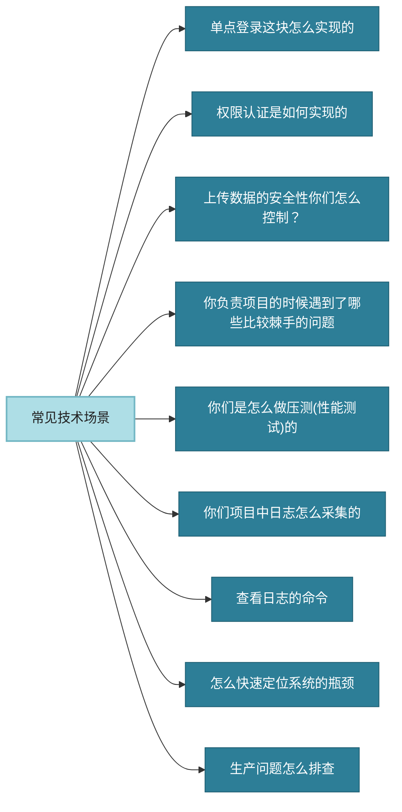
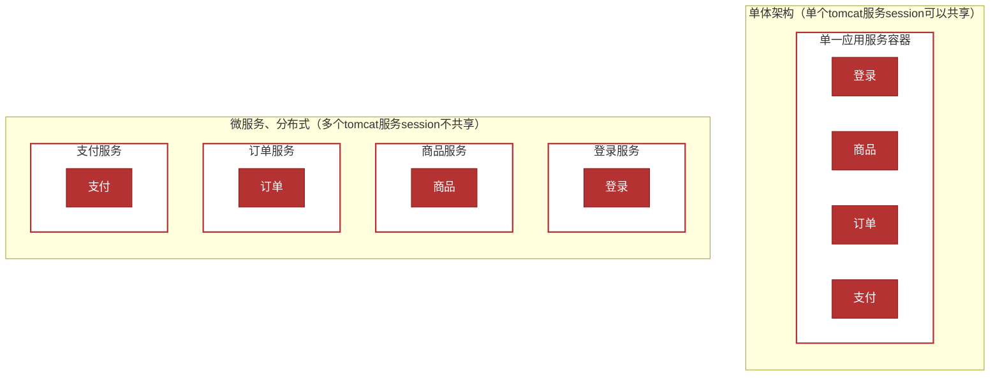
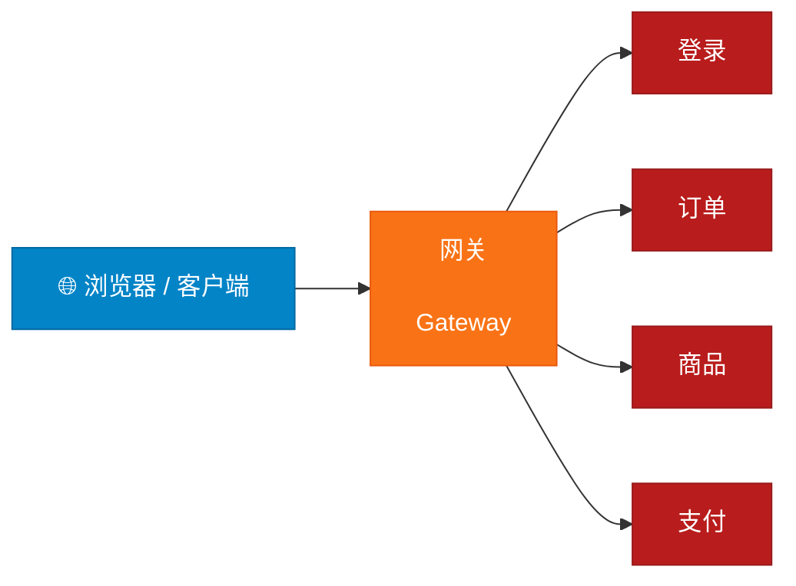
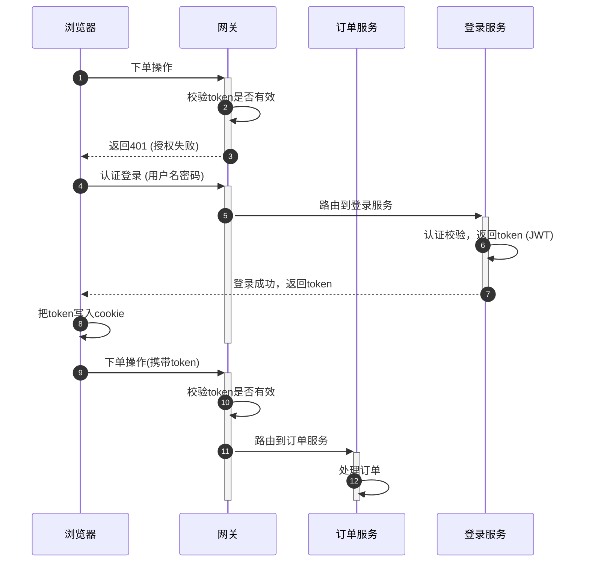
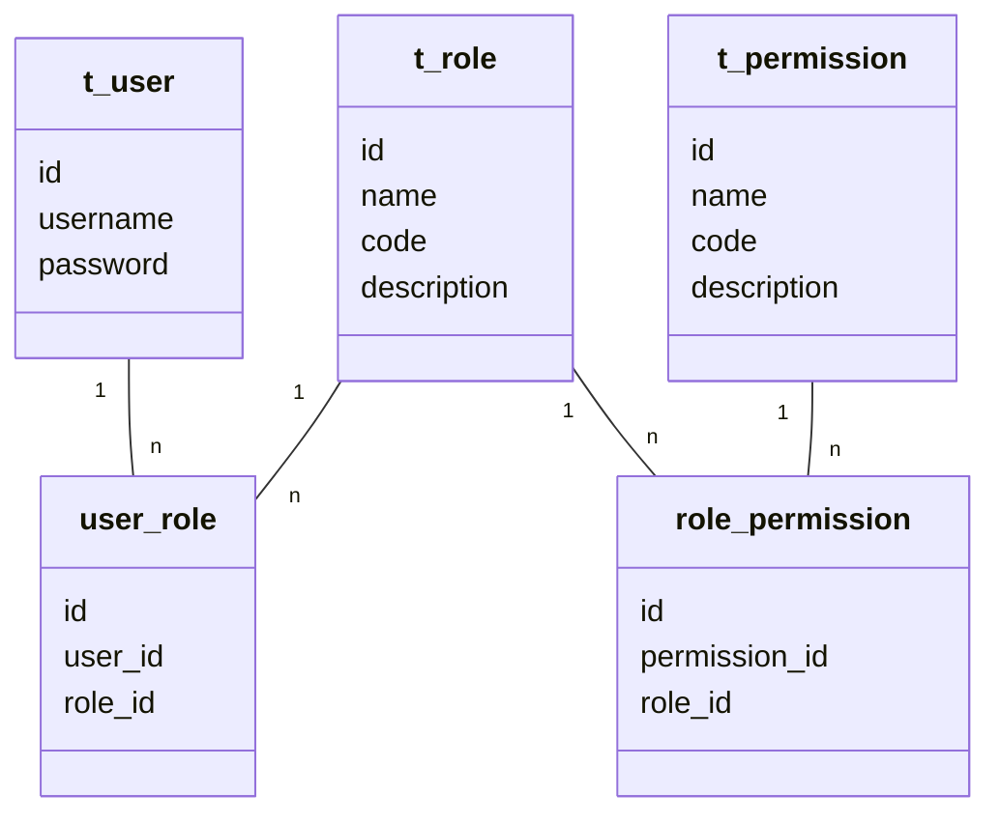
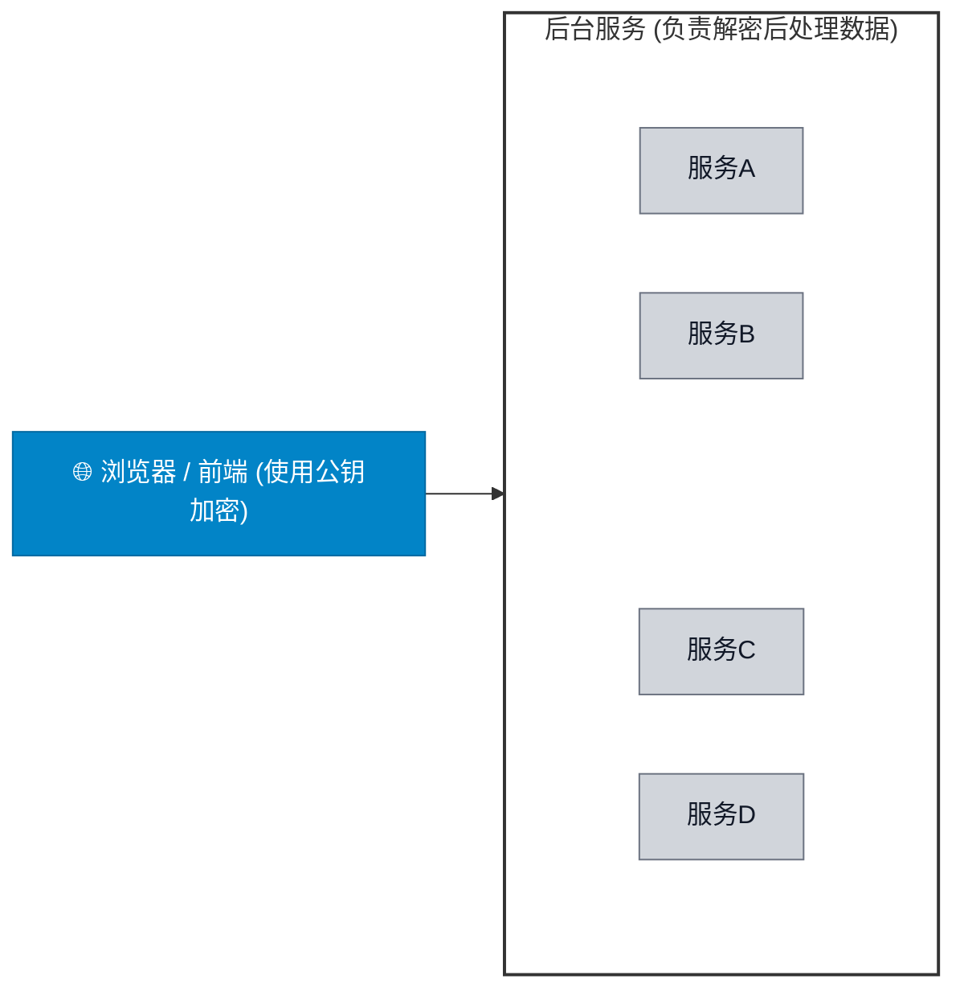
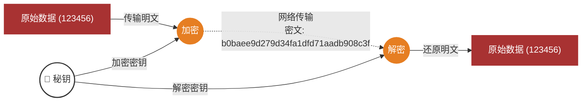
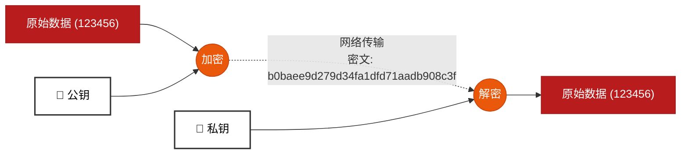
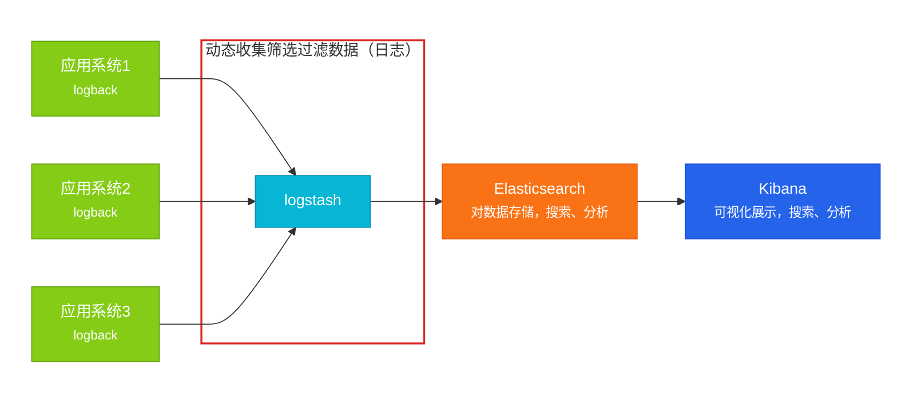

# 单点登录
**单点登录这块怎么实现的**
单点登录的英文名叫做：Single Sign On（简称SSO），只需要登录一次，就可以访问所有信任的应用系统
**单体 vs 微服务/分布式**
- **单体**：单个tomcat服务session可以共享
- **微服务、分布式**：多个tomcat服务session不共享

**单点登录解决方案**
- JWT(常见)
- Oauth2
- CAS



**JWT解决单点登录**



流程图



**单点登录这块怎么实现的**
1. **先解释什么是单点登录**
	单点登录的英文名叫做：Single Sign On（简称**SSO**）
2. **介绍自己项目中涉及到的单点登录**（即使没涉及过，也可以说实现的思路）
3. **介绍单点登录的解决方案，以JWT为例**
	- I. 用户访问其他系统，会在网关判断token是否有效
	- II. 如果token无效则会返回401（认证失败）前端跳转到登录页面
	- III. 用户发送登录请求，返回浏览器一个token，浏览器把token保存到cookie
	- IV. 再去访问其他服务的时候，都需要携带token，由网关统一验证后路由到目标服务

# 权限认证
**权限认证是如何实现的**
后台的管理系统，更注重权限控制，最常见的就是RBAC模型来指导实现权限
RBAC(Role-Based Access Control)基于角色的访问控制
- 3个基础部分组成：用户、角色、权限
- 具体实现
	- 5张表（用户表、角色表、权限表、用户角色中间表、角色权限中间表）
	- 7张表（用户表、角色表、权限表、菜单表、用户角色中间表、角色权限中间表、权限菜单中间表）

**RBAC权限模型**




**权限认证是如何实现的**
- 后台管理系统的开发经验
- 介绍RBAC权限模型5张表的关系（用户、角色、权限）
- 权限框架：Spring security

# 上传数据的安全性
**上传数据的安全性你们怎么控制？**
使用**非对称加密（或对称加密）**，给前端一个公钥让他把数据加密后传到后台，后台负责解密后处理数据



**对称加密**
文件加密和解密使用相同的密钥，即加密密钥也可以用作解密密钥



- **优点：** 加密速度快，效率高
- **缺点：** 相对不太安全（不要保存敏感信息）

**非对称加密**



- **优点：** 与对称加密相比，安全性更高
- **缺点：** 加密和解密速度慢，建议少量数据加密

**上传数据的安全性你们怎么控制？**
使用**非对称加密（或对称加密）**，给前端一个公钥让他把数据加密后传到后台，后台负责解密后处理数据
- 文件很大建议使用对称加密，不过不能保存敏感信息
- 文件较小，要求安全性高，建议采用非对称加密

# 棘手问题
**你负责项目的时候遇到了哪些比较棘手的问题？怎么解决的**
**回答框架：**
1. 什么背景（技术问题）
2. 过程（解决问题的过程）
3. 最终落地方案

```mermaid
flowchart TD
    %% 核心中心
    Ready(("提前准备"))

    %% 01 设计模式
    subgraph G1 ["01 设计模式"]
        direction TB
        P1["工厂"]
        P2["策略"]
        P3["责任链"]
        P4["..."]
    end

    %% 02 线上BUG
    subgraph G2 ["02 线上BUG"]
        direction TB
        B1["CPU飙高"]
        B2["内存泄漏"]
        B3["线程死锁"]
        B4["..."]
    end

    %% 03 调优
    subgraph G3 ["03 调优"]
        direction TB
        O1["慢接口"]
        O2["慢SQL"]
        O3["缓存方案"]
        O4["..."]
    end

    %% 04 组件封装
    subgraph G4 ["04 组件封装"]
        direction TB
        C1["分布式锁"]
        C2["接口幂等"]
        C3["分布式事务"]
        C4["支付通用"]
    end

    %% 连线
    Ready --> G1
    Ready --> G2
    Ready --> G3
    Ready --> G4

    %% 样式
    style Ready fill:#22c55e,stroke:#16a34a,color:#fff,stroke-width:2px

    style G1 fill:#f0f9ff,stroke:#0284c7,stroke-width:2px
    classDef blueItem fill:#0284c7,stroke:#0369a1,color:#fff;
    class P1,P2,P3,P4 blueItem;

    style G2 fill:#fef2f2,stroke:#dc2626,stroke-width:2px
    classDef redItem fill:#dc2626,stroke:#b91c1c,color:#fff;
    class B1,B2,B3,B4 redItem;

    style G3 fill:#f7fee7,stroke:#65a30d,stroke-width:2px
    classDef greenItem fill:#65a30d,stroke:#4d7c0f,color:#fff;
    class O1,O2,O3,O4 greenItem;

    style G4 fill:#faf5ff,stroke:#9333ea,stroke-width:2px
    classDef purpleItem fill:#9333ea,stroke:#7e22ce,color:#fff;
    class C1,C2,C3,C4 purpleItem;

```



# 日志如何采集
**你们项目中日志怎么采集的**
**1，为什么要采集日志？**
日志是定位系统问题的重要手段，可以根据日志信息快速定位系统中的问题
**2，采集日志的方式有哪些？**
- **ELK：** 即Elasticsearch、Logstash和Kibana三个软件的首字母
- **常规采集：** 按天保存到一个日志文件

```plain text
designpattern-demo-8081-2023-05-14.log
designpattern-demo-8081-2023-05-15.log
designpattern-demo-8081-2023-05-16.log
designpattern-demo-8081-2023-05-17.log
designpattern-demo-8081-2023-05-18.log
designpattern-demo-8082-2023-05-18.log
designpattern-demo-8083-2023-05-18.log

```

**实际开发中使用较多的是ELK**
**ELK即Elasticsearch、Logstash和Kibana三个开源软件的缩写**
**LogBack即Spring Boot 官方默认的日志框架**。只要引入 Spring Boot 起步依赖，无需额外引包即可开箱即用。



```xml
<?xml version="1.0" encoding="UTF-8"?>
<configuration>
    <include resource="org/springframework/boot/logging/logback/base.xml" />
    <springProperty scope="context" name="springAppName" source="spring.application.name"/>
    <springProperty scope="context" name="serverPort" source="server.port"/>
    <appender name="LOGSTASH" class="net.logstash.logback.appender.LogstashTcpSocketAppender">
        <destination>192.168.200.130:5044</destination>
        <!-- 日志输出编码 -->
        <encoder charset="UTF-8" class="net.logstash.logback.encoder.LogstashEncoder">
            <providers>
                <timestamp>
                    <timeZone>UTC</timeZone>
                </timestamp>
                <pattern>
                    <pattern>
                        {
                        <!--应用名称 -->
                        "app": "${springAppName}_${serverPort}",
                        <!--打印时间 -->
                        "timestamp": "%d{yyyy-MM-dd HH:mm:ss.SSS}",
                        <!--线程名称 -->
                        "thread": "%thread",
                        <!--日志级别 -->
                        "level": "%level",
                        <!--日志名称 -->
                        "logger_name": "%logger",
                        <!--日志信息 -->
                        "message": "%msg",
                        <!--日志堆栈 -->
                        "stack_trace": "%exception"
                        }
                    </pattern>
                </pattern>
            </providers>
        </encoder>
    </appender>
    <!--定义日志文件的存储地址,使用绝对路径-->
    <property name="LOG_HOME" value="/home/logs"/>
    <!-- 按照每天生成日志文件 -->
    <appender name="FILE" class="ch.qos.logback.core.rolling.RollingFileAppender">
        <rollingPolicy class="ch.qos.logback.core.rolling.TimeBasedRollingPolicy">
            <!--日志文件输出的文件名-->
            <fileNamePattern>${LOG_HOME}/${springAppName}-${serverPort}-%d{yyyy-MM-dd}.log</fileNamePattern>
        </rollingPolicy>
        <encoder>
            <pattern>%d{yyyy-MM-dd HH:mm:ss.SSS} [%thread] %-5level %logger{36} - %msg%n</pattern>
        </encoder>
    </appender>
    <root level="INFO">
        <appender-ref ref="LOGSTASH" />
        <appender-ref ref="FILE" />
        <appender-ref ref="CONSOLE" />
    </root>

</configuration>

```

**你们项目中日志怎么采集的**
- 我们搭建了ELK日志采集系统
- 介绍ELK的三个组件：
	- **Elasticsearch**是全文搜索分析引擎，可以对数据存储、搜索、分析
	- **Logstash**是一个数据收集引擎，可以动态收集数据，可以对数据进行过滤、分析，将数据存储到指定的位置
	- **Kibana**是一个数据分析和可视化平台，配合Elasticsearch对数据进行搜索，分析，图表化展示

# 常见日志命令


**查看日志的命令**
- **实时监控日志的变化**
	- 实时监控某一个日志文件的变化：`tail -f xx.log`
	- 实时监控日志最后100行日志：`tail -n 100 -f xx.log`
- **按照行号查询**
	- 查询日志尾部最后100行日志：`tail -n 100 xx.log`
	- 查询日志头部开始100行日志：`head -n 100 xx.log`
	- 查询某一个日志行号区间：`cat -n xx.log | tail -n +100 | head -n 100`（查询100行至200行的日志）
- **按照关键字找日志的信息**
	- 查询日志文件中包含debug的日志行号：`cat -n xx.log | grep "debug"`
- **按照日期查询**
	- `sed -n '/2023-05-18 14:22:31.070/,/ 2023-05-18 14:27:14.158/p' xx.log`
- **日志太多，处理方式**
	- 分页查询日志信息：`cat -n xx.log |grep "debug" | more`
	- 筛选过滤以后，输出到一个文件：`cat -n xx.log | grep "debug" >debug.txt`

> 前三条较为重要
# 如何排查生产环境
**生产问题怎么排查**
已经上线的bug排查的思路：
1，先分析日志，通常在业务中都会有日志的记录，或者查看系统日志，或者查看日志文件，然后定位问题
2，远程debug（通常公司的正式环境（生产环境）是不允许远程debug的。一般远程debug都是公司的测试环境，方便调试代码）
# 快速定位系统瓶颈
**怎么快速定位系统的瓶颈**
- 压测（性能测试），项目上线之前测评系统的压力
- 监控工具、链路追踪工具，项目上线之后监控
- 线上诊断工具Arthas(阿尔萨斯)，项目上线之后监控、排查


