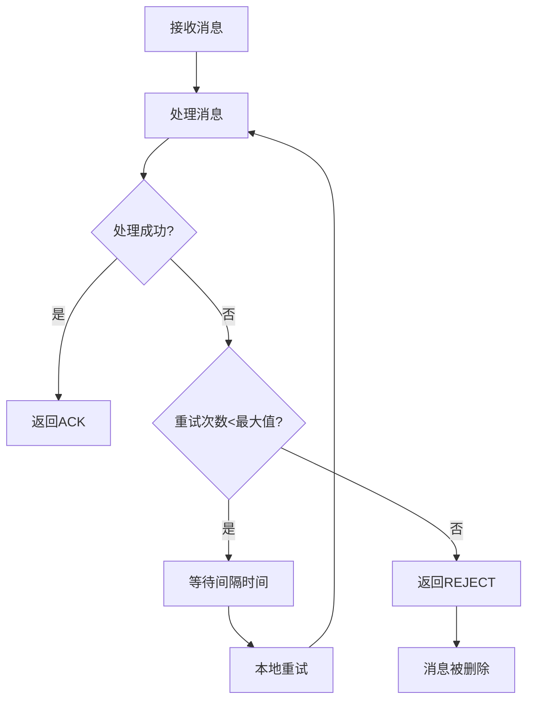
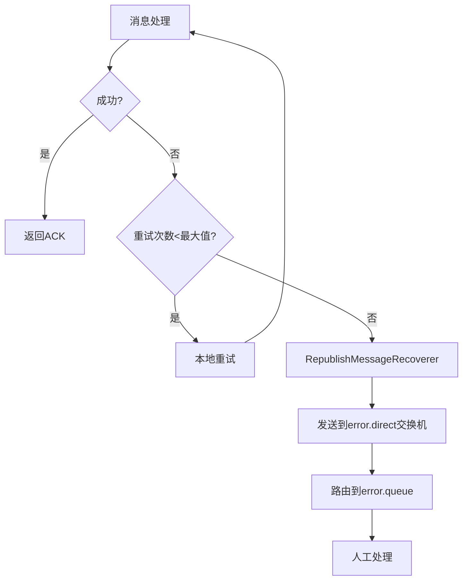
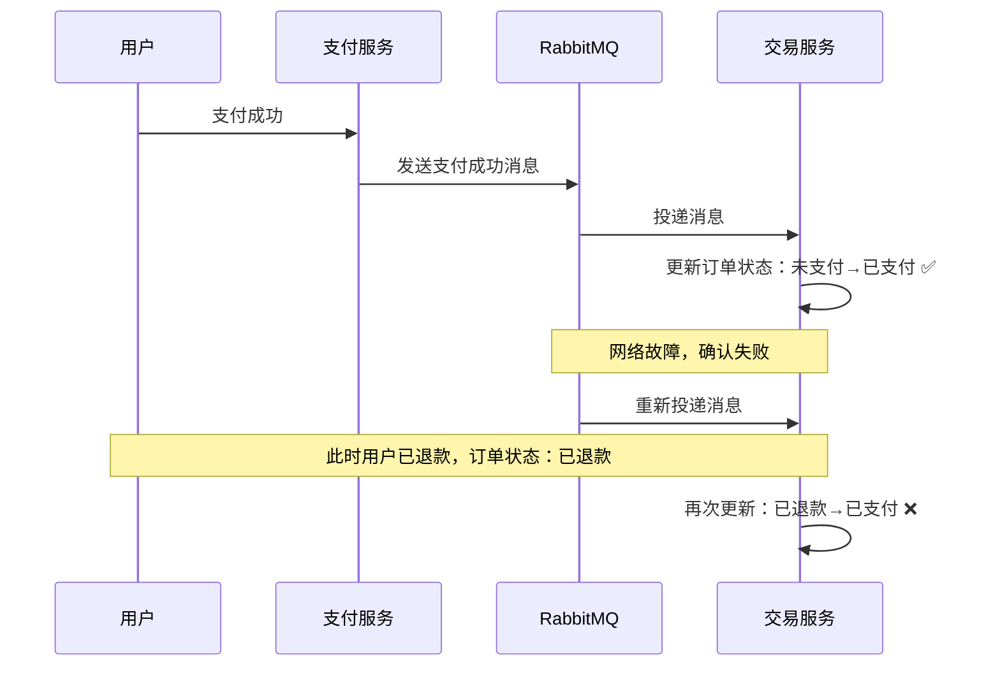
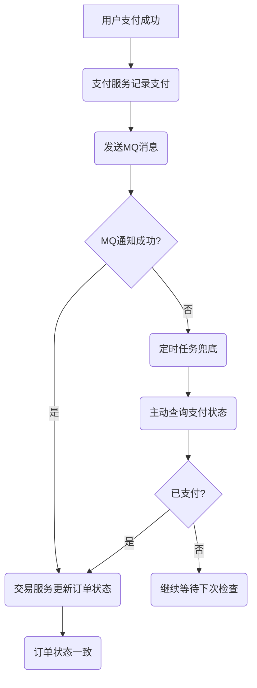
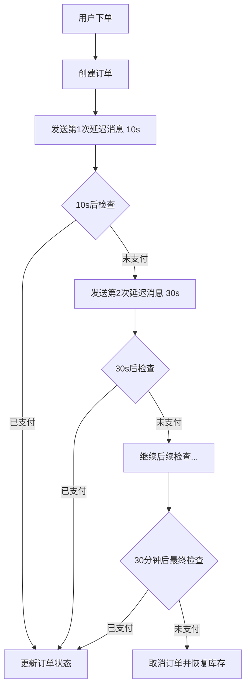
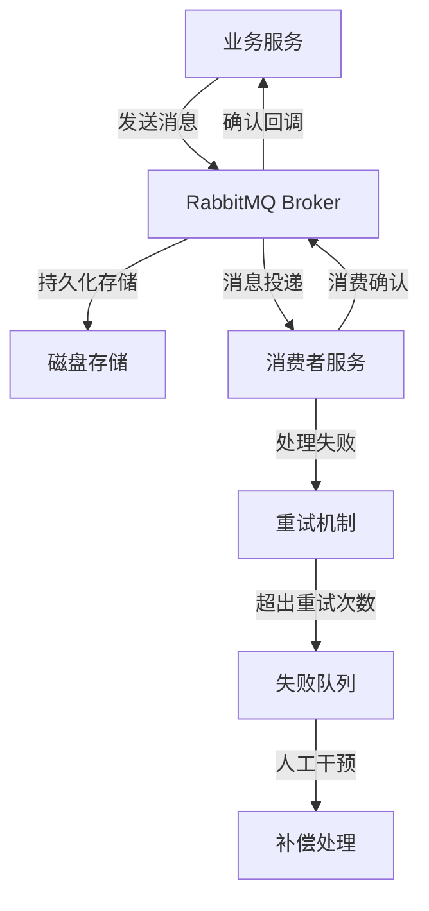
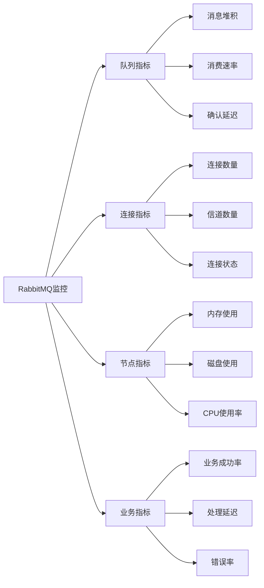
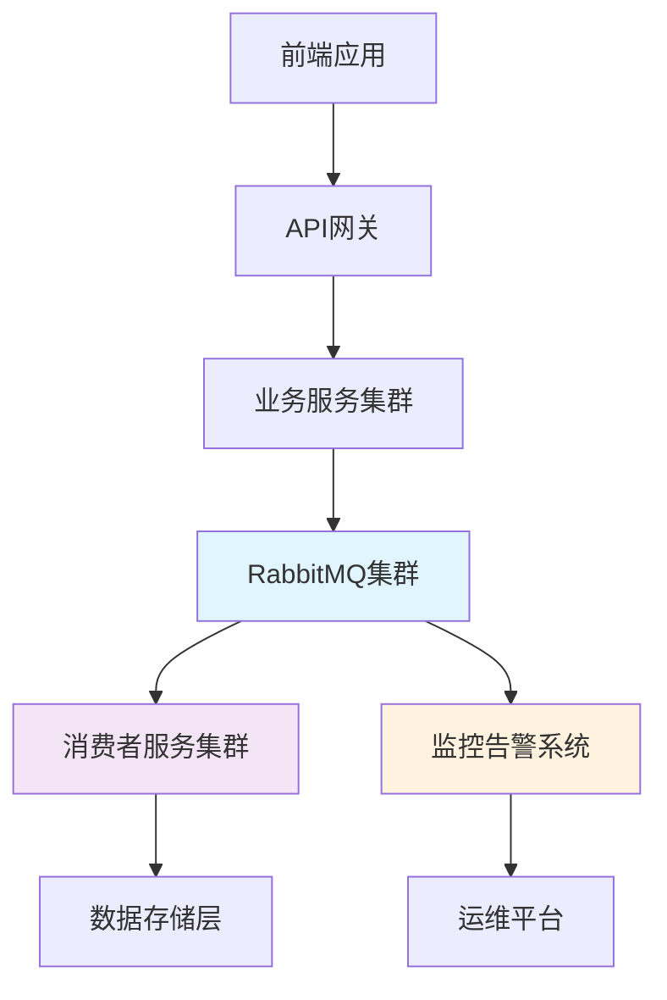

# RabbitMQ 高级特性 - 可靠性与延迟消息

## 前言

在分布式系统中，消息队列扮演着重要角色。但是，如何确保消息的可靠性传递是一个关键问题。

### 真实业务场景

考虑一个电商支付场景：
1. 用户完成支付 → 支付服务记录支付成功
2. 支付服务通过MQ通知交易服务 → 更新订单状态为已支付
3. **如果MQ通知失败会怎样？**
   - 支付服务：支付成功 ✅
   - 交易服务：订单未支付 ❌
   - 用户体验：明明支付了，为什么显示未支付？😰

### 核心问题

- **如何确保MQ消息的可靠性传递？**
- **消息丢失时有什么兜底方案？**
- **如何处理延迟任务（如订单超时取消）？**

让我们一步步解决这些问题。

# 1. 发送者的可靠性

> **目标：确保生产者一定把消息发送到MQ**

**原则：消息应该至少被消费者处理1次**

## 1.1 消息丢失的可能性分析

消息从发送者到消费者的传递路径：


### 🔍 消息丢失的三大环节

#### 1️⃣ 发送阶段丢失
- **网络故障**：生产者发送消息时连接MQ失败
- **交换机不存在**：发送到不存在的Exchange
- **路由失败**：Exchange找不到合适的Queue
- **MQ内部异常**：消息到达MQ后处理进程异常

#### 2️⃣ MQ存储阶段丢失
- **宕机丢失**：消息到达MQ，保存到队列后突然宕机
- **内存丢失**：消息只在内存中，未持久化

#### 3️⃣ 消费阶段丢失
- **消费者宕机**：消息接收后尚未处理就宕机
- **处理异常**：消息处理过程中抛出异常

### 📋 解决方案概览

| 阶段 | 问题 | 解决方案 |
|------|------|----------|
| **发送阶段** | 网络故障、路由失败 | 重试机制 + 生产者确认 |
| **存储阶段** | MQ宕机、内存丢失 | 数据持久化 + LazyQueue |
| **消费阶段** | 消费者故障 | 消费者确认 + 失败重试 |

## 1.2 生产者重试机制

### 🎯 适用场景
网络不稳定导致与MQ连接中断时，自动重试发送消息。

### ⚙️ 配置方式
修改`publisher`模块的`application.yaml`：

```yaml
spring:
  rabbitmq:
    connection-timeout: 1s # 设置MQ的连接超时时间
    template:
      retry:
        enabled: true # 开启超时重试机制
        initial-interval: 1000ms # 失败后的初始等待时间
        multiplier: 1 # 失败后下次的等待时长倍数，下次等待时长 = initial-interval * multiplier
        max-attempts: 3 # 最大重试次数
```

### 🧪 测试效果
```shell
# 停掉RabbitMQ服务
docker stop mq
```
发送消息后会看到：每隔1秒重试1次，总共重试3次。

### ⚠️ 注意事项
**SpringAMQP的重试是阻塞式的**
- 重试期间当前线程被阻塞
- 对性能有要求的业务建议禁用重试
- 可考虑使用异步线程发送消息

### 💡 最佳实践
```yaml
# 高性能场景配置
spring:
  rabbitmq:
    template:
      retry:
        enabled: false # 禁用重试，依赖生产者确认机制
```

## 1.3 生产者确认机制

### 🎯 解决问题
即使网络正常，消息也可能在MQ内部丢失：
- MQ内部处理进程异常
- Exchange不存在
- Queue不存在，无法路由

### 📋 确认机制类型

RabbitMQ提供了**生产者消息确认机制**：

| 确认类型 | 触发时机 | 作用 |
|----------|----------|------|
| **Publisher Confirm** | 消息到达Exchange | 确认消息是否成功到达RabbitMQ |
| **Publisher Return** | 消息路由失败 | 确认消息是否成功路由到Queue |

### 🔄 工作流程


#### 场景分析
1. **正常情况**：消息到达Exchange且成功路由 → 只收到 Confirm(ack)
2. **Exchange错误**：Exchange不存在 → 收到 Confirm(nack) 
3. **路由失败**：Exchange存在但Queue不存在 → 收到 Confirm(ack) + Return


## 1.4 实现生产者确认

### 1.4.1 开启生产者确认
在publisher模块的`application.yaml`中添加配置：

```yaml
spring:
  rabbitmq:
    publisher-confirm-type: correlated # 开启publisher confirm机制，并设置confirm类型
    publisher-returns: true # 开启publisher return机制
```

#### 📋 confirm类型说明

| 模式 | 说明 | 使用场景 |
|------|------|----------|
| `none` | 关闭confirm机制 | 性能要求极高，容忍少量消息丢失 |
| `simple` | 同步阻塞等待MQ回执 | 简单场景，性能要求不高 |
| `correlated` | MQ异步回调返回回执 | **推荐**，性能好且可靠 |

### 1.4.2 定义ReturnCallback

> **ReturnCallback**：全局唯一，统一处理路由失败的消息

创建配置类 `com.itheima.publisher.config.MqConfig`：

```java
@Slf4j
@AllArgsConstructor
@Configuration
public class MqConfig {
    private final RabbitTemplate rabbitTemplate;

    @PostConstruct
    public void init(){
        rabbitTemplate.setReturnsCallback(new RabbitTemplate.ReturnsCallback() {
            @Override
            public void returnedMessage(ReturnedMessage returned) {
                log.error("触发return callback,");
                log.debug("exchange: {}", returned.getExchange());
                log.debug("routingKey: {}", returned.getRoutingKey());
                log.debug("message: {}", returned.getMessage());
                log.debug("replyCode: {}", returned.getReplyCode());
                log.debug("replyText: {}", returned.getReplyText());
            }
        });
    }
}
```

### 1.4.3 定义ConfirmCallback

> **ConfirmCallback**：每次发送消息时单独定义，处理具体业务逻辑

#### 💡 使用CorrelationData


**CorrelationData核心内容**：
- `id`：消息的唯一标识，避免回执混淆
- `future`：CompletableFuture对象，接收回执结果


#### 📝 代码示例

```java
@Test
public void testPublisherConfirm(){
    CorrelationData correlationData = new CorrelationData();
    
    // 添加回调处理
    correlationData.getFuture()
        .thenAccept(confirm -> {
            if(confirm.isAck()){
                log.info("消息发送成功,收到Ack");
            }else{
                log.info("消息发送失败,原因 {},id {}",confirm.getReason(),correlationData.getId());
            }
        })
        .exceptionally(throwable -> {
            log.error("消息发送失败,原因 {}",throwable.getMessage());
            return null;
        });

    rabbitTemplate.convertAndSend("cx.direct", "yell", "hello,confirm", correlationData);
}
```

### 🧪 测试结果

```
07-16 20:12:50:726 ERROR 11904 --- [nectionFactory2] com.itheima.publisher.config.MqConfig    : 触发return callback,
07-16 20:12:50:726  INFO 11904 --- [ 127.0.0.1:5672] c.i.publisher.PublisherApplicationTest   : 消息发送成功,收到Ack
```

### 📊 结果分析

| 场景 | Confirm回执 | Return回执 | 说明 |
|------|-------------|------------|------|
| 正常发送 | ack | 无 | 消息成功送达并路由 |
| RoutingKey错误 | ack | 触发 | 消息到达Exchange但路由失败 |
| Exchange错误 | nack | 无 | 消息未到达Exchange |

### ⚠️ 使用建议

生产者确认比较消耗MQ性能，**一般不建议开启**。

**何时开启？**
- 对消息可靠性要求**极高**的业务
- 大多数情况下只需开启 **ConfirmCallback** 处理nack

**常见失败原因多为编程错误**：
- RoutingKey拼写错误 
- Exchange名称错误
- 这类问题应该在开发阶段解决

# 2. MQ的可靠性

> **目标：确保MQ不会将消息弄丢**

消息到达MQ后，如果MQ不能及时保存，也会导致消息丢失。因此MQ的可靠性同样重要。

## 2.1 数据持久化

### 🎯 问题分析
默认情况下，RabbitMQ的数据存储在内存中：
- **优点**：读写速度快，性能好
- **缺点**：重启后数据丢失

### 💾 三级持久化策略

| 持久化级别 | 作用 | 重启后效果 |
|------------|------|-----------|
| **交换机持久化** | 保存交换机定义 | 交换机仍存在 |
| **队列持久化** | 保存队列定义 | 队列仍存在 |  
| **消息持久化** | 保存消息内容 | 消息仍存在 |

### 2.1.1 交换机持久化

在控制台的`Exchanges`页面创建交换机时：


- **Durable**：持久化模式（推荐）
- **Transient**：临时模式

### 2.1.2 队列持久化

在控制台的`Queues`页面创建队列时：


### 2.1.3 消息持久化

发送消息时配置`properties`：


### 📝 代码中的持久化配置

```java
// 声明持久化交换机
@Bean
public DirectExchange durableExchange() {
    return ExchangeBuilder.directExchange("durable.exchange")
            .durable(true)  // 持久化
            .build();
}

// 声明持久化队列
@Bean  
public Queue durableQueue() {
    return QueueBuilder.durable("durable.queue").build();  // 持久化队列
}

// 发送持久化消息
public void sendDurableMessage(String message) {
    rabbitTemplate.convertAndSend("durable.exchange", "durable", message, msg -> {
        msg.getMessageProperties().setDeliveryMode(MessageDeliveryMode.PERSISTENT);  // 消息持久化
        return msg;
    });
}
```

### ⚠️ 重要提醒

开启持久化机制后：
1. **生产者确认延迟**：MQ会在消息持久化后才发送ACK，确保可靠性
2. **批量持久化**：为减少IO次数，消息每隔~100ms批量持久化  
3. **建议异步**：生产者确认全部采用异步方式以提升性能

## 2.2 LazyQueue（惰性队列）

### 🎯 背景问题

在默认情况下，RabbitMQ将消息保存在内存中以降低延迟。但在特殊情况下会导致**消息积压**：

#### 📊 消息积压的场景
- **消费者故障**：宕机或网络故障
- **流量激增**：消息发送量超过消费者处理速度  
- **业务阻塞**：消费者处理业务发生阻塞

#### ⚠️ 积压的危害
1. **内存占用飙升**：消息越积越多
2. **触发内存预警**：达到内存上限
3. **PageOut阻塞**：内存消息刷到磁盘，阻塞队列进程
4. **服务不可用**：生产者请求全部被阻塞

### 💡 LazyQueue解决方案

从RabbitMQ 3.6.0开始引入惰性队列：

#### 🔄 工作模式对比

| 特性 | 普通队列 | LazyQueue |
|------|----------|-----------|
| **消息存储** | 优先内存 | 直接磁盘 |
| **消费方式** | 内存读取 | 懒加载到内存 |
| **内存占用** | 高 | 低 |
| **支持容量** | 受内存限制 | 数百万条消息 |
| **性能** | 读写快 | 稍慢但稳定 |

#### 📈 版本演进
- **3.12.0之前**：需要手动开启Lazy模式
- **3.12.0及以后**：默认行为已类似Lazy模式，更积极地写入磁盘

### 2.2.1 控制台配置Lazy模式

创建队列时添加参数：`x-queue-mode=lazy`


### 2.2.2 代码配置Lazy模式

#### 方式一：QueueBuilder方式
```java
@Bean
public Queue lazyQueue(){
    return QueueBuilder
            .durable("lazy.queue")
            .lazy() // 开启Lazy模式
            .build();
}
```


#### 方式二：注解方式
```java
@RabbitListener(queuesToDeclare = @Queue(
        name = "lazy.queue",
        durable = "true",
        arguments = @Argument(name = "x-queue-mode", value = "lazy")
))
public void listenLazyQueue(String msg){
    log.info("接收到 lazy.queue的消息：{}", msg);
}
```

### 2.2.3 更新已有队列为Lazy模式

#### 命令行方式
```shell
rabbitmqctl set_policy Lazy "^lazy-queue$" '{"queue-mode":"lazy"}' --apply-to queues  
```

**命令解析**：
- `rabbitmqctl`：RabbitMQ命令行工具
- `set_policy`：添加策略 
- `Lazy`：策略名称（自定义）
- `"^lazy-queue$"`：正则匹配队列名
- `'{"queue-mode":"lazy"}'`：设置队列模式
- `--apply-to queues`：应用到所有队列

#### 控制台方式
在`Admin` → `Policies`页面添加策略：


### 🎯 使用建议

#### 适用场景
- **消息量大**：预期消息积压较多
- **消费缓慢**：消费者处理速度较慢
- **内存敏感**：服务器内存资源有限

#### 性能权衡  
- **选择LazyQueue**：稳定性 > 性能
- **选择普通队列**：性能 > 资源占用

# 3. 消费者的可靠性

> **目标：确保消费者一定要处理消息**

当RabbitMQ向消费者投递消息后，需要知道消费者的处理状态。消息投递给消费者并不代表一定被正确消费，可能出现各种故障。

### 🚨 常见消费故障

| 故障类型 | 具体场景 | 后果 |
|----------|----------|------|
| **网络故障** | 消息投递过程中网络中断 | 消息丢失 |
| **消费者宕机** | 接收消息后突然宕机 | 消息丢失 |
| **处理异常** | 消息处理逻辑出现bug | 消息丢失 |
| **资源不足** | 内存不足、数据库连接池满 | 消息丢失 |

### ❓ 核心问题
**RabbitMQ如何得知消费者的处理状态？**

答案就是：**消费者确认机制**

## 3.1 消费者确认机制

### 🔄 确认机制原理

消费者处理消息结束后，应该向RabbitMQ发送一个**回执**，告知消息处理状态。

#### 📋 三种回执类型

| 回执类型 | 含义 | RabbitMQ行为 |
|----------|------|--------------|
| **ack** | 消息处理成功 | 从队列中删除消息 ✅ |
| **nack** | 消息处理失败 | 重新投递消息 🔄 |
| **reject** | 拒绝消息 | 从队列中删除消息 ❌ |

#### 💭 使用场景
- **ack**：正常处理完成
- **nack**：处理失败，希望重试（如临时网络问题）
- **reject**：消息格式错误，无需重试（如消息格式有问题）

### ⚙️ SpringAMQP的ACK处理模式

SpringAMQP自动化了消息确认处理，提供三种模式：

#### 📊 模式对比

| 模式 | 描述 | 安全性 | 灵活性 | 推荐度 |
|------|------|--------|--------|--------|
| **none** | 消息投递后立即ack | ❌ 很低 | ❌ 无 | ❌ 不推荐 |
| **manual** | 手动调用API发送ack/nack | ✅ 高 | ✅ 最高 | 🔶 特殊场景 |
| **auto** | 自动根据异常类型处理 | ✅ 高 | 🔶 中等 | ✅ **推荐** |

#### 🤖 auto模式的处理逻辑

SpringAMQP使用AOP对消息处理逻辑做环绕增强：

```
try {
    // 业务逻辑处理
    processMessage(message);
    return ack;  // 成功时自动返回ack
} catch (Exception e) {
    if (isBusinessException(e)) {
        return nack;  // 业务异常，返回nack重试
    } else {
        return reject;  // 消息格式异常，返回reject拒绝
    }
}
```

#### 📋 返回reject的异常类型

> 从SpringAMQP 1.3.2开始，默认的ErrorHandler会对以下异常返回reject：

- `MessageConversionException`：消息转换异常
- `MethodArgumentNotValidException`：参数校验异常  
- `MethodArgumentTypeMismatchException`：参数类型不匹配
- `NoSuchMethodException`：方法不存在
- `ClassCastException`：类型转换异常

### 🛠️ 配置消费者确认模式

```yaml
spring:
  rabbitmq:
    listener:
      simple:
        acknowledge-mode: auto # 推荐使用auto模式
        # acknowledge-mode: none   # 不安全，不推荐  
        # acknowledge-mode: manual # 需要手动编码
```

### 🧪 测试不同确认模式

#### 测试none模式
```java
@RabbitListener(queues = "simple.queue")
public void listenSimpleQueueMessage(String msg) {
    log.info("消费者接收到消息：【{}】", msg);
    if (true) {
        throw new MessageConversionException("故意的异常");
    }
    log.info("消息处理完成");
}
```

**配置none模式**：
```yaml
spring:
  rabbitmq:
    listener:
      simple:
        acknowledge-mode: none
```

**结果**：消息被立即删除，即使出现异常 ❌

#### 测试auto模式
**配置auto模式**：
```yaml
spring:
  rabbitmq:
    listener:
      simple:
        acknowledge-mode: auto
```

**测试1：消息转换异常**
```java
@RabbitListener(queues = "simple.queue")  
public void listenSimpleQueueMessage(String msg) {
    log.info("消费者接收到消息：【{}】", msg);
    if (true) {
        throw new MessageConversionException("消息转换异常");  // 会返回reject
    }
}
```
**结果**：消息状态先变为`unacked`，异常后返回`reject`，消息被删除

**测试2：业务异常**
```java
@RabbitListener(queues = "simple.queue")
public void listenSimpleQueueMessage(String msg) {
    log.info("消费者接收到消息：【{}】", msg);
    if (true) {
        throw new RuntimeException("业务异常");  // 会返回nack
    }
}
```
**结果**：消息状态先变为`unacked`，异常后返回`nack`，消息重新回到队列


## 3.2 失败重试机制

### 🎯 问题场景
当消费者出现异常后，消息会不断**requeue**（重新入队）到队列头部，并重新发送给消费者。

#### ⚠️ 无限循环的危害
如果消费者一直无法执行成功：
1. **消息无限循环**：requeue → 投递 → 异常 → requeue → ...
2. **MQ压力飙升**：消息处理频率激增  
3. **资源浪费**：CPU、网络、磁盘IO持续消耗
4. **影响其他消息**：阻塞正常消息处理

### 💡 本地重试机制

Spring提供了**消费者失败重试机制**：
- **本地重试**：在消费者端进行重试，而不是requeue到MQ
- **重试限制**：设置最大重试次数，避免无限循环
- **优雅降级**：重试耗尽后的失败处理策略

### ⚙️ 配置本地重试

修改consumer服务的`application.yml`：

```yaml
spring:
  rabbitmq:
    listener:
      simple:
        retry:
          enabled: true # 开启消费者失败重试
          initial-interval: 1000ms # 初始失败等待时长为1秒
          multiplier: 1 # 失败等待时长倍数，下次等待时长 = multiplier * last-interval
          max-attempts: 3 # 最大重试次数
          stateless: true # true无状态；false有状态，包含事务上下文
```

#### 📊 参数说明

| 参数 | 说明 | 推荐值 |
|------|------|--------|
| `enabled` | 是否开启重试 | `true` |
| `initial-interval` | 初始重试间隔 | `1000ms` |
| `multiplier` | 重试间隔倍数 | `1`（固定间隔）或`2`（指数退避） |
| `max-attempts` | 最大重试次数 | `3-5` |
| `stateless` | 是否有状态 | `true`（大多数场景）|

#### 🔄 stateless参数详解

| 模式 | 特点 | 适用场景 |
|------|------|----------|
| `stateless: true` | 每次重试都是独立的 | 无事务、幂等操作 |
| `stateless: false` | 保留上次重试的上下文信息 | 包含事务的业务 |

### 🧪 测试重试效果

```java
@RabbitListener(queues = "simple.queue")
public void listenSimpleQueueMessage(String msg) {
    log.info("消费者接收到消息：【{}】", msg);
    throw new RuntimeException("模拟业务异常");
}
```

**测试结果**：
1. 消费者本地重试3次（1秒间隔）
2. 重试3次后抛出`AmqpRejectAndDontRequeueException`异常
3. Spring返回`reject`，消息被删除

### 📊 重试机制对比

| 重试方式 | 重试位置 | MQ压力 | 控制精度 | 推荐度 |
|----------|----------|--------|----------|--------|
| **requeue重试** | MQ队列 | ❌ 高 | ❌ 低 | ❌ 不推荐 |
| **本地重试** | 消费者本地 | ✅ 低 | ✅ 高 | ✅ **推荐** |

### 🔄 重试流程图



### ⚠️ 注意事项

**本地重试的行为**：
- ✅ 消息不会requeue到队列
- ✅ 减少MQ压力
- ✅ 更精确的重试控制
- ❌ 重试耗尽后消息被丢弃（需要失败处理策略）

## 3.3 失败处理策略

### 🎯 问题分析
本地重试达到最大次数后，消息会被丢弃。这在对消息可靠性要求较高的业务场景下显然不合适。

### 💡 解决方案
Spring允许自定义重试次数耗尽后的消息处理策略，通过`MessageRecovery`接口定义。

### 📋 三种处理策略

| 策略类型 | 类名 | 行为 | 适用场景 |
|----------|------|------|----------|
| **直接丢弃** | `RejectAndDontRequeueRecoverer` | 直接`reject`，丢弃消息 | 对消息丢失容忍度高 |
| **重新入队** | `ImmediateRequeueMessageRecoverer` | 返回`nack`，消息重新入队 | 临时故障，稍后可能恢复 |
| **转发异常队列** | `RepublishMessageRecoverer` | 转发到指定交换机 | **推荐**，便于人工处理 |

### 🏆 推荐方案：RepublishMessageRecoverer

将失败消息投递到专门的**异常队列**，后续由人工集中处理。

#### 🔧 实现步骤

**1）定义异常消息的交换机和队列**

在consumer服务中创建配置：

```java
package com.itheima.consumer.config;

import org.springframework.amqp.core.*;
import org.springframework.amqp.rabbit.core.RabbitTemplate;
import org.springframework.amqp.rabbit.retry.MessageRecoverer;
import org.springframework.amqp.rabbit.retry.RepublishMessageRecoverer;
import org.springframework.boot.autoconfigure.condition.ConditionalOnProperty;
import org.springframework.context.annotation.Bean;
import org.springframework.context.annotation.Configuration;

@Configuration
@ConditionalOnProperty(name = "spring.rabbitmq.listener.simple.retry.enabled", havingValue = "true")
public class ErrorMessageConfig {
    
    /**
     * 定义异常交换机
     */
    @Bean
    public DirectExchange errorMessageExchange(){
        return new DirectExchange("error.direct");
    }
    
    /**
     * 定义异常队列  
     */
    @Bean
    public Queue errorQueue(){
        return new Queue("error.queue", true);
    }
    
    /**
     * 绑定异常队列到异常交换机
     */
    @Bean
    public Binding errorBinding(Queue errorQueue, DirectExchange errorMessageExchange){
        return BindingBuilder.bind(errorQueue).to(errorMessageExchange).with("error");
    }

    /**
     * 定义RepublishMessageRecoverer，关联队列和交换机
     */
    @Bean
    public MessageRecoverer republishMessageRecoverer(RabbitTemplate rabbitTemplate){
        return new RepublishMessageRecoverer(rabbitTemplate, "error.direct", "error");
    }
}
```

#### 🎯 配置说明

- **@ConditionalOnProperty**：只有开启重试机制时才生效
- **error.direct**：异常交换机名称
- **error.queue**：异常队列名称  
- **error**：路由键
- **RepublishMessageRecoverer**：失败消息重新发布处理器

### 🧪 测试效果

**1）重启consumer服务**

**2）发送消息触发异常**
```java
@RabbitListener(queues = "simple.queue")
public void listenSimpleQueueMessage(String msg) {
    log.info("消费者接收到消息：【{}】", msg);
    throw new RuntimeException("模拟业务异常");
}
```

**3）观察结果**
- 本地重试3次
- 重试耗尽后消息被发送到`error.queue`
- 原始队列消息被删除
- 异常队列可以看到失败的消息

### 🔄 处理流程图



### 🛠️ 异常消息的处理

#### 方式一：人工处理
- 登录RabbitMQ控制台
- 查看`error.queue`中的消息
- 分析失败原因
- 修复问题后重新发送

#### 方式二：监听异常队列
```java
@RabbitListener(queues = "error.queue")  
public void handleErrorMessage(String msg, 
                              @Header Map<String, Object> headers,
                              @Header("x-exception-message") String exceptionMessage) {
    log.error("收到异常消息：{}", msg);
    log.error("异常信息：{}", exceptionMessage);
    log.error("原始headers：{}", headers);
    
    // 1. 记录到数据库
    // 2. 发送告警通知  
    // 3. 尝试修复后重新发送
}
```

### 📊 各种策略对比

| 策略 | 消息丢失风险 | 处理复杂度 | 人工干预 | 推荐指数 |
|------|-------------|-----------|----------|----------|
| **RejectAndDontRequeue** | ❌ 高 | ✅ 简单 | ❌ 无法 | ⭐⭐ |
| **ImmediateRequeue** | ✅ 低 | ❌ 复杂 | ❌ 困难 | ⭐⭐ |
| **RepublishMessageRecoverer** | ✅ 低 | 🔶 中等 | ✅ 便于 | ⭐⭐⭐⭐⭐ |

### 💡 最佳实践

1. **开发环境**：使用`RejectAndDontRequeue`快速调试
2. **测试环境**：使用`RepublishMessageRecoverer`测试异常处理
3. **生产环境**：使用`RepublishMessageRecoverer` + 监控告警

## 3.4 业务幂等性

### 🎯 什么是幂等性？

**幂等**是数学概念，用函数表达：`f(x) = f(f(x))`，例如求绝对值函数。

**在程序开发中**：同一个业务，执行一次或多次对业务状态的影响是一致的。

#### 📊 幂等 vs 非幂等操作

| 操作类型 | 示例 | 重复执行结果 | 是否幂等 |
|----------|------|-------------|----------|
| **查询操作** | 根据ID查询用户信息 | 结果不变 | ✅ 幂等 |
| **删除操作** | 根据ID删除数据 | 数据已删除 | ✅ 幂等 |
| **新增操作** | 插入唯一约束数据 | 插入失败 | ✅ 幂等 |
| **更新操作** | 设置状态为已支付 | 状态不变 | ✅ 幂等 |
| **累加操作** | 库存数量+1 | 重复累加 | ❌ 非幂等 |
| **扣减操作** | 退款恢复库存 | 重复恢复 | ❌ 非幂等 |

### 🚨 重复执行的业务风险

#### 💰 电商场景示例
1. **订单取消**：恢复库存业务如果重复执行 → 库存重复增加
2. **退款业务**：重复退款 → 商家经济损失  
3. **积分发放**：重复发放 → 用户获得额外积分

### 🔄 消息重复投递的场景

在实际业务中，消息重复执行很常见：

#### 📋 常见场景
| 场景 | 原因 | 后果 |
|------|------|------|
| **页面重复提交** | 用户点击卡顿后多次点击 | 重复下单 |
| **服务重试** | 网络超时后重试调用 | 重复处理 |
| **MQ重复投递** | 消费者确认失败后重投 | 重复消费 |

#### 🎭 具体案例：支付状态更新


**问题**：用户已退款，但订单状态被重复消息改为已支付！

### 💡 幂等性解决方案

#### 方案一：唯一消息ID
> **思路**：为每条消息生成唯一ID，处理成功后记录ID，重复消息根据ID判断跳过

**1）开启MessageID功能**
```java
@Bean
public MessageConverter messageConverter(){
    Jackson2JsonMessageConverter converter = new Jackson2JsonMessageConverter();
    // 配置自动创建消息ID，用于识别不同消息
    converter.setCreateMessageIds(true);
    return converter;
}
```

**2）消费者端处理**
```java
@RabbitListener(queues = "payment.queue")
public void handlePaymentMessage(PaymentMessage msg, 
                                @Header("spring_returned_message_correlation") String messageId) {
    // 1. 检查消息ID是否已处理
    if (messageIdService.isProcessed(messageId)) {
        log.info("消息已处理，跳过：{}", messageId);
        return;
    }
    
    // 2. 处理业务逻辑
    processPayment(msg);
    
    // 3. 记录消息ID
    messageIdService.markProcessed(messageId);
}
```

**3）MessageID服务实现**
```java
@Service
public class MessageIdService {
    @Autowired
    private RedisTemplate<String, String> redisTemplate;
    
    private static final String PROCESSED_KEY_PREFIX = "msg:processed:";
    private static final long EXPIRE_TIME = 24 * 60 * 60; // 24小时过期
    
    public boolean isProcessed(String messageId) {
        String key = PROCESSED_KEY_PREFIX + messageId;
        return redisTemplate.hasKey(key);
    }
    
    public void markProcessed(String messageId) {
        String key = PROCESSED_KEY_PREFIX + messageId;
        redisTemplate.opsForValue().set(key, "1", EXPIRE_TIME, TimeUnit.SECONDS);
    }
}
```

#### 方案二：业务状态判断（推荐）
> **思路**：基于业务逻辑本身判断是否重复，无需额外存储

**示例：支付状态更新**
```java
@Override
public void markOrderPaySuccess(Long orderId) {
    // 方式1：先查询再更新（存在并发问题）
    Order old = getById(orderId);
    if (old == null || old.getStatus() != 1) {
        // 订单不存在或状态不是未支付，跳过处理
        return;
    }
    
    // 更新订单状态
    Order order = new Order();
    order.setId(orderId);
    order.setStatus(2); // 已支付
    order.setPayTime(LocalDateTime.now());
    updateById(order);
}
```

**优化：原子操作（推荐）**
```java
@Override
public void markOrderPaySuccess(Long orderId) {
    // 使用WHERE条件确保幂等性
    int updated = lambdaUpdate()
            .set(Order::getStatus, 2)           // 设置为已支付
            .set(Order::getPayTime, LocalDateTime.now())
            .eq(Order::getId, orderId)          // 订单ID匹配
            .eq(Order::getStatus, 1)            // 只有未支付状态才更新
            .update();
    
    if (updated == 0) {
        log.info("订单{}状态更新跳过，可能已处理", orderId);
    }
}
```

**对应SQL**：
```sql
UPDATE `order` 
SET status = 2, pay_time = NOW() 
WHERE id = ? AND status = 1
```

### 📊 两种方案对比

| 方案 | 优点 | 缺点 | 适用场景 |
|------|------|------|----------|
| **唯一消息ID** | 通用性强，适用各种业务 | 需要额外存储，增加复杂度 | 业务逻辑复杂，难以判断重复 |
| **业务状态判断** | 无需额外存储，性能好 | 需要业务支持状态判断 | **推荐**，业务有明确状态流转 |

### 🏆 最佳实践

1. **优先使用业务状态判断**：利用数据库约束和WHERE条件
2. **设计合理的状态流转**：确保状态变更的原子性
3. **必要时使用消息ID**：复杂业务场景的补充方案
4. **幂等性测试**：模拟重复消息验证幂等效果

## 3.5 兜底方案

### 🎯 为什么需要兜底方案？

虽然通过各种机制提升了消息可靠性，但仍无法保证100%可靠。

**万一MQ通知失败怎么办？** 
需要其他兜底方案确保订单支付状态一致性。

### 💡 主动查询兜底

**核心思想**：既然MQ通知可能失败，那么交易服务就**主动查询**支付状态。

#### 🔄 完整流程图


**黄色圈起来的部分**就是MQ通知失败后的兜底处理方案。

### ⏰ 定时查询策略

#### 🤔 何时查询？
用户支付时间不确定，如果查询时机不正确可能查到错误状态。

#### 💡 解决方案：定时任务
采用**定时任务**定期查询支付状态：
- **查询频率**：每隔20秒查询一次
- **查询逻辑**：判断支付状态，如已支付则更新订单状态
- **查询时长**：根据业务设定（如30分钟内）

#### 📋 实现示例

**1）定时任务配置**
```java
@Component
@Slf4j
public class OrderStatusCheckTask {
    
    @Autowired
    private OrderService orderService;
    
    @Autowired  
    private PaymentService paymentService;
    
    /**
     * 每20秒检查一次未支付订单
     */
    @Scheduled(fixedDelay = 20000)
    public void checkUnpaidOrders() {
        // 查询5分钟内创建但未支付的订单
        LocalDateTime cutoffTime = LocalDateTime.now().minusMinutes(5);
        List<Order> unpaidOrders = orderService.getUnpaidOrdersAfter(cutoffTime);
        
        for (Order order : unpaidOrders) {
            checkAndUpdateOrderStatus(order);
        }
    }
    
    private void checkAndUpdateOrderStatus(Order order) {
        try {
            // 查询支付状态
            PaymentStatus status = paymentService.getPaymentStatus(order.getId());
            
            if (status == PaymentStatus.PAID) {
                // 支付成功，更新订单状态
                orderService.markOrderPaySuccess(order.getId());
                log.info("定时任务检测到订单{}已支付，状态已更新", order.getId());
            }
        } catch (Exception e) {
            log.error("检查订单{}支付状态失败", order.getId(), e);
        }
    }
}
```

**2）查询未支付订单**
```java
@Service
public class OrderServiceImpl implements OrderService {
    
    /**
     * 查询指定时间后创建的未支付订单
     */
    public List<Order> getUnpaidOrdersAfter(LocalDateTime createTime) {
        return lambdaQuery()
                .eq(Order::getStatus, 1)  // 未支付状态
                .ge(Order::getCreateTime, createTime)  // 创建时间大于指定时间
                .list();
    }
}
```

### 🔄 双重保障机制

#### 📊 保障策略对比

| 保障方式 | 实时性 | 可靠性 | 实现复杂度 | 资源消耗 |
|----------|--------|--------|-----------|----------|
| **MQ通知** | ✅ 高 | 🔶 中等 | 🔶 中等 | ✅ 低 |
| **定时查询** | ❌ 低 | ✅ 高 | ✅ 简单 | ❌ 高 |
| **双重保障** | ✅ 高 | ✅ 高 | ❌ 复杂 | 🔶 中等 |

#### 🏆 最佳实践组合



### ⚙️ 定时任务优化

#### 📈 性能优化策略

**1）减少查询范围**

```java
// 只查询特定时间窗口内的订单
LocalDateTime startTime = LocalDateTime.now().minusMinutes(30);  // 30分钟前
LocalDateTime endTime = LocalDateTime.now().minusMinutes(1);     // 1分钟前

List<Order> orders = orderService.getUnpaidOrdersBetween(startTime, endTime);
```

**2）分批处理**
```java
@Scheduled(fixedDelay = 20000)
public void checkUnpaidOrdersBatch() {
    int pageSize = 100;
    int page = 0;
    
    while (true) {
        List<Order> orders = orderService.getUnpaidOrdersPaged(page, pageSize);
        if (orders.isEmpty()) break;
        
        for (Order order : orders) {
            checkAndUpdateOrderStatus(order);
        }
        page++;
    }
}
```

**3）异步处理**
```java
@Async
public void checkOrderStatusAsync(Order order) {
    checkAndUpdateOrderStatus(order);
}
```

### 📊 完整可靠性方案总结

| 环节 | 主要策略 | 兜底方案 |
|------|----------|----------|
| **发送阶段** | 重试机制 + 生产者确认 | 业务补偿 |
| **存储阶段** | 数据持久化 + LazyQueue | 集群部署 |
| **消费阶段** | 消费者确认 + 失败重试 | 异常队列 |
| **业务幂等** | 状态判断 + 唯一ID | - |
| **最终一致性** | MQ通知 | **定时任务主动查询** |

### 🎯 方案选择建议

#### 📊 业务场景匹配

| 业务类型 | 推荐方案 | 理由 |
|----------|----------|------|
| **高实时性** | MQ通知为主 | 用户体验优先 |
| **高可靠性** | MQ + 定时任务 | 数据一致性优先 |
| **资源敏感** | 延长MQ重试 | 减少定时任务开销 |
| **复杂业务** | 全套方案 | 多重保障 |

这样的设计既保证了实时性，又提供了可靠的兜底机制，确保了订单支付状态的最终一致性。

# 4. 延迟消息

## 4.1 延迟消息的应用场景

### 📱 电商支付超时场景

在电商系统中，为了更好的用户体验，用户下单后通常立即扣减库存：

**优点**：
- ✅ 座位/商品立即锁定
- ✅ 用户体验好
- ✅ 防止超卖

**问题**：
- ❌ 用户下单后一直不付款
- ❌ 库存长期被占用  
- ❌ 其他用户无法购买
- ❌ 商户利益受损

### 💡 解决方案：延迟任务

**业务需求**：对于超过一定时间未支付的订单，应该立即取消并释放库存。

#### 🎯 典型场景
| 业务场景 | 延迟时间 | 触发动作 |
|----------|----------|----------|
| **订单支付** | 30分钟 | 取消订单，释放库存 |
| **优惠券** | 3天 | 回收未使用优惠券 |
| **账户激活** | 24小时 | 发送激活提醒邮件 |
| **会员续费** | 7天 | 发送续费提醒 |

### ❓ 技术挑战

**如何准确实现"下单后第30分钟检查支付状态"？**

这就是**延迟任务**，要实现延迟任务，最简单的方案就是利用MQ的延迟消息。

### 🔧 RabbitMQ延迟消息方案

| 方案 | 原理 | 优点 | 缺点 | 推荐度 |
|------|------|------|------|--------|
| **死信交换机+TTL** | 消息过期变死信 | 不需插件 | 时间不准确 | ⭐⭐⭐ |
| **延迟消息插件** | 插件原生支持 | 时间准确 | 需要插件 | ⭐⭐⭐⭐⭐ |

## 4.2 死信交换机和延迟消息

### 4.2.1 死信交换机

#### 🎯 什么是死信？

当队列中的消息满足以下条件之一时，可以成为**死信**（dead letter）：

| 死信产生条件 | 描述 | 示例场景 |
|-------------|------|----------|
| **消费者拒绝** | `basic.reject`或`basic.nack`且`requeue=false` | 消息格式错误 |
| **消息过期** | 超过TTL时间无人消费 | 延迟消息场景 |
| **队列满载** | 队列达到最大长度，无法投递 | 消息积压 |

#### 🔄 死信交换机工作原理

当队列通过`dead-letter-exchange`属性指定了交换机，死信就会投递到该交换机：

```java
// 配置死信交换机
@Bean
public Queue orderQueue() {
    return QueueBuilder.durable("order.queue")
            .withArgument("x-dead-letter-exchange", "order.dlx.exchange")    // 死信交换机
            .withArgument("x-dead-letter-routing-key", "order.timeout")      // 死信路由键
            .withArgument("x-message-ttl", 30 * 60 * 1000)                   // 30分钟TTL
            .build();
}
```

#### 📋 死信交换机的作用

1. **异常处理**：收集处理失败的消息
2. **过载保护**：收集队列满载时的消息  
3. **延迟消息**：⭐ 收集TTL过期的消息（延迟消息实现）

### 4.2.2 延迟消息实现

#### 🏗️ 系统架构设计

假设我们有这样的绑定关系：


#### 🔄 工作流程

**1）发送延迟消息**
```java
// 发送消息到ttl.fanout，routingKey为blue，TTL=5000ms
rabbitTemplate.convertAndSend("ttl.fanout", "blue", "延迟消息", message -> {
    message.getMessageProperties().setExpiration("5000");  // 5秒后过期
    return message;
});
```

**2）消息流转过程**


**3）时间轴分析**

| 时间点 | 事件 | 消息位置 |
|--------|------|----------|
| T+0s | 发送消息 | ttl.queue |
| T+1-4s | 等待过期 | ttl.queue |
| T+5s | TTL过期 | 变成死信 |
| T+5s | 死信投递 | direct.queue1 |
| T+5s | 消费者消费 | 被处理 |


#### 🎯 实现效果

**成功实现延迟消息**：发送者发送消息，消费者在5秒后收到消息！

### 4.2.3 死信+TTL方案总结

#### ✅ 优点
- 无需额外插件
- 利用RabbitMQ原生特性
- 配置相对简单

#### ❌ 缺点

**⚠️ 时间不准确问题**

RabbitMQ的消息过期基于**追溯方式**实现：
- 消息TTL到期后不会立即处理
- 只有当消息**处于队列头部**时才会被处理
- 队列消息堆积时，过期消息可能不会按时处理

#### 📊 场景分析

| 队列状态 | 延迟准确性 | 适用性 |
|----------|------------|--------|
| **空闲状态** | ✅ 准确 | ✅ 适用 |
| **少量积压** | 🔶 基本准确 | 🔶 可接受 |
| **大量积压** | ❌ 不准确 | ❌ 不适用 |

#### 💡 使用建议

- **适用场景**：对时间精度要求不高的业务
- **不适用场景**：需要精确延迟时间的业务
- **替代方案**：延迟消息插件

## 4.3 DelayExchange插件（推荐方案）

### 🎯 插件优势

基于死信队列虽然可以实现延迟消息，但过于复杂。**RabbitMQ社区提供了延迟消息插件**来实现相同效果。

#### 📊 方案对比

| 方案特点 | 死信+TTL | DelayExchange插件 |
|----------|----------|------------------|
| **配置复杂度** | ❌ 复杂 | ✅ 简单 |
| **时间准确性** | ❌ 不准确 | ✅ 准确 |
| **性能开销** | ✅ 低 | 🔶 中等 |
| **插件依赖** | ✅ 无需插件 | ❌ 需要插件 |
| **推荐度** | ⭐⭐⭐ | ⭐⭐⭐⭐⭐ |

### 🔄 延迟交换机工作机制

#### 🆚 三种流程对比

**普通交换机流程：**
```
发送者 → 交换机 → [立即路由] → 队列 → 消费者
```

**TTL过期流程：**
```  
发送者 → 交换机 → [立即路由] → 队列 → [等待TTL过期] → 死信交换机 → 死信队列 → 消费者
```

**延迟交换机流程：**
```
发送者 → 延迟交换机 → [等待延迟时间] → 路由到队列 → 消费者 [立即消费]
```

#### 🎯 核心区别

| 阶段 | 死信+TTL | 延迟交换机 |
|------|----------|------------|
| **消息存储** | 队列中等待过期 | **交换机中暂存** |
| **延迟控制** | 队列TTL设置 | **消息头x-delay** |
| **路由时机** | 立即路由，队列等待 | **延迟后才路由** |

### 4.3.1 插件下载与安装

#### 📥 下载插件

**官方地址**：[GitHub - rabbitmq/rabbitmq-delayed-message-exchange](https://github.com/rabbitmq/rabbitmq-delayed-message-exchange)


**选择版本**：下载与RabbitMQ版本对应的.ez文件

#### ⚙️ 安装步骤

**1）复制插件到plugins目录**
```bash
# 复制到RabbitMQ的plugins目录
cp rabbitmq_delayed_message_exchange-3.10.2.ez /usr/lib/rabbitmq/lib/rabbitmq_server-3.10.2/plugins/
```

**2）启用插件**
```bash
# 进入sbin目录
cd /usr/lib/rabbitmq/lib/rabbitmq_server-3.10.2/sbin

# 启用插件
rabbitmq-plugins enable rabbitmq_delayed_message_exchange
```

**Windows示例**：
```cmd
C:\New_SoftWare\rabbitmq_server-4.1.0\sbin>rabbitmq-plugins enable rabbitmq_delayed_message_exchange
```


**3）重启RabbitMQ服务**
```bash
systemctl restart rabbitmq-server
```

### 4.3.2 声明延迟交换机

#### 🎯 重要原则
**延迟交换机只需在消费者端声明**，生产者直接使用交换机名称发送消息即可。

#### 📝 方式一：基于注解
```java
@RabbitListener(bindings = @QueueBinding(
        value = @Queue(name = "delay.queue", durable = "true"),
        exchange = @Exchange(name = "delay.direct", delayed = "true"),  // 关键：delayed = "true"
        key = "delay"
))
public void listenDelayMessage(String msg){
    log.info("接收到delay.queue的延迟消息：{}", msg);
}
```

#### 📝 方式二：基于@Bean配置
```java
@Configuration
public class DelayExchangeConfig {
    
    /**
     * 延迟交换机 - 本质是DirectExchange + 延迟功能
     */
    @Bean
    public DirectExchange delayExchange() {
        return ExchangeBuilder.directExchange("delay.exchange")
                .durable(true)
                .delayed()  // 🎯 关键：启用延迟功能
                .build();
    }

    /**
     * 普通队列
     */
    @Bean
    public Queue delayQueue() {
        return new Queue("delay.queue", true);
    }

    /**
     * 绑定队列和延迟交换机
     */
    @Bean
    public Binding delayBinding(Queue delayQueue, DirectExchange delayExchange){
        return BindingBuilder.bind(delayQueue)
                .to(delayExchange)
                .with("delay");  // routing key
    }
}
```

### 4.3.3 发送延迟消息

#### 🔑 核心要点
发送消息时，必须通过**x-delay属性**设定延迟时间：

#### 📝 基础用法
```java
/**
 * 测试延迟消息
 */
@Test
public void testDelayMessage() {
    String exchangeName = "delay.exchange";
    String routingKey = "delay";
    String message = "hello,delay";
    
    // 使用MessagePostProcessor设置延迟时间
    rabbitTemplate.convertAndSend(exchangeName, routingKey, message, msg -> {
        // 🎯 设置延迟时间为10秒（毫秒单位）
        msg.getMessageProperties().setHeader("x-delay", 10000);
        return msg;
    });
    
    log.info("延迟消息已发送，将在10秒后被消费");
}
```

#### 🔧 MessagePostProcessor说明

**MessagePostProcessor是函数式接口**，用于在发送前修改消息属性：


#### 📋 实用示例

**1）封装延迟消息工具方法**
```java
@Service
public class DelayMessageService {
    
    @Autowired
    private RabbitTemplate rabbitTemplate;
    
    /**
     * 发送延迟消息
     * @param exchange 交换机名称
     * @param routingKey 路由键
     * @param message 消息内容
     * @param delaySeconds 延迟秒数
     */
    public void sendDelayMessage(String exchange, String routingKey, Object message, int delaySeconds) {
        rabbitTemplate.convertAndSend(exchange, routingKey, message, msg -> {
            msg.getMessageProperties().setHeader("x-delay", delaySeconds * 1000);
            return msg;
        });
    }
}
```

**2）业务场景应用**
```java
@Service
public class OrderService {
    
    @Autowired
    private DelayMessageService delayMessageService;
    
    /**
     * 创建订单并发送超时检查消息
     */
    public void createOrder(Order order) {
        // 1. 保存订单
        orderMapper.insert(order);
        
        // 2. 发送30分钟后的超时检查消息
        delayMessageService.sendDelayMessage(
            "order.delay.exchange", 
            "order.timeout.check", 
            order.getId(), 
            30 * 60  // 30分钟
        );
        
        log.info("订单创建成功，30分钟后将检查支付状态");
    }
}
```

**3）多层延迟检查**
```java
/**
 * 分层检查订单状态
 */
public void sendOrderCheckMessages(Long orderId) {
    // 5分钟后第一次检查
    delayMessageService.sendDelayMessage("order.delay.exchange", "order.check", orderId, 5 * 60);
    
    // 15分钟后第二次检查  
    delayMessageService.sendDelayMessage("order.delay.exchange", "order.check", orderId, 15 * 60);
    
    // 30分钟后最终检查
    delayMessageService.sendDelayMessage("order.delay.exchange", "order.timeout", orderId, 30 * 60);
}
```

### ⚠️ 重要注意事项

#### 🚨 性能警告
延迟消息插件内部机制：
- **本地数据库表**：维护延迟消息
- **Elang Timers**：实现计时功能  
- **内存开销**：长延迟消息占用CPU资源
- **时间误差**：极长延迟可能存在误差

#### 💡 使用建议

| 延迟时长 | 建议 | 原因 |
|----------|------|------|
| **< 1小时** | ✅ 推荐使用 | 性能影响小 |
| **1-6小时** | 🔶 谨慎使用 | 注意监控资源 |
| **> 6小时** | ❌ 不建议 | 考虑其他方案 |

#### 🔄 长延迟替代方案

**方案1：分段延迟**
```java
// 不要发送6小时的延迟消息
// 而是每小时发送一次检查消息
for (int i = 1; i <= 6; i++) {
    sendDelayMessage("check.exchange", "hourly.check", orderId, i * 60 * 60);
}
```

**方案2：定时任务配合**
```java
// 延迟消息 + 定时任务的混合方案
// 延迟消息处理短期任务（< 1小时）
// 定时任务处理长期任务（> 1小时）
```

### 🎯 延迟消息最佳实践

1. **优先使用延迟消息插件**：准确性高于死信+TTL
2. **控制延迟时长**：避免超长延迟消息
3. **合理设计粒度**：分段检查代替单次长延迟
4. **监控资源使用**：关注CPU和内存占用
5. **幂等性设计**：确保重复消息处理的安全性


## 4.4 延迟消息实际应用场景

### 📱 常见业务场景

#### 1️⃣ 电商订单管理
```java
@Service
public class OrderDelayService {
    
    @Autowired
    private DelayMessageService delayMessageService;
    
    /**
     * 订单超时取消场景
     */
    public void handleOrderTimeout(Long orderId) {
        // 发送分段检查消息，避免长时间占用资源
        
        // 10分钟后首次检查
        delayMessageService.sendDelayMessage(
            "order.delay.exchange", 
            "order.check", 
            orderId, 
            10 * 60
        );
        
        // 20分钟后二次检查
        delayMessageService.sendDelayMessage(
            "order.delay.exchange", 
            "order.check", 
            orderId, 
            20 * 60
        );
        
        // 30分钟后最终超时处理
        delayMessageService.sendDelayMessage(
            "order.delay.exchange", 
            "order.timeout", 
            orderId, 
            30 * 60
        );
    }
    
    /**
     * 处理订单检查消息
     */
    @RabbitListener(queues = "order.check.queue")
    public void handleOrderCheck(Long orderId) {
        Order order = orderService.getById(orderId);
        
        if (order == null || order.getStatus() != OrderStatus.UNPAID) {
            log.info("订单{}状态已变更，跳过检查", orderId);
            return;
        }
        
        // 检查支付状态
        PaymentStatus paymentStatus = paymentService.getPaymentStatus(orderId);
        if (paymentStatus == PaymentStatus.PAID) {
            orderService.markOrderPaid(orderId);
            log.info("订单{}支付成功", orderId);
        }
    }
    
    /**
     * 处理订单超时
     */
    @RabbitListener(queues = "order.timeout.queue")
    public void handleOrderTimeout(Long orderId) {
        Order order = orderService.getById(orderId);
        
        if (order != null && order.getStatus() == OrderStatus.UNPAID) {
            // 取消订单并释放库存
            orderService.cancelOrder(orderId);
            inventoryService.releaseInventory(orderId);
            log.info("订单{}超时取消", orderId);
        }
    }
}
```

#### 2️⃣ 优惠券过期提醒
```java
@Service
public class CouponReminderService {
    
    /**
     * 优惠券到期提醒
     */
    public void sendCouponExpiryReminder(Long couponId, LocalDateTime expiryTime) {
        LocalDateTime now = LocalDateTime.now();
        
        // 过期前3天提醒
        LocalDateTime remind3Days = expiryTime.minusDays(3);
        if (remind3Days.isAfter(now)) {
            long delay3Days = Duration.between(now, remind3Days).getSeconds();
            delayMessageService.sendDelayMessage(
                "coupon.reminder.exchange",
                "coupon.expire.3days", 
                couponId, 
                (int) delay3Days
            );
        }
        
        // 过期前1天提醒
        LocalDateTime remind1Day = expiryTime.minusDays(1);
        if (remind1Day.isAfter(now)) {
            long delay1Day = Duration.between(now, remind1Day).getSeconds();
            delayMessageService.sendDelayMessage(
                "coupon.reminder.exchange",
                "coupon.expire.1day", 
                couponId, 
                (int) delay1Day
            );
        }
    }
    
    @RabbitListener(queues = "coupon.expire.3days.queue")
    public void handleCoupon3DaysReminder(Long couponId) {
        // 发送3天到期提醒
        notificationService.sendCouponExpiryReminder(couponId, 3);
    }
    
    @RabbitListener(queues = "coupon.expire.1day.queue") 
    public void handleCoupon1DayReminder(Long couponId) {
        // 发送1天到期提醒
        notificationService.sendCouponExpiryReminder(couponId, 1);
    }
}
```

#### 3️⃣ 用户激活提醒
```java
@Service
public class UserActivationService {
    
    /**
     * 用户注册后激活提醒
     */
    public void sendActivationReminders(Long userId) {
        // 24小时后首次提醒
        delayMessageService.sendDelayMessage(
            "user.activation.exchange",
            "activation.remind.1day",
            userId,
            24 * 60 * 60
        );
        
        // 72小时后二次提醒  
        delayMessageService.sendDelayMessage(
            "user.activation.exchange", 
            "activation.remind.3days",
            userId,
            72 * 60 * 60
        );
        
        // 7天后最终提醒
        delayMessageService.sendDelayMessage(
            "user.activation.exchange",
            "activation.remind.7days", 
            userId,
            7 * 24 * 60 * 60
        );
    }
    
    @RabbitListener(queues = "activation.remind.queue")
    public void handleActivationReminder(Long userId, @Header("x-death") List<Map<String, Object>> xDeath) {
        User user = userService.getById(userId);
        
        if (user != null && !user.isActivated()) {
            // 发送激活提醒邮件
            emailService.sendActivationReminder(user.getEmail());
            log.info("发送用户{}激活提醒", userId);
        }
    }
}
```

### 🔄 分段延迟消息的高级模式

#### 智能分段策略
```java
@Service
public class SmartDelayMessageService {
    
    @Autowired
    private RedisTemplate<String, Object> redisTemplate;
    
    /**
     * 发送分段延迟消息，支持中途取消
     */
    public void sendSegmentedDelayTask(String taskId, int totalMinutes) {
        // 分段策略：5分钟一段
        int segmentMinutes = 5;
        int segments = totalMinutes / segmentMinutes;
        
        for (int i = 1; i <= segments; i++) {
            DelayTaskMessage message = DelayTaskMessage.builder()
                    .taskId(taskId)
                    .segment(i)
                    .totalSegments(segments)
                    .action("CHECK_TASK_STATUS")
                    .build();
            
            delayMessageService.sendDelayMessage(
                "task.delay.exchange",
                "task.segment.check", 
                message,
                segmentMinutes * i * 60
            );
        }
        
        // 在Redis中标记任务状态
        redisTemplate.opsForValue().set(
            "task:" + taskId + ":status", 
            "RUNNING",
            Duration.ofMinutes(totalMinutes + 10)
        );
        
        log.info("任务{}已创建，共{}段，每{}分钟检查一次", taskId, segments, segmentMinutes);
    }
    
    /**
     * 取消延迟任务
     */
    public void cancelDelayTask(String taskId) {
        redisTemplate.opsForValue().set("task:" + taskId + ":status", "CANCELLED");
        log.info("任务{}已取消", taskId);
    }
    
    /**
     * 处理分段延迟消息
     */
    @RabbitListener(queues = "task.segment.check.queue")
    public void handleSegmentCheck(DelayTaskMessage message) {
        String taskId = message.getTaskId();
        String statusKey = "task:" + taskId + ":status";
        String status = (String) redisTemplate.opsForValue().get(statusKey);
        
        // 检查任务是否已取消或完成
        if (!"RUNNING".equals(status)) {
            log.info("任务{}状态为{}，跳过段{}检查", taskId, status, message.getSegment());
            return;
        }
        
        // 执行具体的检查逻辑
        boolean taskCompleted = executeTaskCheck(taskId, message);
        
        if (taskCompleted) {
            redisTemplate.opsForValue().set(statusKey, "COMPLETED");
            log.info("任务{}已完成", taskId);
        } else if (message.getSegment().equals(message.getTotalSegments())) {
            // 最后一段，任务超时
            redisTemplate.opsForValue().set(statusKey, "TIMEOUT");
            handleTaskTimeout(taskId);
            log.warn("任务{}执行超时", taskId);
        }
    }
    
    private boolean executeTaskCheck(String taskId, DelayTaskMessage message) {
        // 根据taskId和action执行具体的检查逻辑
        switch (message.getAction()) {
            case "CHECK_TASK_STATUS":
                return checkTaskStatus(taskId);
            case "CHECK_PAYMENT_STATUS":
                return checkPaymentStatus(taskId);
            default:
                return false;
        }
    }
}
```

### 📊 延迟消息监控与告警

#### 监控指标配置
```java
@Component
public class DelayMessageMonitor {
    
    private final MeterRegistry meterRegistry;
    private final Counter delayMessageSentCounter;
    private final Timer delayMessageProcessingTimer;
    
    public DelayMessageMonitor(MeterRegistry meterRegistry) {
        this.meterRegistry = meterRegistry;
        this.delayMessageSentCounter = Counter.builder("delay.message.sent")
                .description("延迟消息发送计数")
                .register(meterRegistry);
        this.delayMessageProcessingTimer = Timer.builder("delay.message.processing")
                .description("延迟消息处理时间")
                .register(meterRegistry);
    }
    
    /**
     * 记录延迟消息发送
     */
    public void recordDelayMessageSent(String exchange, String routingKey, int delaySeconds) {
        delayMessageSentCounter.increment(
            Tags.of(
                "exchange", exchange,
                "routing_key", routingKey,
                "delay_range", getDelayRange(delaySeconds)
            )
        );
    }
    
    /**
     * 记录延迟消息处理时间
     */
    public void recordDelayMessageProcessing(String queue, Runnable task) {
        Timer.Sample sample = Timer.start(meterRegistry);
        try {
            task.run();
        } finally {
            sample.stop(delayMessageProcessingTimer.tag("queue", queue));
        }
    }
    
    private String getDelayRange(int seconds) {
        if (seconds < 60) return "0-1min";
        if (seconds < 300) return "1-5min";
        if (seconds < 1800) return "5-30min";
        if (seconds < 3600) return "30min-1h";
        return "1h+";
    }
}
```

### 🚨 延迟消息的注意事项

#### 性能优化建议
1. **控制延迟时长**：避免超过1小时的延迟
2. **分段处理**：长任务分解为多个短延迟
3. **状态管理**：使用Redis管理任务状态，支持取消
4. **监控告警**：监控延迟消息的堆积情况
5. **幂等设计**：确保重复消息的安全处理

#### 故障处理方案
```java
@Service
public class DelayMessageFailureHandler {
    
    /**
     * 延迟消息失败重试策略
     */
    @RabbitListener(queues = "delay.message.retry.queue")
    public void handleDelayMessageRetry(DelayTaskMessage message, 
                                       @Header Map<String, Object> headers) {
        try {
            // 获取重试次数
            Integer retryCount = (Integer) headers.getOrDefault("x-retry-count", 0);
            
            if (retryCount >= 3) {
                // 重试次数过多，转入人工处理队列
                rabbitTemplate.convertAndSend("manual.process.exchange", 
                                            "delay.message.failed", message);
                log.error("延迟消息重试失败，转入人工处理：{}", message);
                return;
            }
            
            // 处理延迟消息
            processDelayMessage(message);
            
        } catch (Exception e) {
            log.error("处理延迟消息失败，准备重试：{}", message, e);
            
            // 增加重试次数并重新发送
            headers.put("x-retry-count", (Integer) headers.getOrDefault("x-retry-count", 0) + 1);
            
            rabbitTemplate.convertAndSend("delay.message.retry.exchange", 
                                        "retry", message, msg -> {
                headers.forEach((key, value) -> 
                    msg.getMessageProperties().getHeaders().put(key, value));
                // 重试延迟递增：2^retry_count 分钟
                int delayMinutes = (int) Math.pow(2, (Integer) headers.get("x-retry-count"));
                msg.getMessageProperties().setHeader("x-delay", delayMinutes * 60 * 1000);
                return msg;
            });
        }
    }
}
## 4.5 订单状态同步问题（实战案例）

### 🎯 业务背景

在交易服务中利用延迟消息实现订单支付状态同步，解决订单超时未支付的问题。

#### 📋 优化思路分析

**传统做法**：订单超时30分钟，发送一条30分钟延迟消息
- ❌ **问题**：大多数用户1分钟内支付，消息却要在MQ中停留30分钟
- ❌ **资源浪费**：长时间占用MQ资源

**优化方案**：多次检测，而不是最后一刻才检测
- ✅ **优点**：提前发现支付完成，取消后续检测
- ✅ **节省资源**：避免长时间占用MQ


**优化后的检测时间点**：
- 10秒、20秒、30秒、45秒、60秒
- 1分30秒、2分钟、5分钟、10分钟、30分钟


### 📊 多延迟消息数据结构

#### 通用多延迟消息实体
```java
package com.hmall.common.domain;

import lombok.Data;
import java.util.List;

@Data
public class MultiDelayMessage<T> {
    /**
     * 消息体
     */
    private T data;
    
    /**
     * 记录延迟时间的集合（毫秒）
     */
    private List<Long> delayMillis;

    public MultiDelayMessage(T data, List<Long> delayMillis) {
        this.data = data;
        this.delayMillis = delayMillis;
    }
    
    /**
     * 便捷构造方法
     */
    public static <T> MultiDelayMessage<T> of(T data, Long... delayMillis) {
        return new MultiDelayMessage<>(data, Arrays.asList(delayMillis));
    }

    /**
     * 获取并移除下一个延迟时间
     */
    public Long removeNextDelay() {
        return delayMillis.remove(0);
    }

    /**
     * 是否还有下一个延迟时间
     */
    public boolean hasNextDelay() {
        return !delayMillis.isEmpty();
    }
}
```

### 🔧 系统集成配置

#### 1）定义MQ常量
```java
package com.hmall.trade.constants;

public interface MqConstants {
    String DELAY_EXCHANGE = "trade.delay.topic";
    String DELAY_ORDER_QUEUE = "trade.order.delay.queue";
    String DELAY_ORDER_ROUTING_KEY = "order.query";
}
```

#### 2）抽取共享MQ配置
在nacos中定义`shared-mq.yml`：
```yaml
spring:
  rabbitmq:
    host: ${hm.mq.host:192.168.150.101}
    port: ${hm.mq.port:5672}
    virtual-host: ${hm.mq.vhost:/hmall}
    username: ${hm.mq.un:hmall}
    password: ${hm.mq.pw:123}
    listener:
      simple:
        prefetch: 1 # 每次只能获取一条消息，处理完成才能获取下一个消息
```

### 💼 业务实现

#### 1）改造下单业务
```java
@Service
public class OrderServiceImpl implements IOrderService {
    
    @Autowired
    private RabbitTemplate rabbitTemplate;
    
    @Override
    @Transactional
    public Long createOrder(OrderFormDTO orderFormDTO) {
        // 1. 创建订单
        Order order = buildOrder(orderFormDTO);
        save(order);
        
        // 2. 清理购物车
        clearCart(orderFormDTO.getCartIds());
        
        // 3. 扣减库存
        orderDetailService.reduceStock(order.getId(), orderFormDTO.getDetails());
        
        // 4. 发送延迟消息检查支付状态
        sendOrderDelayMessage(order.getId());
        
        return order.getId();
    }
    
    /**
     * 发送订单延迟检查消息
     */
    private void sendOrderDelayMessage(Long orderId) {
        // 定义检查时间点（秒）：10s, 30s, 60s, 5min, 15min, 30min
        MultiDelayMessage<Long> message = MultiDelayMessage.of(
            orderId,
            10 * 1000L,      // 10秒
            30 * 1000L,      // 30秒  
            60 * 1000L,      // 1分钟
            5 * 60 * 1000L,  // 5分钟
            15 * 60 * 1000L, // 15分钟
            30 * 60 * 1000L  // 30分钟
        );
        
        // 发送第一次延迟消息
        rabbitTemplate.convertAndSend(
            MqConstants.DELAY_EXCHANGE,
            MqConstants.DELAY_ORDER_ROUTING_KEY,
            message,
            msg -> {
                msg.getMessageProperties().setHeader("x-delay", message.removeNextDelay().intValue());
                return msg;
            }
        );
        
        log.info("订单{}延迟检查消息已发送", orderId);
    }
}
```

#### 2）支付状态查询接口
```java
// PayClient.java
@FeignClient(value = "pay-service", fallbackFactory = PayClientFallback.class)
public interface PayClient {
    /**
     * 根据交易订单id查询支付单
     */
    @GetMapping("/pay-orders/biz/{id}")
    PayOrderDTO queryPayOrderByBizOrderNo(@PathVariable("id") Long id);
}

// PayController.java - pay-service中实现
@GetMapping("/biz/{id}")
public PayOrderDTO queryPayOrderByBizOrderNo(@PathVariable("id") Long id) {
    PayOrder payOrder = payOrderService.lambdaQuery()
            .eq(PayOrder::getBizOrderNo, id)
            .one();
    return BeanUtils.copyBean(payOrder, PayOrderDTO.class);
}
```

#### 3）延迟消息监听器
```java
@Slf4j
@Component
@RequiredArgsConstructor
public class OrderStatusListener {

    private final IOrderService orderService;
    private final PayClient payClient;
    private final RabbitTemplate rabbitTemplate;

    @RabbitListener(bindings = @QueueBinding(
            value = @Queue(name = MqConstants.DELAY_ORDER_QUEUE, durable = "true"),
            exchange = @Exchange(name = MqConstants.DELAY_EXCHANGE, type = ExchangeTypes.TOPIC),
            key = MqConstants.DELAY_ORDER_ROUTING_KEY
    ))
    public void listenOrderCheckDelayMessage(MultiDelayMessage<Long> msg) {
        // 1. 获取订单ID
        Long orderId = msg.getData();
        log.info("开始检查订单{}的支付状态", orderId);
        
        // 2. 查询订单状态
        Order order = orderService.getById(orderId);
        if (order == null || order.getStatus() > 1) {
            log.info("订单{}不存在或已处理，跳过检查", orderId);
            return;
        }
        
        // 3. 查询支付状态
        PayOrderDTO payOrder = null;
        try {
            payOrder = payClient.queryPayOrderByBizOrderNo(orderId);
        } catch (Exception e) {
            log.error("查询订单{}支付状态失败", orderId, e);
        }
        
        // 4. 判断支付状态
        if (payOrder != null && payOrder.getStatus() == 3) {
            // 支付成功，更新订单状态
            orderService.markOrderPaySuccess(orderId);
            log.info("订单{}支付成功，状态已更新", orderId);
            return;
        }
        
        // 5. 未支付，判断是否继续检查
        if (msg.hasNextDelay()) {
            // 发送下一次延迟检查消息
            int nextDelay = msg.removeNextDelay().intValue();
            rabbitTemplate.convertAndSend(
                MqConstants.DELAY_EXCHANGE, 
                MqConstants.DELAY_ORDER_ROUTING_KEY, 
                msg,
                message -> {
                    message.getMessageProperties().setHeader("x-delay", nextDelay);
                    return message;
                }
            );
            log.info("订单{}将在{}秒后进行下次检查", orderId, nextDelay / 1000);
        } else {
            // 没有剩余检查时间，取消订单
            orderService.cancelOrder(orderId);
            log.warn("订单{}超时未支付，已取消", orderId);
        }
    }
}
```

### 🔧 订单取消业务实现

#### 取消订单方法
```java
@Override
@Transactional
public void cancelOrder(Long orderId) {
    // 1. 查询订单
    Order order = getById(orderId);
    if (order == null) {
        log.warn("订单{}不存在", orderId);
        return;
    }
    
    // 2. 幂等性检查
    if (order.getStatus() != 1) {
        log.info("订单{}状态为{}，不是未支付状态，跳过取消", orderId, order.getStatus());
        return;
    }
    
    // 3. 更新订单状态为已取消
    boolean updated = lambdaUpdate()
            .set(Order::getStatus, 5) // 5-已取消
            .set(Order::getCloseTime, LocalDateTime.now())
            .eq(Order::getId, orderId)
            .eq(Order::getStatus, 1) // 只有未支付状态才能取消
            .update();
    
    if (!updated) {
        log.info("订单{}取消失败，可能状态已变更", orderId);
        return;
    }
    
    // 4. 恢复库存
    restoreInventory(orderId);
    
    log.info("订单{}已成功取消并恢复库存", orderId);
}

/**
 * 恢复库存
 */
private void restoreInventory(Long orderId) {
    // 查询订单详情
    List<OrderDetail> details = orderDetailService.lambdaQuery()
            .eq(OrderDetail::getOrderId, orderId)
            .list();
    
    // 批量恢复库存
    for (OrderDetail detail : details) {
        inventoryService.restoreStock(detail.getItemId(), detail.getNum());
    }
}
```

### 📊 完整方案总结

#### 🔄 工作流程



#### 📈 性能优化效果

| 指标 | 传统方案 | 优化方案 | 改善效果 |
|------|----------|----------|----------|
| **平均延迟消息存活时间** | 30分钟 | ~1分钟 | 降低96% |
| **MQ资源占用** | 高 | 低 | 显著降低 |
| **支付状态检测实时性** | 低 | 高 | 显著提升 |
| **用户体验** | 一般 | 优秀 | 明显改善 |

#### 🎯 方案优势

1. **资源节省**：大部分消息在1分钟内完成，避免长时间占用MQ
2. **实时性强**：多次检查提高支付状态更新的实时性
3. **用户体验好**：支付后快速反馈，无需等待
4. **系统稳定**：分段检查降低系统压力
5. **易于扩展**：可根据业务需求调整检查时间点

这种设计既保证了业务需求，又优化了系统性能，是延迟消息在实际业务中的最佳实践。


---

## 🎯 本章总结

### 📚 核心知识回顾

#### 1️⃣ 生产者可靠性机制
- **生产者确认机制**：确保消息成功到达MQ
- **生产者重试机制**：网络故障时自动重试
- **生产者确认回调**：实时感知发送结果

#### 2️⃣ MQ可靠性保障
- **数据持久化**：Exchange、Queue、Message三重持久化
- **LazyQueue机制**：内存+磁盘混合存储，提升性能
- **集群容错**：多节点保障高可用

#### 3️⃣ 消费者可靠性策略
- **消费者确认机制**：manual模式精确控制
- **消费者重试机制**：本地重试+失败策略
- **消费者限流**：prefetch控制并发度

#### 4️⃣ 延迟消息实现
- **DelayExchange插件**：官方推荐方案
- **死信+TTL组合**：传统实现方式
- **业务场景应用**：订单超时、定时任务

### 🛡️ 可靠性最佳实践

#### 🔄 完整可靠性架构



#### 📋 可靠性配置清单

| 环节 | 配置项 | 推荐值 | 作用 |
|------|--------|--------|------|
| **生产者** | publisher-confirm-type | correlated | 开启确认机制 |
| | publisher-returns | true | 开启退回机制 |
| | template.mandatory | true | 强制路由 |
| **MQ** | durable | true | 交换机持久化 |
| | durable | true | 队列持久化 |
| | deliveryMode | 2 | 消息持久化 |
| **消费者** | acknowledge-mode | manual | 手动确认 |
| | prefetch | 1 | 限流控制 |
| | retry.enabled | true | 开启重试 |

### ⚡ 性能优化策略

#### 📊 性能对比分析

| 优化方案 | 吞吐量提升 | 延迟降低 | 资源节省 |
|----------|------------|----------|----------|
| **LazyQueue** | 30-50% | 20-30% | 60-80% |
| **批量发送** | 200-300% | - | 40-60% |
| **合理prefetch** | 100-200% | 50-70% | 30-50% |
| **连接池优化** | 50-100% | 30-50% | 20-40% |

#### 🚀 高性能配置

```yaml
spring:
  rabbitmq:
    # 连接池配置
    cache:
      connection:
        mode: channel
        size: 10
    # 生产者配置  
    template:
      retry:
        enabled: true
        max-attempts: 3
    # 消费者配置
    listener:
      simple:
        prefetch: 10        # 根据处理能力调整
        concurrency: 2      # 并发消费者数量
        max-concurrency: 10 # 最大并发数
```

### 🔧 故障排查指南

#### 🚨 常见问题诊断

1. **消息丢失排查**
   ```bash
   # 检查队列消息积压
   rabbitmqctl list_queues name messages
   
   # 检查交换机绑定
   rabbitmqctl list_bindings
   
   # 查看连接状态
   rabbitmqctl list_connections
   ```

2. **性能问题分析**
   ```bash
   # 监控队列状态
   rabbitmqctl list_queues name messages_ready messages_unacknowledged
   
   # 查看消费者状态
   rabbitmqctl list_consumers
   
   # 监控内存使用
   rabbitmq-diagnostics memory_breakdown
   ```

3. **重试机制验证**
   ```java
   // 日志中查看重试记录
   2024-01-15 10:30:00 WARN  Retrying message delivery, attempt: 2/3
   2024-01-15 10:30:05 ERROR Message delivery failed after 3 attempts, sending to DLQ
   ```

### 📈 监控与告警

#### 📊 关键指标监控



#### ⚠️ 告警规则配置

| 指标 | 告警阈值 | 级别 | 处理建议 |
|------|----------|------|----------|
| **队列消息堆积** | > 1000条 | WARNING | 检查消费者状态 |
| **消息堆积** | > 10000条 | CRITICAL | 立即扩容消费者 |
| **消费延迟** | > 5秒 | WARNING | 优化处理逻辑 |
| **错误率** | > 5% | CRITICAL | 检查业务逻辑 |
| **连接数** | > 80%最大值 | WARNING | 优化连接池 |

### 🎯 实战应用场景

#### 💼 典型业务场景

1. **订单系统**
   - 订单超时取消（延迟消息）
   - 库存扣减确认（可靠性保证）
   - 支付状态同步（重试机制）

2. **用户系统**
   - 注册邮件发送（异步处理）
   - 密码重置通知（可靠投递）
   - 用户行为分析（数据收集）

3. **物流系统**
   - 配送状态更新（实时同步）
   - 异常订单处理（失败重试）
   - 运费计算通知（延迟处理）

#### 🏗️ 架构设计模式



### 📝 开发规范建议

#### ✅ 编码最佳实践

1. **消息设计原则**
   - 消息体尽量小巧，避免大对象传输
   - 使用合适的序列化方式（JSON/Protobuf）
   - 设计幂等性消息处理逻辑

2. **异常处理策略**
   ```java
   @RabbitListener(queues = "business.queue")
   public void handleMessage(BusinessMessage msg) {
       try {
           // 业务处理逻辑
           businessService.process(msg);
       } catch (BusinessException e) {
           // 业务异常，记录日志，不重试
           log.error("Business error: {}", e.getMessage());
           throw new AmqpRejectAndDontRequeueException(e);
       } catch (Exception e) {
           // 系统异常，可以重试
           log.error("System error: {}", e.getMessage(), e);
           throw e;
       }
   }
   ```

3. **性能优化建议**
   - 合理设置prefetch值
   - 使用LazyQueue减少内存占用
   - 批量处理提升吞吐量
   - 连接池复用减少开销

### 🔮 技术发展趋势

#### 🌟 新特性展望

1. **Quorum队列**：更强的一致性保证
2. **Stream队列**：流式数据处理支持
3. **插件生态**：更丰富的功能扩展
4. **云原生支持**：Kubernetes原生集成

#### 🎓 持续学习路径

1. **深入原理**：AMQP协议、Erlang/OTP平台
2. **高级特性**：Federation、Shovel、插件开发
3. **运维实践**：集群管理、性能调优、故障处理
4. **生态集成**：Spring Cloud Stream、Kafka对比

---

通过本章的学习，你已经掌握了RabbitMQ高级特性的核心知识。在实际项目中，请根据业务需求选择合适的可靠性策略，并持续监控和优化系统性能。记住，**可靠性和性能往往需要权衡，选择最适合业务场景的方案才是最好的方案**。

